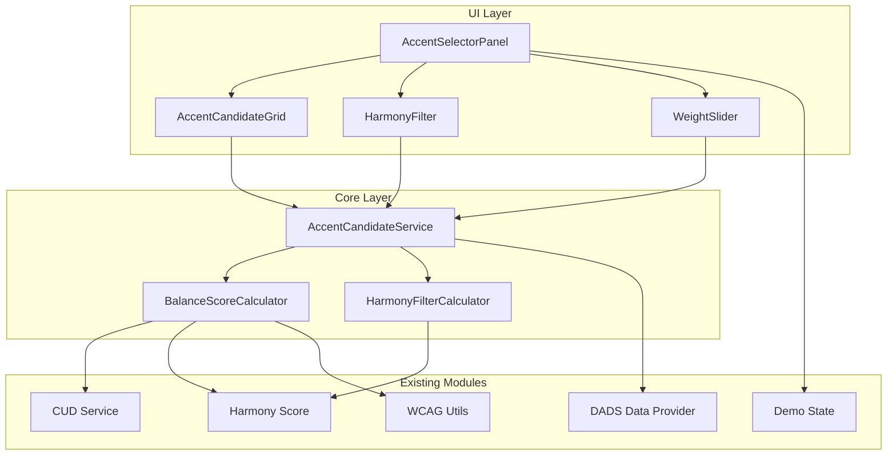
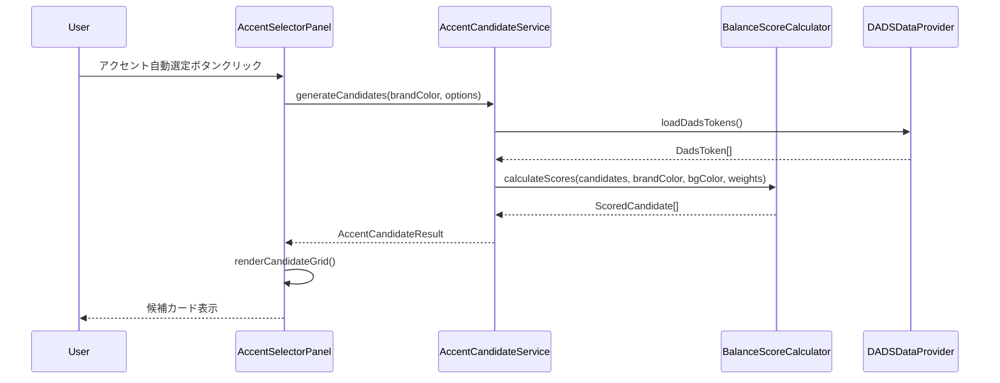
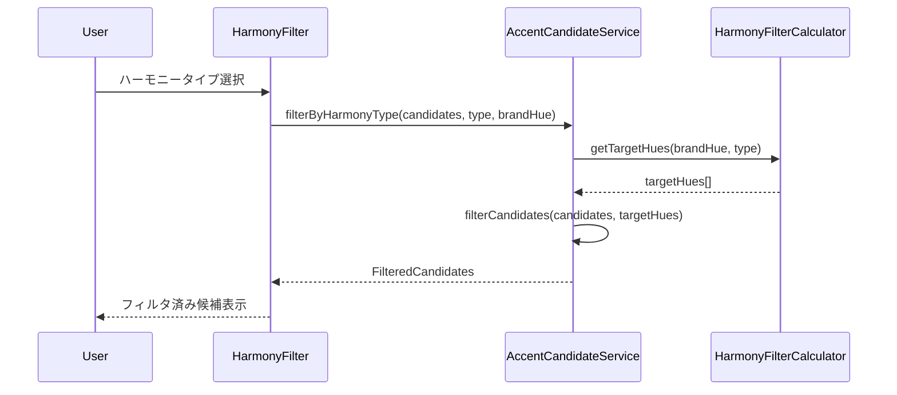
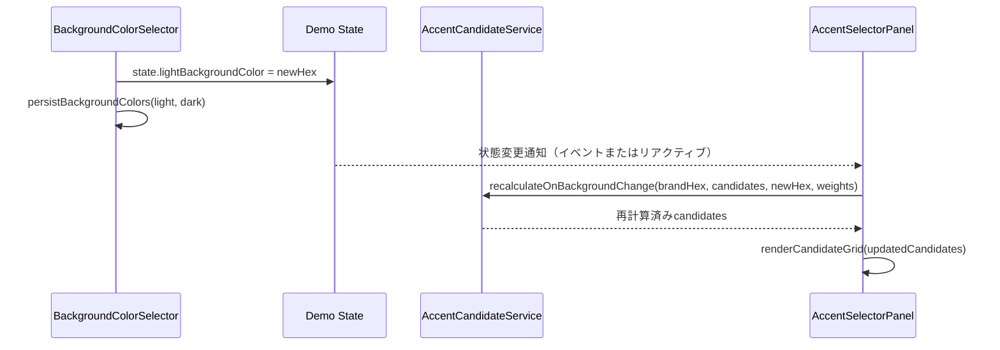
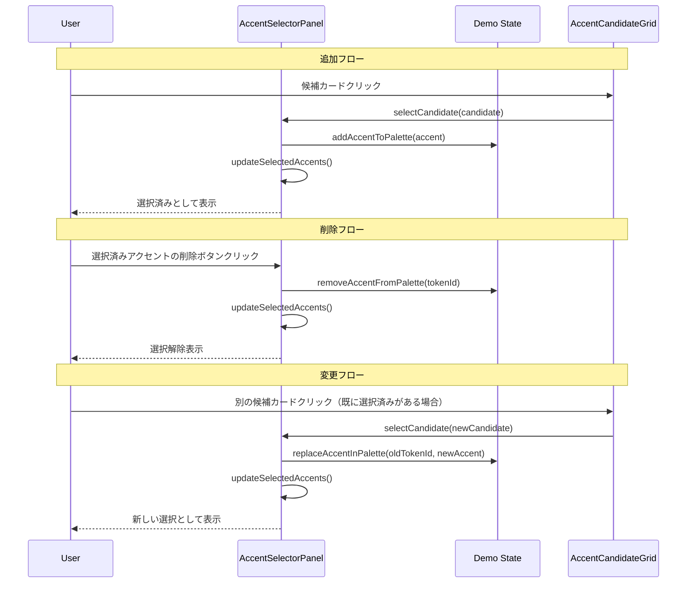
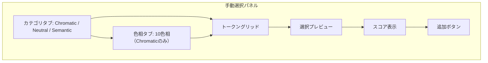
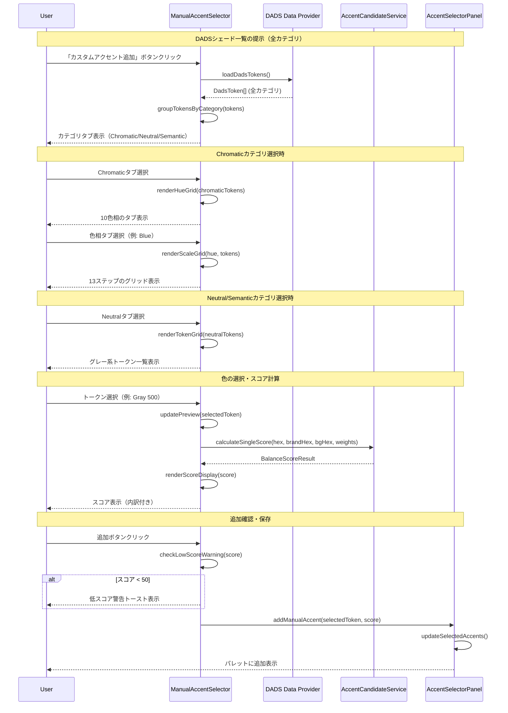
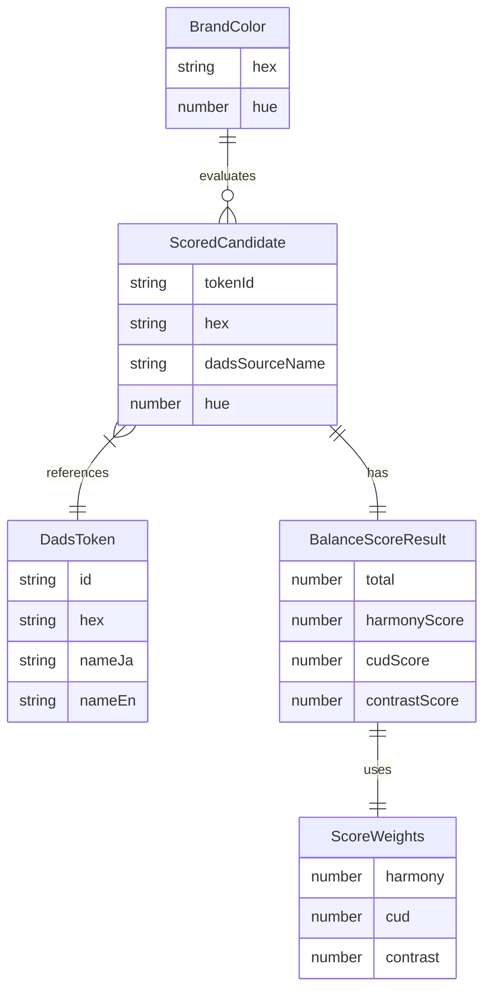

# Design Document: アクセントカラー自動選定

## Overview

本機能は、ブランドカラー（Primary）に対して相性の良いアクセントカラーをDADSカラーシェード（10色相×13ステップ = 130色）から自動的に選定する。

**Purpose**: デザイナーがアクセントカラーを選ぶ際に、ハーモニー（色相関係）、CUD適合性、コントラストのバランスを考慮した最適な候補を自動提案し、選定作業の効率化とアクセシビリティ要件の自動充足を実現する。

**Users**: デザインシステム構築に従事するデザイナー、フロントエンドエンジニア

**Impact**: 既存のDADSデータプロバイダーとCUDモジュールを活用し、新規アクセント選定サービス層を追加。UI層にアクセント選定パネルを新設。

### Goals
- ブランドカラーに対するバランススコア（ハーモニー40%、CUD30%、コントラスト30%）による候補評価
- ハーモニータイプ（補色、トライアド、類似色等）によるフィルタリング
- 130色の全候補評価を200ms以内に完了するパフォーマンス
- DADSシェードからの手動選択機能

### Non-Goals
- カスタム色（DADS外）の直接入力
- 複数アクセントの同時選定
- ブランドカラー自体の変更機能
- 他のデザインシステム（M3等）との連携

## Architecture

### Existing Architecture Analysis

本機能は既存システムの拡張として実装する。

- **既存CUDモジュール**: `src/core/cud/harmony-score.ts`、`service.ts`が調和スコア・CUD距離計算を提供
- **DADSデータプロバイダー**: `src/core/tokens/dads-data-provider.ts`がトークンアクセスを提供
- **状態管理**: `src/ui/demo/state.ts`が背景色・パレット状態を管理
- **依存方向**: UI層 → Core層 → Utils層（循環依存禁止）

### Architecture Pattern & Boundary Map



**Architecture Integration**:
- **Selected pattern**: Service Layer - 計算ロジックをサービス層に集約
- **Domain/feature boundaries**: `src/core/accent/`を新規ドメインとして作成、UI層は`src/ui/accent-selector/`に配置
- **Existing patterns preserved**: 既存CUDモジュールのResult型パターン、状態管理パターン
- **New components rationale**: アクセント選定は独立機能ドメイン、CUDモジュールの単一責任を維持
- **Steering compliance**: 依存方向ルール、TypeScript strict mode、`any`型禁止

### Technology Stack

| Layer | Choice / Version | Role in Feature | Notes |
|-------|------------------|-----------------|-------|
| Frontend | Vanilla TS | アクセント選定パネルUI | 既存UIパターンに整合 |
| Core Services | TypeScript 5.3+ | スコア計算・フィルタリング | strict mode必須 |
| Data | DADS Tokens | 130色候補データソース | キャッシュ済み |
| Color Ops | culori.js | OKLCH/OKLab色変換 | 既存依存 |

## System Flows

### アクセント候補生成フロー



### ハーモニーフィルタ適用フロー



**Key Decisions**:
- スコア再計算なし: フィルタ適用時はキャッシュ済みスコアを使用
- 候補0件時: 最も近い色相の候補を3件まで代替表示

## Requirements Traceability

| Requirement | Summary | Components | Interfaces | Flows |
|-------------|---------|------------|------------|-------|
| 1.1 | 全130色のスコア計算・ソート（同スコア時は主要ステップ優先） | BalanceScoreCalculator, AccentCandidateService | calculateScores(), sortCandidates() | 候補生成 |
| 1.2 | バランススコア（0-100）計算 | BalanceScoreCalculator | calculateBalanceScore() | 候補生成 |
| 1.3 | 上位10件の推奨リスト | AccentCandidateService | generateCandidates() | 候補生成 |
| 1.4, 1.5 | ブランドカラー未設定/背景色未設定時の処理 | AccentCandidateService | - | エラー処理 |
| 2.1 | ハーモニー/CUD/コントラストスコア計算 | BalanceScoreCalculator | calculateHarmonyScore(), calculateCudScore(), calculateContrastScore() | 候補生成 |
| 2.2 | デフォルト重み付け適用 | BalanceScoreCalculator | DEFAULT_WEIGHTS | - |
| 2.3 | 重み正規化（合計100保証） | BalanceScoreCalculator | normalizeWeights() | - |
| 2.4 | 背景色変更時の再計算 | AccentCandidateService, AccentSelectorPanel | onBackgroundChange() | 背景色変更 |
| 2.5 | スコア内訳表示 | AccentCandidateGrid | ScoreBreakdown | 候補表示 |
| 3.1 | ハーモニータイプフィルタ | HarmonyFilterCalculator | getTargetHues() | フィルタ適用 |
| 3.2 | ±30°以内の候補抽出 | HarmonyFilterCalculator | filterByHueDistance() | フィルタ適用 |
| 3.3 | フィルタ後のソート維持 | AccentCandidateService | - | フィルタ適用 |
| 3.4 | 候補0件時の代替表示 | AccentCandidateService | findNearestAlternatives() | フィルタ適用 |
| 4.1, 4.2 | アクセント選定パネル表示 | AccentSelectorPanel | openPanel() | 候補表示 |
| 4.3 | 候補カードグリッド | AccentCandidateGrid | renderCard() | 候補表示 |
| 4.4 | 候補選択・パレット追加 | AccentSelectorPanel | selectCandidate() | 候補選択 |
| 5.1, 5.2 | カスタムアクセント追加 | AccentSelectorPanel | openManualSelector() | 手動選択 |
| 5.3 | 手動追加色のスコア表示 | BalanceScoreCalculator | - | 手動選択 |
| 5.4 | 低スコア警告 | AccentSelectorPanel | showLowScoreWarning() | 手動選択 |
| 6.1 | 200ms以内のパフォーマンス | BalanceScoreCalculator | - | 全体 |
| 6.2 | スコアメモ化 | AccentCandidateService | scoreCache | 候補生成 |
| 6.3 | フィルタ時の再計算回避 | AccentCandidateService | - | フィルタ適用 |
| 7.1, 7.2, 7.3 | エラー処理・フォールバック | AccentCandidateService, AccentSelectorPanel | - | エラー処理 |

## Components and Interfaces

### Component Summary

| Component | Domain/Layer | Intent | Req Coverage | Key Dependencies | Contracts |
|-----------|--------------|--------|--------------|------------------|-----------|
| BalanceScoreCalculator | Core/Accent | 3指標の加重平均スコア計算 | 1.2, 2.1, 2.2, 2.3, 5.3 | CUD Service (P0), Harmony Score (P0), WCAG Utils (P0) | Service |
| HarmonyFilterCalculator | Core/Accent | ハーモニータイプ別フィルタ | 3.1, 3.2 | Harmony Score (P1) | Service |
| AccentCandidateService | Core/Accent | 候補生成・キャッシュ管理 | 1.1, 1.3, 1.4, 1.5, 2.4, 3.3, 3.4, 6.1, 6.2, 6.3, 7.1, 7.2, 7.3 | BalanceScoreCalculator (P0), HarmonyFilterCalculator (P0), DADS Provider (P0) | Service |
| AccentSelectorPanel | UI/AccentSelector | 選定パネル統括 | 4.1, 4.2, 4.4, 5.1, 5.4 | AccentCandidateService (P0), Demo State (P0) | State |
| AccentCandidateGrid | UI/AccentSelector | 候補カードグリッド表示 | 4.3, 2.5 | - | - |
| HarmonyFilter | UI/AccentSelector | ハーモニータイプ選択UI | 3.1 | AccentCandidateService (P1) | - |
| WeightSlider | UI/AccentSelector | 重み調整スライダーUI | 2.3 | AccentCandidateService (P1) | - |

### Core / Accent

#### BalanceScoreCalculator

| Field | Detail |
|-------|--------|
| Intent | ブランドカラーと候補色のバランススコアを計算 |
| Requirements | 1.2, 2.1, 2.2, 2.3, 5.3 |

**Responsibilities & Constraints**
- 3指標（ハーモニー、CUD、コントラスト）を計算し加重平均を返す
- 重みの正規化（合計100保証）を担当
- 純粋関数として副作用なし

**Dependencies**
- Inbound: AccentCandidateService — スコア計算依頼 (P0)
- Outbound: CUD Service (`findNearestCudColor`) — CUD距離取得 (P0)
- Outbound: Harmony Score (`calculateHueDistanceScore`) — 色相スコア取得 (P0)
- Outbound: WCAG Utils (`getContrast`) — コントラスト比取得 (P0)

**Contracts**: Service [x]

##### Service Interface

```typescript
/** スコア重み設定 */
interface ScoreWeights {
  /** ハーモニースコア重み（0-100） */
  harmony: number;
  /** CUDスコア重み（0-100） */
  cud: number;
  /** コントラストスコア重み（0-100） */
  contrast: number;
}

/** スコア計算結果 */
interface BalanceScoreResult {
  /** 総合スコア（0-100） */
  total: number;
  /** スコア内訳 */
  breakdown: {
    harmonyScore: number;
    cudScore: number;
    contrastScore: number;
  };
  /** 使用した重み（正規化済み） */
  weights: ScoreWeights;
}

interface BalanceScoreCalculatorService {
  /**
   * バランススコアを計算する
   * @param brandColorHex ブランドカラー（HEX形式）
   * @param candidateHex 候補色（HEX形式）
   * @param backgroundHex 背景色（HEX形式）
   * @param weights 重み設定（オプション、デフォルト: 40/30/30）
   * @returns スコア計算結果
   * @throws InvalidColorError 無効な色形式の場合
   */
  calculateBalanceScore(
    brandColorHex: string,
    candidateHex: string,
    backgroundHex: string,
    weights?: Partial<ScoreWeights>
  ): BalanceScoreResult;

  /**
   * 重みを正規化する（合計100を保証）
   * @param weights 入力重み
   * @returns 正規化済み重み
   */
  normalizeWeights(weights: ScoreWeights): ScoreWeights;
}
```

- Preconditions:
  - brandColorHexは有効なHEX形式であること（無効時はInvalidColorError）
  - backgroundHexは有効なHEX形式であること（**無効または未設定時は#FFFFFFにフォールバック**）
  - candidateHexは有効なHEX形式であること
- Postconditions: totalは0-100の範囲、weightsの合計は100
- Invariants: 同一入力に対して同一出力（純粋関数）

##### HEX Input Normalization (Requirement 1.5, 2.3, 6.2)

すべてのHEX入力は正規化してから処理・キャッシュキー生成に使用する:

```typescript
/**
 * HEX色の正規化
 * - 大文字に統一
 * - #プレフィックスを保証
 * - 3桁HEXは6桁に展開
 *
 * @param hex 入力HEX値（#付き/なし、大文字/小文字どちらも可）
 * @returns 正規化済みHEX（#RRGGBB形式、大文字）
 * @throws InvalidColorError 無効なHEX形式の場合
 */
function normalizeHex(hex: string): string {
  let normalized = hex.trim().toUpperCase();

  // #プレフィックスを保証
  if (!normalized.startsWith("#")) {
    normalized = `#${normalized}`;
  }

  // 3桁HEXを6桁に展開 (#RGB -> #RRGGBB)
  if (normalized.length === 4) {
    const r = normalized[1];
    const g = normalized[2];
    const b = normalized[3];
    normalized = `#${r}${r}${g}${g}${b}${b}`;
  }

  // フォーマット検証
  if (!/^#[0-9A-F]{6}$/.test(normalized)) {
    throw new InvalidColorError(`Invalid hex color: ${hex}`);
  }

  return normalized;
}

/** 無効な色エラー */
class InvalidColorError extends Error {
  constructor(message: string) {
    super(message);
    this.name = "InvalidColorError";
  }
}
```

##### Background Color Fallback (Requirement 1.5)

背景色のバリデーションとフォールバック処理:

```typescript
const DEFAULT_BACKGROUND_HEX = "#FFFFFF";

function resolveBackgroundHex(backgroundHex: string | undefined): string {
  if (!backgroundHex) return DEFAULT_BACKGROUND_HEX;
  try {
    // 正規化を試行（失敗時はフォールバック）
    return normalizeHex(backgroundHex);
  } catch {
    return DEFAULT_BACKGROUND_HEX;
  }
}
```

**重要**: ブランドカラーのみがエラー対象。背景色は常にフォールバックで処理継続。

##### Background Color State Mapping (Requirement 2.1, 2.4)

既存の状態管理（`src/ui/demo/state.ts`）では背景色が`lightBackgroundColor`と`darkBackgroundColor`に分離されている。
アクセント選定サービスでは現在の表示モードに基づいて適切な背景色を選択する:

```typescript
import { state } from "@/ui/demo/state";

/** カラーモード（ライト/ダーク） */
type ColorMode = "light" | "dark";

/**
 * 現在の表示モードから背景色を取得
 *
 * ★ 既存state構造との連携:
 * - state.lightBackgroundColor: ライトモード背景（デフォルト: #ffffff）
 * - state.darkBackgroundColor: ダークモード背景（デフォルト: #000000）
 *
 * @param mode 現在のカラーモード
 * @returns 背景色（HEX形式）
 */
function getBackgroundColorFromState(mode: ColorMode): string {
  if (mode === "dark") {
    return state.darkBackgroundColor;
  }
  return state.lightBackgroundColor;
}

/**
 * アクセント選定パネルで使用する背景色の決定ルール
 *
 * 1. UIオプションで明示的に指定された場合: その値を使用
 * 2. 未指定の場合: 現在の表示モードに基づいてstateから取得
 * 3. stateの値が無効な場合: デフォルト#FFFFFFにフォールバック
 */
interface BackgroundColorResolver {
  /**
   * 背景色を解決する
   * @param options.backgroundHex 明示的に指定された背景色（オプション）
   * @param options.colorMode 現在の表示モード（オプション、デフォルト: "light"）
   * @returns 正規化済み背景色HEX
   */
  resolve(options: {
    backgroundHex?: string;
    colorMode?: ColorMode;
  }): string;
}

const backgroundColorResolver: BackgroundColorResolver = {
  resolve({ backgroundHex, colorMode = "light" }) {
    // 1. 明示的指定がある場合
    if (backgroundHex) {
      return resolveBackgroundHex(backgroundHex);
    }

    // 2. stateから取得
    const stateBackgroundHex = getBackgroundColorFromState(colorMode);
    return resolveBackgroundHex(stateBackgroundHex);
  },
};
```

**背景色変更時のイベント連携**:



**統合ポイント**:
- `BackgroundColorSelector`の変更イベントをリッスン
- `persistBackgroundColors()`呼び出し後にスコア再計算をトリガー
- 再計算は`recalculateOnBackgroundChange()`を使用（部分キャッシュ活用）

##### Cache Key Generation (Requirement 6.2)

キャッシュキーは正規化済みHEX値で生成:

```typescript
/**
 * キャッシュキー生成
 * 正規化済みHEX値を使用して同一色の重複キャッシュを防止
 */
function buildCacheKey(
  brandHex: string,
  backgroundHex: string | undefined,
  weights: ScoreWeights
): string {
  const normalizedBrand = normalizeHex(brandHex);
  const normalizedBg = resolveBackgroundHex(backgroundHex);
  const weightsHash = `${weights.harmony}_${weights.cud}_${weights.contrast}`;
  return `${normalizedBrand}_${normalizedBg}_${weightsHash}`;
}
```

**キャッシュキー整合性ポリシー**:
- 全てのHEX値は正規化後にキー化
- 背景色はフォールバック後の値でキー化（#FFFFFF等）
- 重みは3値をアンダースコアで連結
- 例: `#0056FF_#FFFFFF_40_30_30`

##### Score Normalization Formulas (Requirement 2.1)

各スコアの正規化式（0-100スケール）を明示:

```typescript
/**
 * CUDスコア計算（Requirement 2.1）
 * 既存 findNearestCudColor() からΔE値を取得し正規化
 *
 * @param candidateHex 候補色（HEX形式）
 * @returns CUDスコア（0-100）
 *
 * 計算式: score = clamp(0, 100, 100 - (deltaE / 0.20) * 100)
 * - ΔE = 0.00 → 100点（完全一致）
 * - ΔE ≥ 0.20 → 0点（離れすぎ）
 */
function calculateCudScore(candidateHex: string): number {
  const cudResult = findNearestCudColor(candidateHex);
  const deltaE = cudResult.deltaE; // OKLab空間でのユークリッド距離

  // 正規化: ΔE=0で100点、ΔE≥0.20で0点
  const score = 100 - (deltaE / 0.20) * 100;
  return Math.max(0, Math.min(100, score));
}

/**
 * ハーモニースコア計算（Requirement 2.1）
 * 既存 calculateHueDistanceScore() を使用
 *
 * @param brandHex ブランドカラー（HEX形式）
 * @param candidateHex 候補色（HEX形式）
 * @returns ハーモニースコア（0-100）
 *
 * 注: 既存APIは `calculateHueDistanceScore(anchorHex, paletteHexes: string[])`
 * 単色の場合は配列に1色だけ渡して使用する
 */
function calculateHarmonyScore(brandHex: string, candidateHex: string): number {
  // 既存のharmony-score.tsのcalculateHueDistanceScore()を使用
  // 単色の場合は配列で渡す: [candidateHex]
  // この関数は既に0-100スケールで返すため、追加の正規化は不要
  return calculateHueDistanceScore(brandHex, [candidateHex]);
}
```

**既存関数との整合性**:
- `findNearestCudColor()`: OKLab空間でのΔE値を返す（0.00〜約0.50の範囲）
- `calculateHueDistanceScore()`: 既に0-100スケール

##### Contrast Calculation Strategy (Advisory: 2.1)

コントラスト計算には既存の`src/utils/wcag.ts`の`getContrast()`を使用する:

```typescript
import { parse } from "culori";
import { getContrast } from "@/utils/wcag";
import type { ColorObject } from "@/utils/color-space";

/**
 * コントラストスコア計算（Requirement 2.1）
 * 既存の src/utils/wcag.ts の getContrast() を使用
 *
 * ★ プロジェクト内の既存ユーティリティを再利用して統合性を維持
 *
 * @param candidateHex 候補色（HEX形式）
 * @param backgroundHex 背景色（HEX形式）
 * @returns コントラストスコア（0-100）
 */
function calculateContrastScore(candidateHex: string, backgroundHex: string): number {
  const candidate = parse(candidateHex) as ColorObject;
  const background = parse(backgroundHex) as ColorObject;

  if (!candidate || !background) {
    throw new InvalidColorError(`Invalid color: ${candidateHex} or ${backgroundHex}`);
  }

  // 既存 getContrast() を使用（内部で culori.wcagContrast() を呼び出し）
  const contrastRatio = getContrast(candidate, background);

  // 正規化: 比1.0で0点、比7.0以上で100点
  const score = ((contrastRatio - 1) / 6) * 100;
  return Math.max(0, Math.min(100, score));
}
```

**実装方針**:
- **使用関数**: `getContrast()` from `@/utils/wcag` - 既存プロジェクトユーティリティ
- **理由**: `getContrast()` は内部で `culori.wcagContrast()` を使用しており、プロジェクト全体で統一したコントラスト計算を保証
- **テスト整合性**: 既存の wcag.test.ts でカバーされており、追加テストが不要
- **不要**: 独自の `getRelativeLuminance()` 実装は不要（getContrast内部で処理済み）

**Implementation Notes**
- Integration: 既存`findNearestCudColor()`のdeltaE値をCUDスコアに変換
- Validation: ブランドカラー・候補色のHEXバリデーションはculoriに委譲、背景色はフォールバック
- Risks: 無彩色でのハーモニースコア計算（既存実装で対応済み）

---

#### HarmonyFilterCalculator

| Field | Detail |
|-------|--------|
| Intent | ハーモニータイプに基づく候補フィルタリング |
| Requirements | 3.1, 3.2 |

**Responsibilities & Constraints**
- ハーモニータイプからターゲット色相を計算
- ±30°の循環距離判定を担当
- フィルタ結果は元のスコア順を維持

**Dependencies**
- Inbound: AccentCandidateService — フィルタ依頼 (P0)
- Outbound: color-space utils — OKLCH変換 (P1)

**Contracts**: Service [x]

##### Service Interface

```typescript
/** ハーモニータイプ */
type HarmonyFilterType =
  | "all"
  | "complementary"
  | "triadic"
  | "analogous"
  | "split-complementary";

/** ハーモニータイプ定義 */
interface HarmonyTypeDefinition {
  id: HarmonyFilterType;
  nameJa: string;
  nameEn: string;
  hueOffsets: number[]; // 基準色相からのオフセット角度
}

interface HarmonyFilterCalculatorService {
  /**
   * ハーモニータイプのターゲット色相を取得
   * @param brandHue ブランドカラーの色相（0-360）
   * @param type ハーモニータイプ
   * @returns ターゲット色相配列
   */
  getTargetHues(brandHue: number, type: HarmonyFilterType): number[];

  /**
   * 候補が指定色相から±30°以内かを判定
   * @param candidateHue 候補の色相
   * @param targetHues ターゲット色相配列
   * @returns 範囲内ならtrue
   */
  isWithinHarmonyRange(candidateHue: number, targetHues: number[]): boolean;

  /**
   * ハーモニータイプ定義一覧を取得
   */
  getHarmonyTypes(): readonly HarmonyTypeDefinition[];
}
```

- Preconditions: 色相は0-360の範囲
- Postconditions: ターゲット色相は0-360に正規化
- Invariants: 循環距離計算で最短角度差を使用

---

#### AccentCandidateService

| Field | Detail |
|-------|--------|
| Intent | アクセント候補の生成・フィルタ・キャッシュ管理 |
| Requirements | 1.1, 1.3, 1.4, 1.5, 2.4, 3.3, 3.4, 6.1, 6.2, 6.3, 7.1, 7.2, 7.3 |

**Responsibilities & Constraints**
- DADSトークンからの候補生成（**chromatic category のみ**、10色相×13ステップ = 130色）
- スコア計算結果のメモ化
- フィルタ適用とソート維持
- エラー処理とフォールバック

##### Candidate Filtering (Requirement 1.1)

DADSデータプロバイダーはchromatic/neutral/semanticの全カテゴリを返すため、
候補生成時に**chromaticカテゴリのみ**をフィルタリングする:

```typescript
import {
  loadDadsTokens,
  getAllDadsChromatic,
  getHueOrder,
  getScaleOrder,
  type DadsColorScale,
} from "@/core/tokens/dads-data-provider";
import type { DadsToken, DadsColorHue, DadsChromaScale } from "@/core/tokens/types";

/**
 * 候補対象トークンの取得（Requirement 1.1）
 * 10色相 × 13ステップ = 130色に限定
 *
 * ★ 重要: loadDadsTokens()は非同期関数のため、awaitが必須
 *
 * @returns chromatic カテゴリのDADSトークン（130色）
 */
async function getChromaticCandidates(): Promise<DadsToken[]> {
  // ★ 非同期でトークンを読み込み
  const allTokens = await loadDadsTokens();

  // chromaticカテゴリのみをフィルタ
  const chromaticTokens = allTokens.filter(
    token => token.classification.category === "chromatic"
  );

  // 検証: 10色相 × 13ステップ = 130色
  if (chromaticTokens.length !== 130) {
    console.warn(
      `Unexpected chromatic token count: ${chromaticTokens.length}, expected 130`
    );
  }

  return chromaticTokens;
}

/**
 * 代替実装: getAllDadsChromatic を使用して130色を構成
 * ★ 既存API getAllDadsChromatic(tokens) を使用（引数としてtokensが必要）
 */
async function getChromaticCandidatesAlternative(): Promise<DadsToken[]> {
  const tokens = await loadDadsTokens();
  const chromaticScales: DadsColorScale[] = getAllDadsChromatic(tokens);

  // DadsColorScale[] から DadsToken[] を抽出
  return chromaticScales.flatMap(scale => scale.colors.map(c => c.token));
}
```

**フィルタ条件**:
- `classification.category === "chromatic"` を適用
- neutral（グレー系）、semantic（success/warning/error等）は除外
- 結果は正確に130色（10色相 × 13ステップ: 50, 100, 200, 300, 400, 500, 600, 700, 800, 900, 1000, 1100, 1200）

**DADS色相定義（既存dads-data-provider.tsのHUE_ORDERに準拠）**:
```typescript
const DADS_HUE_ORDER: readonly DadsColorHue[] = [
  "blue", "light-blue", "cyan", "green", "lime",
  "yellow", "orange", "red", "magenta", "purple",
] as const;
```

**DADSスケール定義（既存dads-data-provider.tsのSCALE_ORDERに準拠）**:
```typescript
const DADS_SCALE_ORDER: readonly DadsChromaScale[] = [
  50, 100, 200, 300, 400, 500, 600, 700, 800, 900, 1000, 1100, 1200,
] as const;
```

★ **注意**: 設計では固定値を持たず、`getHueOrder()`/`getScaleOrder()`を使用して既存定義を参照する

**Dependencies**
- Inbound: AccentSelectorPanel — 候補生成依頼 (P0)
- Outbound: BalanceScoreCalculator — スコア計算 (P0)
- Outbound: HarmonyFilterCalculator — フィルタ計算 (P0)
- External: DADS Data Provider (`loadDadsTokens`) — トークン取得 (P0)

**Contracts**: Service [x]

##### Service Interface

```typescript
/** スコア付き候補 */
interface ScoredCandidate {
  /** DADSトークンID */
  tokenId: string;
  /** HEX値 */
  hex: string;
  /** 表示名（日本語） */
  nameJa: string;
  /** 表示名（英語） */
  nameEn: string;
  /** DADSソース名（例: "Blue 600"） */
  dadsSourceName: string;
  /** DADSステップ番号（50, 100, ..., 1200） */
  step: number;
  /** バランススコア結果 */
  score: BalanceScoreResult;
  /** 色相（OKLCH） */
  hue: number;
}

/** 主要ステップ定義（同スコア時の優先順位付けに使用） */
const MAJOR_STEPS = [500, 600, 700, 800] as const;

/** 候補生成オプション */
interface GenerateCandidatesOptions {
  /** 背景色（未設定時は#FFFFFF） */
  backgroundHex?: string;
  /** 重み設定 */
  weights?: Partial<ScoreWeights>;
  /** 取得件数（デフォルト: 10） */
  limit?: number;
  /** ハーモニーフィルタ */
  harmonyFilter?: HarmonyFilterType;
}

/** 候補生成結果 */
interface AccentCandidateResult {
  /** スコア順の候補リスト */
  candidates: ScoredCandidate[];
  /** 適用されたフィルタ */
  appliedFilter: HarmonyFilterType;
  /** フィルタで候補が0件になった場合の代替候補 */
  alternatives?: ScoredCandidate[];
  /** 計算時間（ms） */
  calculationTimeMs: number;
}

/** エラー型 */
interface AccentSelectionError {
  code: "BRAND_COLOR_NOT_SET" | "DADS_LOAD_FAILED" | "SCORE_CALCULATION_FAILED";
  message: string;
}

type AccentCandidateResultOrError =
  | { ok: true; result: AccentCandidateResult }
  | { ok: false; error: AccentSelectionError };

interface AccentCandidateServiceInterface {
  /**
   * アクセント候補を生成する
   * @param brandColorHex ブランドカラー（必須）
   * @param options 生成オプション
   * @returns 候補生成結果またはエラー
   */
  generateCandidates(
    brandColorHex: string,
    options?: GenerateCandidatesOptions
  ): Promise<AccentCandidateResultOrError>;

  /**
   * ハーモニーフィルタを適用する（再計算なし）
   * Requirement 3.4: フィルタ後0件時は代替候補を返す
   *
   * @param candidates 既存候補リスト
   * @param type フィルタタイプ
   * @param brandHue ブランドカラーの色相
   * @returns フィルタ結果（候補と代替候補を含む）
   */
  filterByHarmonyType(
    candidates: ScoredCandidate[],
    type: HarmonyFilterType,
    brandHue: number
  ): HarmonyFilterResult;

  /**
   * スコアキャッシュを無効化する
   */
  invalidateCache(): void;

  /**
   * 特定の色のスコアを計算する（手動選択用）
   * @param hex 対象色
   * @param brandColorHex ブランドカラー
   * @param backgroundHex 背景色
   * @param weights 重み
   * @returns スコア結果
   */
  calculateSingleScore(
    hex: string,
    brandColorHex: string,
    backgroundHex: string,
    weights?: Partial<ScoreWeights>
  ): BalanceScoreResult;
}

/** ハーモニーフィルタ結果（Requirement 3.4） */
interface HarmonyFilterResult {
  /** フィルタ済み候補（該当あり） */
  candidates: ScoredCandidate[];
  /** 代替候補（フィルタ後0件時のみ、最大3件） */
  alternatives: ScoredCandidate[];
  /** 代替候補を表示中かどうか */
  isShowingAlternatives: boolean;
}

/**
 * フィルタ0件時の代替候補算出（Requirement 3.4）
 *
 * @param allCandidates 全候補
 * @param targetHues ターゲット色相配列
 * @param maxCount 最大件数（デフォルト: 3）
 * @returns 最も近い色相の候補
 */
function findNearestAlternatives(
  allCandidates: ScoredCandidate[],
  targetHues: number[],
  maxCount: number = 3
): ScoredCandidate[] {
  // ターゲット色相からの距離でソート
  const sorted = [...allCandidates].sort((a, b) => {
    const aMinDist = Math.min(...targetHues.map(t => calculateCircularDistance(a.hue, t)));
    const bMinDist = Math.min(...targetHues.map(t => calculateCircularDistance(b.hue, t)));
    return aMinDist - bMinDist;
  });
  return sorted.slice(0, maxCount);
}

/** 循環距離計算（色相用） */
function calculateCircularDistance(hue1: number, hue2: number): number {
  const diff = Math.abs(hue1 - hue2);
  return Math.min(diff, 360 - diff);
}
```

- Preconditions: brandColorHexは有効なHEX形式
- Postconditions: candidatesはスコア降順でソート、同スコア時は主要ステップ（500, 600, 700, 800）優先
- Invariants: メモ化キーは`${brandHex}_${bgHex}_${weightsHash}`

##### Sorting Algorithm (Requirement 1.1)

候補のソートは二段階で行う:
1. **第一ソートキー**: バランススコア（降順）
2. **第二ソートキー**: 主要ステップ優先度（MAJOR_STEPSに含まれる場合は優先）

```typescript
function sortCandidates(candidates: ScoredCandidate[]): ScoredCandidate[] {
  return candidates.sort((a, b) => {
    // 第一ソート: スコア降順
    if (a.score.total !== b.score.total) {
      return b.score.total - a.score.total;
    }
    // 第二ソート: 主要ステップ優先
    const aIsMajor = MAJOR_STEPS.includes(a.step as typeof MAJOR_STEPS[number]);
    const bIsMajor = MAJOR_STEPS.includes(b.step as typeof MAJOR_STEPS[number]);
    if (aIsMajor && !bIsMajor) return -1;
    if (!aIsMajor && bIsMajor) return 1;
    return 0;
  });
}
```

##### State Management

- **State model**: 内部キャッシュ（二段階キャッシュ）
  - `partialScoreCache: Map<string, PartialScoreData>` — ハーモニー・CUDスコア（背景色非依存）
  - `fullScoreCache: Map<string, AccentCandidateResult>` — 完全結果（候補配列+メタ情報、背景色依存）
- **Persistence**: なし（セッション内メモリのみ）
- **Concurrency**: シングルスレッド前提、非同期処理はPromiseで直列化

##### Partial Recalculation (Requirement 2.4)

背景色変更時はコントラストスコアのみを再計算する。

**二段階キャッシュ方針**:
- **partialScoreCache**: ハーモニー・CUDスコア（背景色非依存）を保持（※エラー時はクリア）
- **fullScoreCache**: 完全スコア結果（背景色依存）

**重要**: `partialScoreCache` は初回計算時に**必ず**保存し、背景色変更時に再利用する。
これにより要件2.4「背景色変更時はコントラストスコアのみ再計算」を保証する。
※エラー発生時は要件7.3に従い全キャッシュをクリア（後述）。

```typescript
/** 背景色非依存のスコアデータ */
interface PartialScoreData {
  harmonyScore: number;
  cudScore: number;
}

/** 二段階キャッシュ構造 */
interface CacheStructure {
  /** キー: ${brandHex}_${candidateHex}（ブランド色と候補色のペア）
   *  ★ 初回計算時に必ず保存し、背景色変更時に再利用
   */
  partialScores: Map<string, PartialScoreData>;
  /** キー: ${brandHex}_${bgHex}_${weightsHash}
   *  ★ AccentCandidateResult全体を保存（候補配列+メタ情報）
   */
  fullResults: Map<string, AccentCandidateResult>;
}

/** キャッシュインスタンス */
const partialScoreCache: Map<string, PartialScoreData> = new Map();
const fullScoreCache: Map<string, AccentCandidateResult> = new Map();

/** 部分キャッシュのキー生成（統一） */
function buildPartialCacheKey(brandHex: string, candidateHex: string): string {
  const normalizedBrand = normalizeHex(brandHex);
  const normalizedCandidate = normalizeHex(candidateHex);
  return `${normalizedBrand}_${normalizedCandidate}`;
}

/**
 * 初回候補生成時のスコア計算
 * ★ partialScoreCache に必ず保存する（要件2.4対応）
 */
function calculateAndCacheScores(
  brandHex: string,
  candidates: DadsToken[],
  backgroundHex: string,
  weights: ScoreWeights
): ScoredCandidate[] {
  return candidates.map(candidate => {
    const partialKey = buildPartialCacheKey(brandHex, candidate.hex);

    // ハーモニー・CUDスコアを計算
    const harmonyScore = calculateHarmonyScore(brandHex, candidate.hex);
    const cudScore = calculateCudScore(candidate.hex);

    // ★ 部分スコアを必ずキャッシュに保存（背景色変更時に再利用）
    partialScoreCache.set(partialKey, { harmonyScore, cudScore });

    // コントラストスコアを計算
    const contrastScore = calculateContrastScore(candidate.hex, backgroundHex);

    // 総合スコアを計算
    const total =
      harmonyScore * (weights.harmony / 100) +
      cudScore * (weights.cud / 100) +
      contrastScore * (weights.contrast / 100);

    return {
      tokenId: candidate.id,
      hex: candidate.hex,
      nameJa: candidate.nameJa,
      nameEn: candidate.nameEn,
      dadsSourceName: `${candidate.classification.hue} ${candidate.classification.scale}`,
      step: candidate.classification.scale as number,
      hue: toOklch(candidate.hex).h ?? 0,
      score: {
        total,
        breakdown: { harmonyScore, cudScore, contrastScore },
        weights,
      },
    };
  });
}

/**
 * 背景色変更時の部分再計算（要件2.4）
 * ★ partialScoreCache から必ずハーモニー・CUDスコアを取得
 *    キャッシュミスは通常発生しない（初回計算時に保存済み）
 */
function recalculateOnBackgroundChange(
  brandHex: string,
  candidates: ScoredCandidate[],
  newBackgroundHex: string,
  weights: ScoreWeights
): ScoredCandidate[] {
  return candidates.map(candidate => {
    const partialKey = buildPartialCacheKey(brandHex, candidate.hex);
    const partial = partialScoreCache.get(partialKey);

    // ★ 通常はキャッシュヒットする（初回計算時に保存済み）
    //    万が一のキャッシュミス時のみ再計算
    const harmonyScore = partial?.harmonyScore ?? calculateHarmonyScore(brandHex, candidate.hex);
    const cudScore = partial?.cudScore ?? calculateCudScore(candidate.hex);

    // キャッシュミス時は保存（次回以降のため）
    if (!partial) {
      partialScoreCache.set(partialKey, { harmonyScore, cudScore });
    }

    // コントラストスコアのみ再計算
    const contrastScore = calculateContrastScore(candidate.hex, newBackgroundHex);

    const total =
      harmonyScore * (weights.harmony / 100) +
      cudScore * (weights.cud / 100) +
      contrastScore * (weights.contrast / 100);

    return {
      ...candidate,
      score: {
        total,
        breakdown: { harmonyScore, cudScore, contrastScore },
        weights,
      },
    };
  });
}
```

**パフォーマンス効果**: 背景色変更時の再計算は約50ms以内（ハーモニー・CUD計算をスキップ）

**キャッシュ保持ポリシー**:
- `partialScoreCache`: 初回計算時に保存、背景色変更時に再利用（**エラー時はクリア**: 要件7.3）
- `fullScoreCache`: エラー時にクリア、重み変更時に無効化（**エラー時はクリア**: 要件7.3）

##### Error-Time Cache Handling (Requirement 7.1, 7.3)

**重要**: 要件7.1/7.3により、エラー発生時は「前回キャッシュを使用しない」ことが必須です。

```typescript
/**
 * エラー発生時のキャッシュ処理ポリシー
 * - キャッシュ参照前にDADSデータ可用性を検証する
 * - エラー検知時はfullScoreCacheを参照せず、即座にエラーを返す
 * - 計算途中でエラー発生した場合、不完全なfullScoreはキャッシュしない
 *
 * ★ 要件7.3対応: エラー発生時は全キャッシュをクリア
 * - partialScoreCache: エラー時にクリア（前回結果の使用禁止）
 * - fullScoreCache: エラー時にクリア（前回結果の使用禁止）
 */
interface CachePolicy {
  /** エラー時にfullScoreCacheをクリアするか */
  clearFullCacheOnError: boolean;
  /** エラー時にpartialScoreCacheをクリアするか（要件7.3対応: true） */
  clearPartialCacheOnError: boolean;
  /** 不完全な計算結果をfullScoreCacheに保存するか（常にfalse） */
  cacheIncompleteResults: false;
  /** キャッシュ参照前にデータソース検証を行うか */
  validateBeforeCacheHit: true;
}

const DEFAULT_CACHE_POLICY: CachePolicy = {
  clearFullCacheOnError: true,
  clearPartialCacheOnError: true, // ★ 要件7.3対応: エラー時は全キャッシュクリア
  cacheIncompleteResults: false,
  validateBeforeCacheHit: true,
};

/** データソースエラー状態 */
let dadsLoadError: Error | null = null;

async function generateCandidatesWithCache(
  brandColorHex: string,
  options: GenerateCandidatesOptions
): Promise<AccentCandidateResultOrError> {
  // ★ 重要: キャッシュ参照前にDADSデータ可用性を検証（要件7.1, 7.3）
  // エラー状態がある場合はキャッシュを使用せずエラーを返す
  if (dadsLoadError) {
    return {
      ok: false,
      error: {
        code: "DADS_LOAD_FAILED",
        message: "DADSデータの読み込みに失敗しました",
      },
    };
  }

  // DADSデータのロードを試行
  try {
    await loadDadsTokens();
  } catch (error) {
    dadsLoadError = error instanceof Error ? error : new Error(String(error));
    // ★ 致命的エラー: 全キャッシュをクリアして一貫性を保つ
    clearAllCaches();
    return {
      ok: false,
      error: {
        code: "DADS_LOAD_FAILED",
        message: "DADSデータの読み込みに失敗しました",
      },
    };
  }

  // ★ optionsから背景色と重みを明示的に抽出してキャッシュキーを生成
  const backgroundHex = resolveBackgroundHex(options.backgroundHex);
  const weights = normalizeWeights({
    harmony: options.weights?.harmony ?? 40,
    cud: options.weights?.cud ?? 30,
    contrast: options.weights?.contrast ?? 30,
  });
  const cacheKey = buildCacheKey(brandColorHex, backgroundHex, weights);

  // ★ DADSデータ検証後にのみキャッシュを参照
  const cached = fullScoreCache.get(cacheKey);
  if (cached) {
    return { ok: true, result: cached };
  }

  try {
    // 計算実行
    const result = await computeCandidates(brandColorHex, options);

    // 正常完了時のみキャッシュに保存（AccentCandidateResult全体）
    fullScoreCache.set(cacheKey, result);
    return { ok: true, result };
  } catch (error) {
    // エラー時はキャッシュに何も保存しない
    // ★ 要件7.3: 全キャッシュをクリア（前回結果の使用禁止）
    clearAllCaches();

    return {
      ok: false,
      error: {
        code: "SCORE_CALCULATION_FAILED",
        message: error instanceof Error ? error.message : "計算中にエラーが発生しました",
      },
    };
  }
}

/**
 * DADSエラー状態のリセット（リトライ用）
 */
function resetDadsErrorState(): void {
  dadsLoadError = null;
}

/**
 * 関連キャッシュの無効化
 * 特定のブランドカラーに関連する全キャッシュエントリをクリア
 *
 * ★ 重要: キャッシュキーは正規化済みHEXで生成されているため、
 *          検索時も正規化済みHEXを使用する（Advisory 7.3対応）
 *
 * ★ 用途: ブランドカラー変更時など、通常のキャッシュ無効化
 *    この関数は fullScoreCache のみを削除し、partialScoreCache は保持する。
 *    ★ 注意: エラー時は clearAllCaches() を使用すること（要件7.3）
 */
function invalidateRelatedCache(brandColorHex: string): void {
  // ★ 入力HEXを正規化してからキャッシュ検索
  const normalizedBrandHex = normalizeHex(brandColorHex);

  // fullScoreCacheから関連エントリを削除
  for (const key of fullScoreCache.keys()) {
    if (key.startsWith(normalizedBrandHex)) {
      fullScoreCache.delete(key);
    }
  }

  // partialScoreCacheは保持（背景色変更時の高速化のため、要件2.4対応）
}

/**
 * 全キャッシュのクリア（エラー時に使用）
 * ★ 要件7.3: エラー発生時は前回キャッシュを使用しないため、全クリア
 */
function clearAllCaches(): void {
  fullScoreCache.clear();
  partialScoreCache.clear();
}
```

**重要ポイント**:
- **キャッシュ参照前にDADSデータ可用性を必ず検証**（要件7.1, 7.3対応）
- エラー状態がある場合はfullScoreCacheを参照せず即座にエラーを返す
- 計算が正常完了するまでfullScoreCacheには書き込まない
- **エラー発生時は全キャッシュをクリア**（要件7.3「エラー発生時にフォールバック候補や前回キャッシュは使用しない」に準拠）
- **不完全な計算結果はキャッシュしない**: 計算途中でエラーが発生した場合、fullScoreCacheに保存しない（`cacheIncompleteResults: false`）

##### エラー時キャッシュポリシー詳細（Requirement 7.3）

要件7.3「エラー発生時にフォールバック候補や前回キャッシュは使用しない」を厳密に満たすため、
エラー発生時は**全キャッシュ（fullScoreCache + partialScoreCache）をクリア**する:

```typescript
/**
 * スコア計算エラー時のキャッシュクリア
 *
 * ★ 要件7.3対応: エラー発生時は前回キャッシュを使用しない
 *
 * エラー種別ごとの対応:
 * - DADS_LOAD_FAILED: clearAllCaches() で全キャッシュクリア
 * - SCORE_CALCULATION_FAILED: clearAllCaches() で全キャッシュクリア
 * - BRAND_COLOR_NOT_SET: キャッシュクリア不要（計算自体が実行されないため）
 */
function handleCalculationError(
  error: Error,
  brandColorHex: string
): AccentSelectionError {
  // ★ 要件7.3: エラー時は全キャッシュをクリア（前回キャッシュ使用禁止）
  clearAllCaches();

  return {
    code: "SCORE_CALCULATION_FAILED",
    message: error.message || "計算中にエラーが発生しました",
  };
}
```

**キャッシュポリシー（参照）**:

上記の`DEFAULT_CACHE_POLICY`設定により、エラー発生時は`clearAllCaches()`が呼ばれ、
`fullScoreCache`と`partialScoreCache`の両方がクリアされます。

**要件2.4との整合性**:
- 要件2.4「背景色変更時はコントラストスコアのみ再計算」はpartialScoreCacheを活用
- **ただし**、エラー発生後は要件7.3が優先され、キャッシュは全クリア
- エラー解消後の次回正常計算時にpartialScoreCacheは再構築される

**Implementation Notes**
- Integration: DADSトークンはキャッシュ済みのため初回以外高速
- Validation: ブランドカラー未設定時はエラー返却（要件1.4）
- Risks: 200ms以内のパフォーマンス要件（早期リターン最適化と二段階キャッシュで対応）

### UI / AccentSelector

#### AccentSelectorPanel

| Field | Detail |
|-------|--------|
| Intent | アクセント選定パネルの統括コンポーネント |
| Requirements | 4.1, 4.2, 4.4, 5.1, 5.4 |

**Responsibilities & Constraints**
- パネルの表示/非表示制御
- 子コンポーネント（Grid, Filter, Slider）の統括
- 選択結果のパレットへの反映

**Dependencies**
- Inbound: Sidebar button — パネル開閉 (P0)
- Outbound: AccentCandidateService — 候補生成 (P0)
- Outbound: Demo State — 状態更新 (P0)

**Contracts**: State [x]

##### State Management

```typescript
/** 選択済みアクセント */
interface SelectedAccent {
  /** DADSトークンID */
  tokenId: string;
  /** HEX値 */
  hex: string;
  /** DADSソース名 */
  dadsSourceName: string;
  /** 選択時のスコア */
  score: BalanceScoreResult;
}

/** パネル状態 */
interface AccentSelectorState {
  /** パネル表示状態 */
  isOpen: boolean;
  /** 現在の候補リスト */
  candidates: ScoredCandidate[];
  /** 選択されたハーモニーフィルタ */
  selectedFilter: HarmonyFilterType;
  /** 現在の重み設定 */
  weights: ScoreWeights;
  /** ローディング状態 */
  isLoading: boolean;
  /** エラー状態 */
  error: AccentSelectionError | null;
  /** 選択済みアクセント（パレットに追加済み） */
  selectedAccents: SelectedAccent[];
}
```

##### Accent Selection & Adjustment Flow (Requirement 4.4)

選択済みアクセントの追加・削除・変更フロー:



##### Service Interface Extensions

```typescript
interface AccentSelectorPanelInterface {
  /** 候補を選択してパレットに追加 */
  selectCandidate(candidate: ScoredCandidate): void;

  /** 選択済みアクセントを削除 */
  removeSelectedAccent(tokenId: string): void;

  /** 選択済みアクセントを別の候補に変更 */
  replaceSelectedAccent(oldTokenId: string, newCandidate: ScoredCandidate): void;

  /** 現在の選択済みアクセント一覧を取得 */
  getSelectedAccents(): SelectedAccent[];
}
```

##### Low Score Warning (Requirement 5.4)

手動追加時の低スコア警告:

```typescript
/** 低スコア警告の閾値（総合スコア） */
const LOW_SCORE_THRESHOLD = 50;

/**
 * 低スコア警告の判定と表示
 * @param candidate 選択された候補
 * @returns 警告が必要かどうか
 */
function showLowScoreWarning(candidate: ScoredCandidate): boolean {
  // 総合スコアが50未満の場合に警告
  if (candidate.score.total < LOW_SCORE_THRESHOLD) {
    // 警告UIを表示（追加は許可）
    displayWarningToast(
      `スコアが低めです（${Math.round(candidate.score.total)}点）。` +
      `推奨色との差が大きい可能性があります。`
    );
    return true;
  }
  return false;
}
```

**警告条件**:
- 閾値: 総合スコア（`score.total`）が **50未満**
- 対象: 手動選択時（カスタムアクセント追加）
- 動作: 警告トーストを表示するが、追加操作は許可する

**Implementation Notes**
- Integration: 背景色変更イベントをリッスンして再計算トリガー
- Integration: Demo Stateのパレット更新APIと連携
- Risks: パネル開閉時のアニメーション遅延（CSS transitionで対応）

---

#### AccentCandidateGrid

| Field | Detail |
|-------|--------|
| Intent | 候補カードのグリッド表示 |
| Requirements | 4.3, 2.5 |

**Implementation Notes**
- 各カードにカラースウォッチ、DADSソース名、総合スコア、スコア内訳（ホバー時）を表示
- クリック時に`AccentSelectorPanel.selectCandidate()`を呼び出し

---

#### HarmonyFilter / WeightSlider

| Field | Detail |
|-------|--------|
| Intent | フィルタ/重み調整UI |
| Requirements | 3.1, 2.3 |

**Implementation Notes**
- HarmonyFilter: ドロップダウンで5タイプ選択
- WeightSlider: 3つのスライダー（0-100）、変更時にサービスのキャッシュ無効化

---

#### ManualAccentSelector (Requirement 5.2, 5.3)

| Field | Detail |
|-------|--------|
| Intent | DADSシェード一覧からの手動アクセント選択 |
| Requirements | 5.2, 5.3 |

**手動選択対象の範囲（Requirement 5.2）**:

★ **重要**: 手動選択はDADSの**全シェード**を対象とする（自動選定のchromatic 130色限定と異なる）

| カテゴリ | 説明 | 色数 | 手動選択 | 自動選定 |
|---------|------|------|----------|----------|
| chromatic | 10色相×13ステップ | 130色 | ✅ 対象 | ✅ 対象 |
| neutral | グレー系（gray, sumi） | 約26色 | ✅ 対象 | ❌ 対象外 |
| semantic | success/warning/error等 | 約15色 | ✅ 対象 | ❌ 対象外 |

**理由**: 要件5.2「DADSシェード一覧から**任意の色**を選択可能」に準拠。デザイナーの自由度を確保するため、中間色やセマンティックカラーも手動選択では許可する。

**UI構成**:



**データフロー**:



**カテゴリ別トークン取得**:

```typescript
/** DADSトークンカテゴリ */
type DadsTokenCategory = "chromatic" | "neutral" | "semantic";

/** カテゴリ別トークングループ */
interface CategorizedTokens {
  chromatic: DadsToken[];  // 10色相×13ステップ = 130色
  neutral: DadsToken[];    // gray, sumi等
  semantic: DadsToken[];   // success, warning, error等
}

/**
 * DADSトークンをカテゴリ別にグループ化
 * ★ 手動選択では全カテゴリを対象とする（Requirement 5.2）
 */
function groupTokensByCategory(allTokens: DadsToken[]): CategorizedTokens {
  return {
    chromatic: allTokens.filter(
      t => t.classification.category === "chromatic"
    ),
    neutral: allTokens.filter(
      t => t.classification.category === "neutral"
    ),
    semantic: allTokens.filter(
      t => t.classification.category === "semantic"
    ),
  };
}

/**
 * 手動選択用の全トークン取得
 * ★ chromaticに限定しない（自動選定のgetChromaticCandidates()と区別）
 */
function getAllDadsTokensForManualSelection(): DadsToken[] {
  return loadDadsTokens(); // 全カテゴリを返す
}
```

**状態遷移**:

```typescript
/** 手動選択パネルの状態 */
interface ManualSelectorState {
  /** パネル表示状態 */
  isOpen: boolean;
  /** DADSトークン一覧（全カテゴリ、キャッシュ） */
  allDadsTokens: DadsToken[];
  /** カテゴリ別トークン */
  categorizedTokens: CategorizedTokens | null;
  /** 選択中のカテゴリ */
  selectedCategory: DadsTokenCategory;
  /** 選択中の色相（chromaticカテゴリのみ有効） */
  selectedHue: DadsColorHue | null;
  /** 選択中のトークン */
  selectedToken: DadsToken | null;
  /** 計算済みスコア */
  calculatedScore: BalanceScoreResult | null;
  /** ローディング状態 */
  isLoading: boolean;
}

/** 初期状態 */
const INITIAL_MANUAL_SELECTOR_STATE: ManualSelectorState = {
  isOpen: false,
  allDadsTokens: [],
  categorizedTokens: null,
  selectedCategory: "chromatic", // デフォルトはchromatic
  selectedHue: null,
  selectedToken: null,
  calculatedScore: null,
  isLoading: false,
};
```

**Service Interface**:

```typescript
interface ManualAccentSelectorInterface {
  /** 手動選択パネルを開く */
  openManualSelector(): Promise<void>;

  /** 手動選択パネルを閉じる */
  closeManualSelector(): void;

  /** カテゴリを選択 */
  selectCategory(category: DadsTokenCategory): void;

  /** 色相を選択（chromaticカテゴリのみ） */
  selectHue(hue: DadsColorHue): void;

  /** トークンを選択（スコア計算を自動実行） */
  selectToken(token: DadsToken): Promise<void>;

  /** 選択したアクセントを追加 */
  addManualAccent(): void;

  /** 現在の状態を取得 */
  getState(): ManualSelectorState;
}
```

**Implementation Notes**
- DADSトークンは初回ロード後キャッシュ（全カテゴリ）
- カテゴリタブ: Chromatic（デフォルト）、Neutral、Semantic の3種
- Chromaticカテゴリでは色相タブ表示（`getHueOrder()`順）
- Neutral/Semanticカテゴリでは色相タブなしでトークン一覧を直接表示
- ステップは50〜1200の13段階を視覚的なグラデーションで表示
- スコア計算は選択時に自動実行（ユーザー操作のフィードバック）
- **CUDスコア**: Neutral/Semanticカテゴリの色もCUD推奨色との距離を計算

## Data Models

### Domain Model



**Aggregates**: `AccentCandidateResult`がルート、`ScoredCandidate`がエンティティ
**Invariants**: 重みの合計は常に100、スコアは0-100の範囲

### Logical Data Model

**Structure**:
- `ScoredCandidate[]`: スコア降順ソート済み配列
- `Map<string, ScoredCandidate[]>`: メモ化キャッシュ

**Indexing**: キャッシュキーは`${brandHex}_${bgHex}_${weightsHash}`

## Error Handling

### Error Strategy

エラー発生時は機能の段階的縮退を行い、可能な限りユーザー操作を継続可能にする。

### Error Categories and Responses

**User Errors (Validation)**:
- ブランドカラー未設定 → エラーメッセージ「ブランドカラーを設定してください」、**自動選定・手動選択ともに無効化**（ブランドカラーがなければスコア計算が不可能なため）

**System Errors (Infrastructure)**:
- DADSデータ読み込み失敗 → エラーメッセージ「DADSデータの読み込みに失敗しました」、**自動選定・手動選択ともに無効化**

**Business Logic Errors**:
- スコア計算エラー → エラーメッセージ表示、自動選定のみ無効化、手動選択は継続可能（ただし、スコアは表示されない）

### Brand Color Validation (Requirement 1.4)

ブランドカラー未設定時のサービス動作を明確化:

```typescript
/**
 * ブランドカラーのバリデーション（サービスエントリーポイント）
 *
 * ★ 重要: ブランドカラー未設定時は自動選定・手動選択の両方を無効化
 *
 * @param brandColorHex ブランドカラー（HEX形式、undefined/null/空文字も可）
 * @returns バリデーション結果
 */
function validateBrandColor(
  brandColorHex: string | undefined | null
): { valid: true; normalizedHex: string } | { valid: false; error: AccentSelectionError } {
  // 未設定チェック
  if (!brandColorHex || brandColorHex.trim() === "") {
    return {
      valid: false,
      error: {
        code: "BRAND_COLOR_NOT_SET",
        message: "ブランドカラーを設定してください",
      },
    };
  }

  // 正規化・形式検証
  try {
    const normalized = normalizeHex(brandColorHex);
    return { valid: true, normalizedHex: normalized };
  } catch {
    return {
      valid: false,
      error: {
        code: "BRAND_COLOR_NOT_SET",
        message: "ブランドカラーの形式が無効です",
      },
    };
  }
}

/**
 * サービスエントリーポイントでのブランドカラー検証（候補生成）
 */
async function generateCandidates(
  brandColorHex: string | undefined | null,
  options?: GenerateCandidatesOptions
): Promise<AccentCandidateResultOrError> {
  // ★ 最初にブランドカラーを検証
  const validation = validateBrandColor(brandColorHex);
  if (!validation.valid) {
    return { ok: false, error: validation.error };
  }

  // 検証済みの正規化済みHEXを使用
  return generateCandidatesWithCache(validation.normalizedHex, options ?? {});
}

/**
 * サービスエントリーポイントでのブランドカラー検証（単一スコア計算）
 */
function calculateSingleScore(
  hex: string,
  brandColorHex: string | undefined | null,
  backgroundHex: string,
  weights?: Partial<ScoreWeights>
): BalanceScoreResult | AccentSelectionError {
  // ★ 最初にブランドカラーを検証
  const validation = validateBrandColor(brandColorHex);
  if (!validation.valid) {
    return validation.error;
  }

  // 以降の計算処理...
  return calculateBalanceScore(
    validation.normalizedHex,
    hex,
    resolveBackgroundHex(backgroundHex),
    weights
  );
}
```

**無効化範囲**:
| エラー種別 | 自動選定 | 手動選択 | 理由 |
|-----------|----------|----------|------|
| ブランドカラー未設定 | ❌ 無効 | ❌ 無効 | スコア計算にブランドカラーが必須 |
| DADSデータ読み込み失敗 | ❌ 無効 | ❌ 無効 | 候補データが存在しない |
| スコア計算エラー | ❌ 無効 | ⚠️ 部分稼働 | 手動選択は可能だがスコア非表示 |

### Monitoring

- エラー発生時は`console.error`でログ出力
- パフォーマンス計測: `calculationTimeMs`を結果に含める

## Testing Strategy

### Unit Tests
- `BalanceScoreCalculator.calculateBalanceScore()`: 既知の色ペアで期待スコアを検証
- `BalanceScoreCalculator.normalizeWeights()`: 合計100保証、端数処理、境界値（0, 100）
- `HarmonyFilterCalculator.getTargetHues()`: 各ハーモニータイプの計算結果
- `HarmonyFilterCalculator.isWithinHarmonyRange()`: ±30°判定（循環距離）

### Integration Tests
- `AccentCandidateService.generateCandidates()`: DADSデータ読み込み→スコア計算→ソート
- メモ化動作: 同一条件での2回目呼び出しがキャッシュヒット
- 背景色変更時の再計算: キャッシュ無効化→新スコア計算

### E2E Tests
- アクセント選定パネルの表示/非表示
- 候補カードクリック→パレットへの追加
- ハーモニーフィルタ切替→候補リスト更新
- 重みスライダー変更→スコア再計算

### Performance Tests
- 130色スコア計算が200ms以内
- メモ化キャッシュヒット時が10ms以内

## Performance & Scalability

**Target metrics**:
- 初回候補生成: 200ms以内
- キャッシュヒット時: 10ms以内
- フィルタ適用: 5ms以内

**Optimization techniques**:
- スコア計算結果のメモ化
- 早期リターン（無彩色判定等）
- DADSトークンのキャッシュ活用

## Supporting References

### ハーモニータイプ定義

| Type | ID | Hue Offsets | Description |
|------|-----|-------------|-------------|
| 全候補 | all | - | フィルタなし |
| 補色 | complementary | [180] | 色相 +180° |
| トライアド | triadic | [120, 240] | 色相 +120°, +240° |
| 類似色 | analogous | [-30, 30] | 色相 ±30° |
| 分裂補色 | split-complementary | [150, 210] | 色相 +150°, +210° |

#### `all`フィルタの挙動（Requirement 3.1, 3.2）

`all`フィルタが選択された場合の動作を明確化:

```typescript
/**
 * ハーモニーフィルタ適用（Requirement 3.1, 3.2）
 *
 * @param candidates 全候補リスト（スコア計算済み）
 * @param type フィルタタイプ
 * @param brandHue ブランドカラーの色相
 * @returns フィルタ結果
 */
function filterByHarmonyType(
  candidates: ScoredCandidate[],
  type: HarmonyFilterType,
  brandHue: number
): HarmonyFilterResult {
  // ★ "all" の場合はフィルタリングをスキップ
  if (type === "all") {
    return {
      candidates: candidates, // 既存候補をそのまま返す
      alternatives: [],       // 代替候補は空
      isShowingAlternatives: false,
    };
  }

  // 他のフィルタタイプの場合は色相フィルタリングを適用
  const targetHues = getTargetHues(brandHue, type);
  const filtered = candidates.filter(c =>
    isWithinHarmonyRange(c.hue, targetHues)
  );

  // 候補が0件の場合は代替候補を提供（Requirement 3.4）
  if (filtered.length === 0) {
    return {
      candidates: [],
      alternatives: findNearestAlternatives(candidates, targetHues, 3),
      isShowingAlternatives: true,
    };
  }

  return {
    candidates: filtered,
    alternatives: [],
    isShowingAlternatives: false,
  };
}
```

**`all`フィルタの特性**:
- フィルタリング処理をスキップ（早期リターン）
- 既存の候補配列をそのまま返す（スコア順維持）
- 代替候補は空配列
- `isShowingAlternatives: false`
- **パフォーマンス**: フィルタ処理を完全にスキップするため最速

### 重み正規化アルゴリズム

```typescript
function normalizeWeights(weights: ScoreWeights): ScoreWeights {
  const sum = weights.harmony + weights.cud + weights.contrast;
  if (sum === 0) return DEFAULT_WEIGHTS;

  // 各値を比例配分し四捨五入
  let harmony = Math.round((weights.harmony / sum) * 100);
  let cud = Math.round((weights.cud / sum) * 100);
  let contrast = Math.round((weights.contrast / sum) * 100);

  // 合計が100でない場合、最大値に差分を加算
  const total = harmony + cud + contrast;
  if (total !== 100) {
    const diff = 100 - total;
    const max = Math.max(harmony, cud, contrast);
    if (harmony === max) harmony += diff;
    else if (cud === max) cud += diff;
    else contrast += diff;
  }

  return { harmony, cud, contrast };
}
```

詳細な調査結果は`research.md`を参照。
