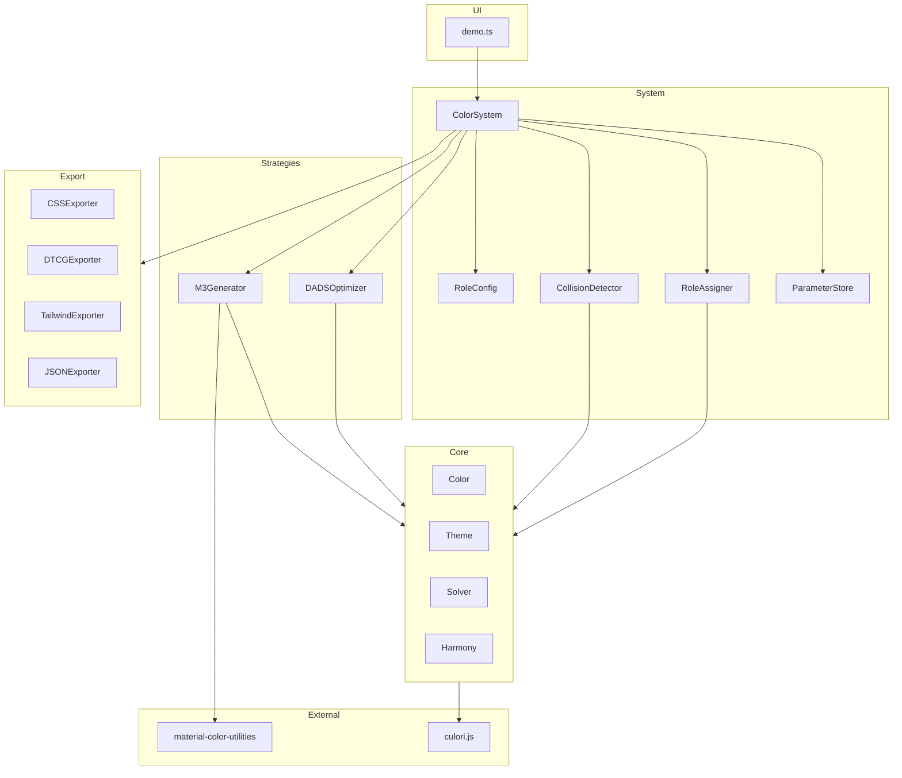
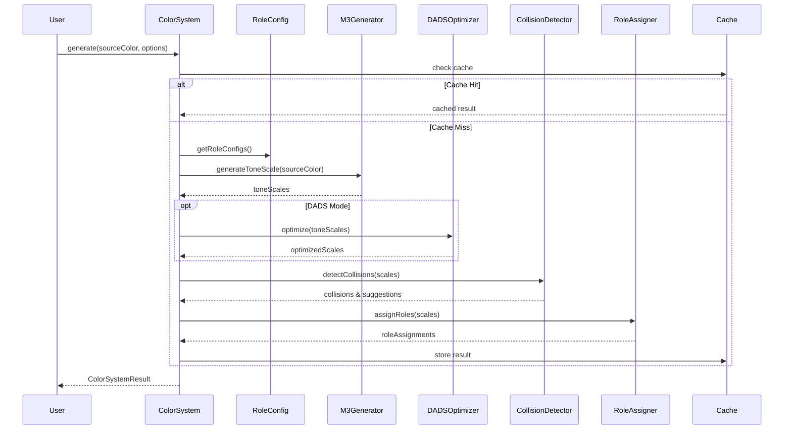
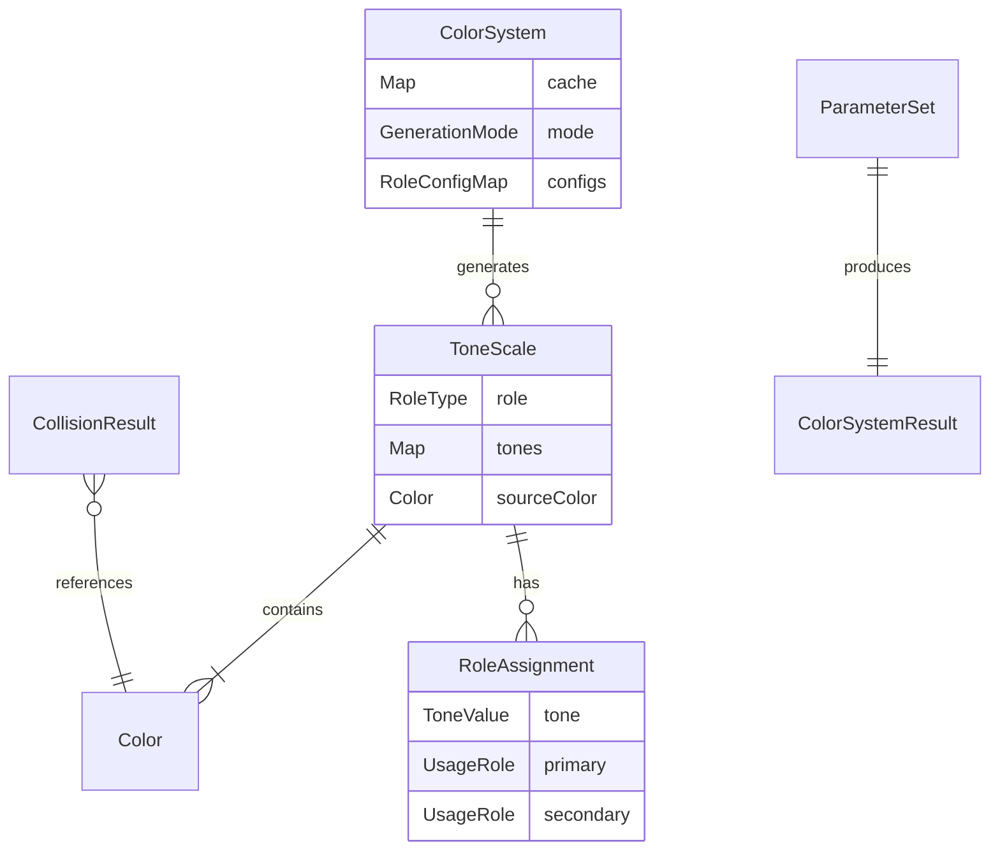

# Technical Design Document

## Overview

**Purpose**: 本機能は、デザインシステム向けの高度なカラーパレット生成エンジンを提供する。役割別L/C調整、ニュートラルスケール、セマンティック衝突回避、Material Design 3/DADS準拠のシェード生成を統合し、アクセシビリティを保証しながら知覚的に均一なOKLCHベースのカラーシステムを生成する。

**Users**: デザイナーはカラーパレットの設計と検証に、開発者はDesign Tokensの生成とエクスポートに本機能を利用する。

**Impact**: 既存のColor/Theme/Harmonyコアを拡張し、新しいColorSystemファサードレイヤーを追加する。demo.tsのUIは段階的にリファクタリングする。

### Goals
- 10の要件エリア（59 Acceptance Criteria）を満たすカラーシステム生成エンジン
- 既存core（Color, Theme, Solver）との互換性維持
- M3/DADSモードの重ねがけ対応
- 4種類のエクスポートフォーマット（CSS/DTCG/Tailwind/JSON）
- パフォーマンス目標: 単一スケール50ms、完全テーマ300ms

### Non-Goals
- React UIへの完全移行（本スコープ外）
- ダークモード自動生成（トークンセットは生成するが、テーマ切替UI は別機能）
- 国際化（i18n）対応（将来の拡張）

---

## Architecture

### Existing Architecture Analysis

現在のアーキテクチャは3層構造:
- **Core層**: Color, Theme, Solver, Interpolation, Harmony
- **Utils層**: color-space, wcag
- **Accessibility層**: apca, wcag2

**既存パターン**:
- Colorクラス: OKLCH内部状態、不変オブジェクト
- Theme: keyColors + ratios → コントラスト比ベースのスケール生成
- Solver: 二分探索によるLightness調整

**技術的負債**:
- harmonyの`generateSystemPalette()`がロール別パラメータを固定値で持つ
- demo.tsが約1000行で肥大化

### Architecture Pattern & Boundary Map

**Selected Pattern**: Facade + Strategy

ColorSystemファサードが統合エントリーポイントとなり、M3/DADSの各モードをStrategyとして切り替える。既存のColor/Theme/Solverは変更せず再利用する。



**Architecture Integration**:
- **Selected pattern**: Facade + Strategy（既存coreを変更せず拡張）
- **Domain boundaries**: system/がファサード、strategies/がモード切替、export/が出力
- **Existing patterns preserved**: Color不変オブジェクト、二分探索Solver、culori依存
- **New components rationale**: 各Strategyが単一責任を持ち独立テスト可能
- **Steering compliance**: TypeScript strict mode、依存性最小化

### Technology Stack

| Layer | Choice / Version | Role in Feature | Notes |
|-------|------------------|-----------------|-------|
| Core | TypeScript 5.3+ | 型安全なエンジン実装 | strict mode必須 |
| Color Library | culori.js 4.x | OKLCH変換、補間、gamut clamp | 既存依存 |
| M3 Support | @material/material-color-utilities 0.2.x | HCT色空間、トーンスケール生成 | 新規依存、約30KB |
| CVD Simulation | 自前実装（Brettel 1997） | 色覚多様性シミュレーション | 依存追加を回避 |
| Runtime | Bun 1.0+ | テスト、ビルド | 既存環境 |

### Mode と Strategy の関係

各モードでどのコンポーネントが動作するかを明示する：

| mode | M3Generator | DADSOptimizer | CollisionDetector | RoleAssigner | 備考 |
|------|-------------|---------------|-------------------|--------------|------|
| default | Off（Harmonyベース） | Off | Optional | On | 既存generateSystemPaletteをラップ |
| m3 | On | Off | Optional | On | M3トーンスケールを生成 |
| dads | Off（Themeベース） | On | On | On | 既存Themeをベースに最適化 |
| m3+dads | On | On | On | On | M3生成後にDADS最適化を適用 |

**Key Decision**: `default`モードは既存の`generateSystemPalette()`をラップし、後方互換性を維持する。`dads`単独モードは既存Themeベースのスケールに対してAAA最適化を適用する。

### L/C/H 調整の優先順位と境界

各コンポーネントがL/C/Hを調整する責務と優先順位：

1. **M3Generator**: トーン値に基づいてLを決定（Tone N ≒ L N%）。RoleConfigのlightnessRangeは無視し、M3仕様に従う
2. **RoleConfig**: default/dadsモードでのL/C/Hレンジを定義。M3モードでは参照されない
3. **DADSOptimizer**: AAA/APCAを満たすためにLを最優先で調整。RoleConfigのレンジ内に収まるよう試み、不可能な場合はレンジ外も許容しWarningを返す

**調整の制約**:
- DADSOptimizerはChroma/Hueを変更しない（Lのみ調整）
- RoleConfigレンジを超える場合は`ColorSystemResult.warnings`に記録
- M3モードとDADSモードの競合時はDADSが優先（アクセシビリティ最優先）

---

## System Flows

### カラーシステム生成フロー



**Key Decisions**:
- キャッシュはgenerateの最初でチェックし、ヒット時は即座に返す
- M3生成後にDADS最適化を適用（重ねがけ）
- 衝突検出は警告と提案を返すが、自動修正はオプション

---

## Requirements Traceability

| Requirement | Summary | Components | Interfaces | Flows |
|-------------|---------|------------|------------|-------|
| 1.1-1.9 | 役割別L/C調整 | RoleConfig, ColorSystem | RoleConfig interface | generate |
| 2.1-2.6 | ニュートラルスケール | RoleConfig, M3Generator | NeutralOptions | generate |
| 3.1-3.7 | セマンティック衝突回避 | CollisionDetector | CollisionResult | detectCollisions |
| 4.1-4.6 | M3準拠シェード | M3Generator | ToneScale | generateToneScale |
| 5.1-5.6 | DADSアクセシビリティ | DADSOptimizer | OptimizationResult | optimize |
| 6.1-6.6 | ロール自動割当 | RoleAssigner | RoleAssignment | assignRoles |
| 7.1-7.7 | エクスポート | Exporters | ExportOptions | export |
| 8.1-8.6 | プレビューUI | ColorSystem | GenerationResult | generate |
| 9.1-9.6 | パフォーマンス | ColorSystem Cache | CacheConfig | internal |
| 10.1-10.6 | バージョニング | ParameterStore | ParameterSet | save/load |

---

## Components and Interfaces

### Summary Table

| Component | Domain | Intent | Req Coverage | Key Dependencies | Contracts |
|-----------|--------|--------|--------------|------------------|-----------|
| ColorSystem | system | 統合ファサード、エントリーポイント | 1-10 | RoleConfig (P0), M3Generator (P0) | Service, State |
| RoleConfig | system | ロール別パラメータ定義 | 1, 2 | None | State |
| CollisionDetector | system | セマンティック衝突検出 | 3 | CVDSimulator (P1) | Service |
| M3Generator | strategies | M3トーンスケール生成 | 4 | material-color-utilities (P0) | Service |
| DADSOptimizer | strategies | アクセシビリティ最適化 | 5 | Solver (P1) | Service |
| RoleAssigner | system | ロール自動割当 | 6 | None | Service |
| Exporters | export | 出力フォーマット変換 | 7 | None | Service |
| ParameterStore | system | パラメータ保存/復元 | 10 | None | Service, State |

---

### System Layer

#### ColorSystem

| Field | Detail |
|-------|--------|
| Intent | カラーシステム生成の統合ファサード |
| Requirements | 1.1-10.6 |

**Responsibilities & Constraints**
- 全生成フローの統括とキャッシュ管理
- M3/DADSモードの状態管理
- エクスポート機能の提供

**Dependencies**
- Inbound: demo.ts — UI呼び出し (P0)
- Outbound: RoleConfig — パラメータ取得 (P0), M3Generator — スケール生成 (P0), DADSOptimizer — 最適化 (P1), CollisionDetector — 衝突検出 (P1), RoleAssigner — ロール割当 (P1), Exporters — 出力 (P1)

**Contracts**: Service [x] / State [x]

##### Service Interface

```typescript
interface ColorSystemService {
  generate(
    sourceColor: string | ColorObject,
    options: GenerationOptions
  ): ColorSystemResult;

  export(
    result: ColorSystemResult,
    format: ExportFormat,
    options?: ExportOptions
  ): string;

  save(result: ColorSystemResult): ParameterSet;
  load(params: ParameterSet): ColorSystemResult;

  compareParams(a: ParameterSet, b: ParameterSet): ParamDiff[];
}

interface GenerationOptions {
  mode: 'default' | 'm3' | 'dads' | 'm3+dads';
  roles?: RoleType[];
  collisionDetection?: boolean;
  autoApplyCollisionSuggestion?: boolean;  // default: false（UIに提案を返すのみ）
  cvdSimulation?: CVDType[];
  customRoleConfigs?: Partial<RoleConfigMap>;
}

interface ColorSystemResult {
  scales: Map<RoleType, ToneScale>;
  collisions: CollisionResult[];
  collisionSuggestions: AdjustmentSuggestion[];  // 適用されていない提案
  roleAssignments: Map<RoleType, RoleAssignment[]>;
  warnings: GenerationWarning[];  // L/C/Hレンジ超過などの警告
  metadata: GenerationMetadata;
}

interface GenerationWarning {
  type: 'range-exceeded' | 'contrast-impossible' | 'hct-conversion-fallback';
  role: RoleType;
  message: string;
  originalValue?: number;
  adjustedValue?: number;
}

type ExportFormat = 'css' | 'dtcg' | 'tailwind' | 'json';
```

- Preconditions: sourceColorが有効なカラー文字列またはColorObject
- Postconditions: 結果がキャッシュに保存される
- Invariants: 同一パラメータからは同一結果を生成（決定論的）

##### State Management

```typescript
interface ColorSystemState {
  cache: Map<string, ColorSystemResult>;
  currentMode: GenerationMode;
  roleConfigs: RoleConfigMap;
}
```

- Persistence: インメモリ（セッション内）
- Concurrency: シングルスレッド前提、将来的にWeb Worker対応

---

#### RoleConfig

| Field | Detail |
|-------|--------|
| Intent | ロール別のL/C/Hパラメータを定義 |
| Requirements | 1.1-1.9, 2.1-2.6 |

**Contracts**: State [x]

##### State Interface

```typescript
interface RoleConfig {
  name: RoleType;
  chromaRange: [number, number];  // e.g., [0.16, 0.25] for primary
  lightnessRange: [number, number];  // e.g., [0.4, 0.7]
  hueRange?: [number, number];  // e.g., [15, 45] for error
  isNeutral?: boolean;
}

type RoleType =
  | 'primary' | 'secondary' | 'tertiary'
  | 'error' | 'warning' | 'success'
  | 'neutral' | 'neutralVariant';

const DEFAULT_ROLE_CONFIGS: Record<RoleType, RoleConfig> = {
  primary: {
    name: 'primary',
    chromaRange: [0.16, 0.25],
    lightnessRange: [0.4, 0.7],
  },
  secondary: {
    name: 'secondary',
    chromaRange: [0.08, 0.16],
    lightnessRange: [0.4, 0.7],
  },
  // ... other roles
};
```

---

#### CollisionDetector

| Field | Detail |
|-------|--------|
| Intent | セマンティックカラー間の衝突を検出し提案を生成 |
| Requirements | 3.1-3.7 |

**Dependencies**
- Outbound: CVDSimulator — 色覚シミュレーション (P1)

**Contracts**: Service [x]

##### Service Interface

```typescript
interface CollisionDetectorService {
  detect(
    colors: Map<RoleType, Color>,
    options: CollisionDetectionOptions
  ): CollisionResult[];

  suggest(collision: CollisionResult): AdjustmentSuggestion;
}

interface CollisionDetectionOptions {
  baseHueThreshold: number;  // default: 30
  baseLightnessThreshold: number;  // default: 0.1
  baseChromaThreshold: number;  // default: 0.05
  pairThresholds?: PairThreshold[];  // e.g., primary-error: 45
  cvdTypes?: CVDType[];
  maxHueAdjustment: number;  // default: 30
}

interface CollisionResult {
  type: 'hue' | 'chroma-lightness' | 'cvd';
  severity: 'warning' | 'error';
  pair: [RoleType, RoleType];
  deltaH?: number;
  deltaC?: number;
  deltaL?: number;
  cvdType?: CVDType;
}

interface AdjustmentSuggestion {
  target: RoleType;
  adjustments: {
    hue?: number;
    chroma?: number;
    lightness?: number;
  };
  priority: 'chroma' | 'lightness' | 'hue';
}

type CVDType = 'protanopia' | 'deuteranopia' | 'tritanopia';
```

**Implementation Notes**
- CVDシミュレーションはBrettel 1997法を自前実装（linearRGB空間）
- 調整優先順位: Chroma → Lightness → Hue（元の色意図を尊重）

---

### Strategies Layer

#### M3Generator

| Field | Detail |
|-------|--------|
| Intent | Material Design 3準拠のトーンスケールを生成 |
| Requirements | 4.1-4.6 |

**Dependencies**
- External: @material/material-color-utilities — HCT変換 (P0)
- Outbound: Color, Solver — スケール生成 (P0)

**Contracts**: Service [x]

##### Service Interface

```typescript
interface M3GeneratorService {
  generateToneScale(
    sourceColor: Color,
    role: RoleType
  ): ToneScale;

  generateKeyColors(
    sourceColor: Color
  ): Map<M3KeyColor, Color>;
}

interface ToneScale {
  role: RoleType;
  tones: Map<ToneValue, Color>;  // 0, 10, 20, ..., 100
  sourceColor: Color;
}

type ToneValue = 0 | 10 | 20 | 30 | 40 | 50 | 60 | 70 | 80 | 90 | 95 | 99 | 100;
type M3KeyColor = 'primary' | 'secondary' | 'tertiary' | 'error' | 'neutral' | 'neutralVariant';
```

**Implementation Notes**
- HCT→ARGB→OKLCH変換パス
- トーン値とLightnessの対応: Tone N ≒ L N%（許容誤差ΔE < 0.01）

---

#### DADSOptimizer

| Field | Detail |
|-------|--------|
| Intent | WCAG AAA/APCA準拠のアクセシビリティ最適化 |
| Requirements | 5.1-5.6 |

**Dependencies**
- Outbound: Solver — Lightness調整 (P1), apca — APCA計算 (P1)

**Contracts**: Service [x]

##### Service Interface

```typescript
interface DADSOptimizerService {
  optimize(
    scales: Map<RoleType, ToneScale>,
    options: DADSOptions
  ): Map<RoleType, ToneScale>;

  generateInteractiveStates(
    baseColor: Color
  ): InteractiveStateColors;
}

interface DADSOptions {
  targetLevel: 'aa' | 'aaa';
  useAPCA: boolean;
  generateInteractiveStates: boolean;
}

interface InteractiveStateColors {
  focus: Color;
  hover: Color;
  active: Color;
  disabled: Color;
}
```

---

#### RoleAssigner

| Field | Detail |
|-------|--------|
| Intent | 生成されたシェードに推奨用途を割り当て |
| Requirements | 6.1-6.6 |

**Contracts**: Service [x]

##### Service Interface

```typescript
interface RoleAssignerService {
  assign(
    scale: ToneScale
  ): RoleAssignment[];

  verifyContrast(
    fg: Color,
    bg: Color
  ): ContrastVerification;
}

interface RoleAssignment {
  tone: ToneValue;
  color: Color;
  primaryUsage: UsageRole;
  secondaryUsage?: UsageRole;
  contrastWithWhite: number;
  contrastWithBlack: number;
}

type UsageRole =
  | 'background' | 'surface' | 'container'
  | 'text' | 'icon' | 'border'
  | 'focus' | 'hover' | 'active' | 'disabled';
```

---

### Export Layer

#### Exporters

| Field | Detail |
|-------|--------|
| Intent | 各フォーマットへの出力変換 |
| Requirements | 7.1-7.7 |

**Contracts**: Service [x]

##### Service Interface

```typescript
interface Exporter {
  export(
    result: ColorSystemResult,
    options?: ExportOptions
  ): string;
}

interface ExportOptions {
  colorSpace: 'oklch' | 'srgb' | 'p3';
  includeAlias: boolean;
  prefix?: string;
  indent?: number;
}

// 各エクスポーターが実装
class CSSExporter implements Exporter { /* ... */ }
class DTCGExporter implements Exporter { /* ... */ }
class TailwindExporter implements Exporter { /* ... */ }
class JSONExporter implements Exporter { /* ... */ }
```

**Implementation Notes**
- CSS: `@supports (color: oklch(0 0 0))`による広色域検出
- DTCG: `$value`, `$type`形式、semanticとaliasを分離

---

#### ParameterStore

| Field | Detail |
|-------|--------|
| Intent | 生成パラメータの保存と決定論的再生成 |
| Requirements | 10.1-10.6 |

**Contracts**: Service [x] / State [x]

##### Service Interface

```typescript
interface ParameterStoreService {
  save(result: ColorSystemResult): ParameterSet;
  load(params: ParameterSet): GenerationOptions;
  diff(a: ParameterSet, b: ParameterSet): ParamDiff[];
}

interface ParameterSet {
  version: string;
  timestamp: string;
  engineVersion: string;
  sourceColor: string;
  options: GenerationOptions;
  checksum: string;
}

interface ParamDiff {
  path: string;
  oldValue: unknown;
  newValue: unknown;
}
```

---

## Data Models

### Domain Model



**Aggregates**:
- ColorSystemResult: 生成結果の集約ルート
- ToneScale: ロールごとのスケール集約

**Business Rules**:
- 同一パラメータからは同一結果を生成（決定論的）
- M3モードとDADSモードは重ねがけ可能（DADS優先）

### Logical Data Model

**Color representation**:
```typescript
interface ColorObject {
  mode: 'oklch';
  l: number;  // 0-1
  c: number;  // 0-0.4
  h?: number; // 0-360
}
```

**Cache key design**:
```typescript
// キー形式: `${sourceHex}-${mode}-${rolesHash}`
const cacheKey = `${sourceColor.toHex()}-${options.mode}-${hashRoles(options.roles)}`;
```

### Cache と ParameterStore の役割分担

**Cache（短期メモリ）**:
- 目的: セッション内での高速な再アクセス
- 寿命: ColorSystemインスタンスと同じ（ページリロードでクリア）
- キー: `${sourceHex}-${mode}-${rolesHash}`
- 最大エントリ: 100件（超過時は最古を削除）

**ParameterStore（長期保存）**:
- 目的: 設定の永続化、チーム共有、履歴管理
- 寿命: ユーザーが明示的に保存/削除
- キー: `ParameterSet.checksum`（SHA-256ハッシュ）
- 用途: JSON/LocalStorage/APIへの保存

**統合方針**: 将来的にParameterSetのchecksumをcacheKeyとして利用可能。現時点では別管理とし、実装後に統合を検討。

### Color Space 変換コスト

**方針**: ColorはOKLCHのみを持ち、sRGB/P3はエクスポート時にculoriで変換する

**理由**:
- エクスポート回数は生成回数より圧倒的に少ない
- 事前計算は3倍のメモリ消費（OKLCH + sRGB + P3）
- culoriの変換は十分高速（1色あたり約0.01ms）

**将来の最適化**: エクスポート頻度が高い場合、Colorにlazy計算のsRGB/P3キャッシュを追加

---

## Error Handling

### Error Categories and Responses

**User Errors (4xx equivalent)**:
- Invalid color input → `InvalidColorError` with parsing guidance
- Invalid role configuration → `ConfigurationError` with valid ranges

**System Errors**:
- HCT conversion failure → Fallback to approximate conversion with warning
- Cache overflow → Clear oldest entries (LRU behavior)

**Business Logic Errors**:
- Collision cannot be resolved within constraints → Return original with suggestions
- AAA contrast impossible → Return closest achievable with warning

### Monitoring

- Generation time logging for performance tracking
- Cache hit/miss ratio monitoring
- Collision detection frequency tracking

---

## Testing Strategy

### Unit Tests
- RoleConfig: パラメータバリデーション、デフォルト値
- CollisionDetector: ΔH/ΔC/ΔL計算、閾値判定、CVDシミュレーション
- M3Generator: HCT→OKLCH変換精度（ΔE < 0.01）
- DADSOptimizer: コントラスト調整、AAA達成
- Exporters: 各フォーマットの出力形式

### Integration Tests
- ColorSystem.generate(): 全モードでの生成フロー
- キャッシュヒット/ミスの動作
- パラメータ保存/復元の往復

### Performance Tests
- 単一スケール生成: < 50ms
- 完全テーマ生成: < 300ms
- キャッシュ有効時: < 5ms

### Snapshot Tests（ゴールデンスナップショット）
- Exporters: 特定の入力（sourceColor + options）に対する出力をゴールデンとして保存
  - CSS: `primary-#0066CC-m3.css.snap`
  - DTCG: `primary-#0066CC-m3.tokens.json.snap`
  - Tailwind: `primary-#0066CC-m3.tailwind.snap`
- ColorSystemResult: 生成結果のJSON構造をスナップショット化
- リファクタリング時の回帰検出に活用

---

## Performance & Scalability

### Target Metrics
- Single scale (13 tones): < 50ms
- Full theme (6 roles × 13 tones): < 300ms
- Cache hit: < 5ms
- Memory: < 10MB for 100 cached results

### Optimization Techniques
- Simple Map cache (no LRU complexity)
- Incremental update for partial parameter changes
- Async generation via `requestIdleCallback` (Web Worker if needed later)

### 非同期 API 方針

**現時点**: `generate()`は同期APIとして実装する

**理由**:
- パフォーマンス目標（50ms/300ms）は同期処理で達成可能
- UIの複雑化を避ける

**将来の拡張**: パフォーマンス測定でボトルネックが判明した場合に以下を追加
```typescript
interface ColorSystemService {
  // 既存の同期API
  generate(sourceColor: string | ColorObject, options: GenerationOptions): ColorSystemResult;

  // 将来追加する非同期API
  generateAsync?(sourceColor: string | ColorObject, options: GenerationOptions): Promise<ColorSystemResult>;
}
```

**Web Worker方針**: `generateAsync()`内部でWorkerに処理を委譲。クライアント側でのラッピングは不要。

---

## Supporting References

### CVD Simulation Matrices (Brettel 1997)

詳細な変換行列とアルゴリズムは`research.md`を参照。

### Export Format Examples

CSS Custom Properties形式:
```css
:root {
  --color-primary-500: oklch(0.65 0.2 250);
  --color-primary-500-srgb: #4a7dff;
}

@supports (color: oklch(0 0 0)) {
  :root {
    --color-primary-500: oklch(0.65 0.2 250);
  }
}
```

DTCG形式の詳細構造は`research.md`を参照。
