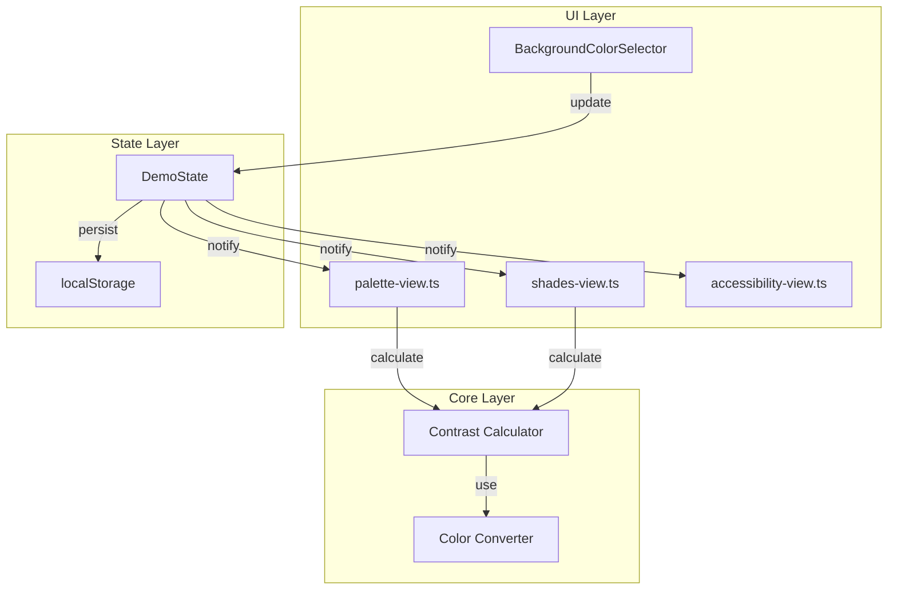
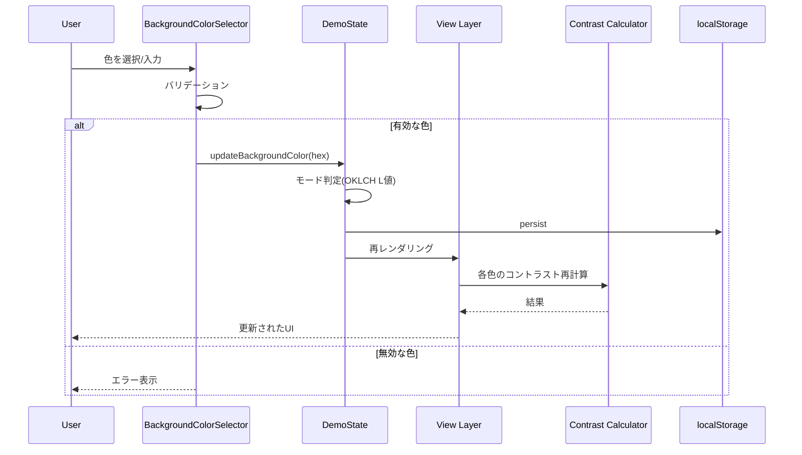
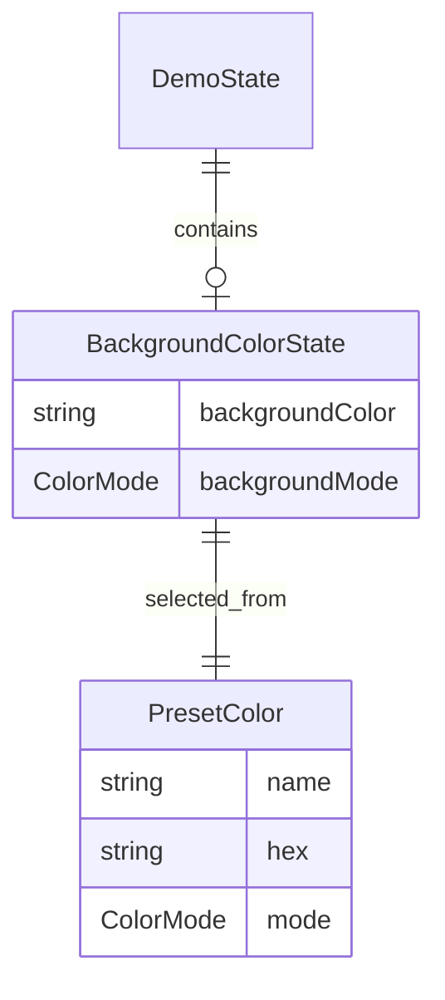
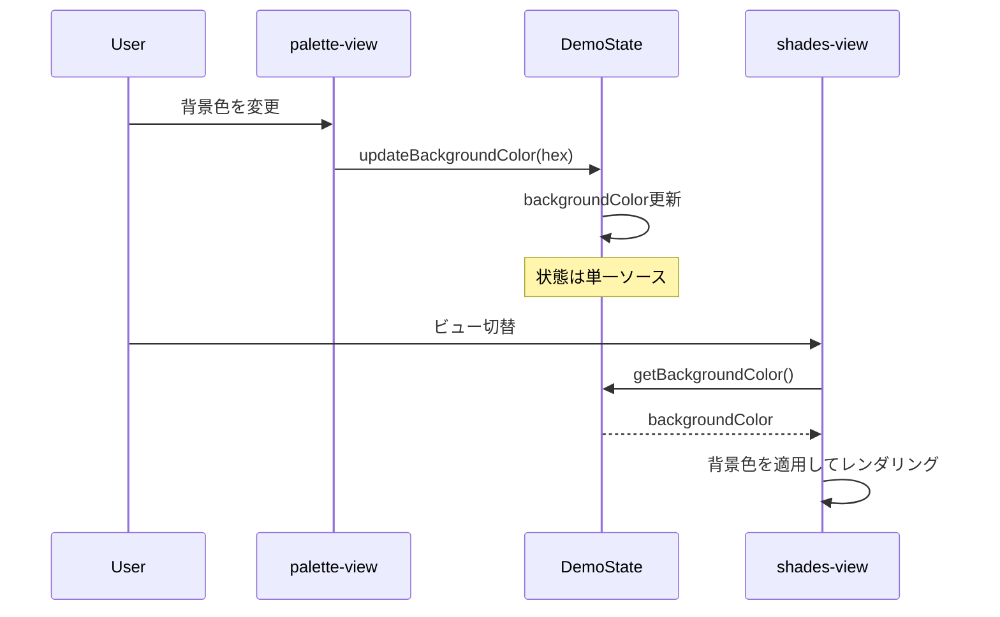

# Design Document: 背景色変更機能

## Overview

**Purpose**: パレット画面およびシェード画面で任意の背景色を選択し、コントラスト値をリアルタイムで再計算する機能を提供する。

**Users**: デザイナーが実際のUI背景色に対してパレットの視認性とWCAGコンプライアンスを確認するために使用。

**Impact**: 現在の固定白背景（#ffffff）を動的に変更可能にし、コントラスト計算の基準色を可変化する。

### Goals
- 任意の背景色選択（カラーピッカー、HEX入力、OKLCH入力）
- 背景色変更時のコントラスト値リアルタイム再計算
- light/darkモード自動判定によるUI適応
- セッション/永続化による状態維持

### Non-Goals
- テーマプリセットのエクスポート機能
- 複数背景色の同時比較
- グラデーション背景のサポート

## Architecture

### Existing Architecture Analysis

現在のデモUIは以下の構造を持つ:
- **状態管理**: `src/ui/demo/state.ts`のシングルトンDemoState
- **ビュー層**: `src/ui/demo/views/`の各ビュー（palette-view, shades-view, accessibility-view）
- **コントラスト計算**: `src/utils/wcag.ts`のgetContrast + culori.jsのwcagContrast
- **永続化**: localStorageパターン（cud-components.tsに前例）

### Architecture Pattern & Boundary Map



**Architecture Integration**:
- Selected pattern: 既存DemoStateへの拡張（シングルトン + observer pattern）
- Domain/feature boundaries: UI層（セレクター）→ 状態層 → コア層（計算）の一方向依存
- Existing patterns preserved: シングルトン状態管理、resetState()パターン
- New components rationale: BackgroundColorSelectorは背景色選択UIを集約
- Steering compliance: 依存方向（UI → Core → Utils）を維持

### Technology Stack

| Layer | Choice / Version | Role in Feature | Notes |
|-------|------------------|-----------------|-------|
| Frontend | TypeScript 5.3+ / Vanilla TS | 背景色セレクターUI | 既存パターン継承 |
| Color Library | culori.js | OKLCH変換（D65準拠）、WCAGコントラスト | 既存依存、CSS Color 4準拠 |
| APCA Library | apca-w3 ^0.1.9 | APCAコントラスト計算 | プロジェクト既存依存 |
| Storage | localStorage API | 背景色永続化 | ブラウザ標準 |

## System Flows

### 背景色変更フロー



## Requirements Traceability

| Requirement | Summary | Components | Interfaces | Flows |
|-------------|---------|------------|------------|-------|
| 1.1 | 背景色セレクター表示 | BackgroundColorSelector | BackgroundColorSelectorProps | - |
| 1.2 | 入力方法（ピッカー/HEX） | BackgroundColorSelector | - | - |
| 1.3 | 詳細モード（OKLCH） | BackgroundColorSelector | - | - |
| 1.4 | 入力検証 | validateBackgroundColor | ValidationResult | - |
| 1.5 | エラー表示 | BackgroundColorSelector | - | - |
| 1.6 | プレビュー表示 | BackgroundColorSelector | - | - |
| 2.1 | プリセット背景色 | BackgroundColorSelector | PresetColor | - |
| 2.2 | プリセット適用 | BackgroundColorSelector | - | 背景色変更フロー |
| 2.3 | モード関連付け | BackgroundColorSelector | ColorMode | - |
| 2.4 | モード自動判定 | determineColorMode | ColorMode | - |
| 2.5 | OKLCH変換 | toOklch | - | - |
| 3.1 | コントラスト再計算 | recalculateContrasts | ContrastResult | 背景色変更フロー |
| 3.2 | WCAG+APCA更新 | recalculateContrasts | - | - |
| 3.3 | バッジ判定 | getContrastLevel | ContrastLevel | - |
| 3.4 | 輝度計算 | getContrast | - | - |
| 3.5 | シェードホバー反映 | shades-view | - | - |
| 4.1 | リアルタイムプレビュー | BackgroundColorSelector | - | - |
| 4.2 | デバウンス処理 | BackgroundColorSelector | - | - |
| 4.3 | 200ms以内計算 | recalculateContrasts | - | - |
| 4.4 | シームレス更新 | View Layer | - | - |
| 5.1 | 状態管理 | DemoState | BackgroundColorState | - |
| 5.2 | ビュー切替維持 | state.ts | - | - |
| 5.3 | localStorage保存 | persistBackgroundColor | - | - |
| 5.4 | フォールバック | loadBackgroundColor | - | - |
| 5.5 | 画面間背景色同期 | DemoState, Views | - | 背景色変更フロー |
| 5.6 | シェード画面背景色適用 | shades-view | - | - |
| 6.1 | テキスト色切替 | View Layer | ColorMode | - |
| 6.2 | バッジ色調整 | View Layer | - | - |
| 6.3 | ボーダー色調整 | View Layer | - | - |
| 6.4 | 低コントラストボーダー | View Layer | - | - |

## Components and Interfaces

| Component | Domain/Layer | Intent | Req Coverage | Key Dependencies | Contracts |
|-----------|--------------|--------|--------------|------------------|-----------|
| BackgroundColorSelector | UI | 背景色選択UI | 1.1-1.6, 2.1-2.5, 4.1-4.2 | DemoState (P0) | State |
| DemoState拡張 | State | 背景色状態管理 | 5.1-5.6 | localStorage (P1) | State |
| recalculateContrasts | Core | コントラスト再計算 | 3.1-3.4, 4.3 | wcag.ts (P0) | Service |
| View Layer更新 | UI | UI適応表示 | 6.1-6.4 | DemoState (P0) | - |
| shades-view背景色適用 | UI | シェード画面背景色同期 | 5.5, 5.6 | DemoState (P0) | - |

### UI Layer

#### BackgroundColorSelector

| Field | Detail |
|-------|--------|
| Intent | 背景色選択のためのUI集約コンポーネント |
| Requirements | 1.1, 1.2, 1.3, 1.4, 1.5, 1.6, 2.1, 2.2, 2.3, 2.4, 2.5, 4.1, 4.2 |

**Responsibilities & Constraints**
- カラーピッカー、HEX入力、OKLCH入力の統合
- プリセットボタンの表示と選択
- 入力バリデーションとエラー表示
- デバウンス処理（HEX入力時150ms）

**Dependencies**
- Inbound: palette-view, shades-view — セレクター埋め込み (P0)
- Outbound: DemoState — 状態更新 (P0)
- External: culori.js — 色変換 (P0)

**Contracts**: State [x]

##### State Management

```typescript
interface BackgroundColorSelectorProps {
  /** 現在の背景色（HEX） */
  currentColor: string;
  /** 色変更時のコールバック */
  onColorChange: (hex: string) => void;
  /** 詳細モード表示フラグ */
  showAdvancedMode?: boolean;
}

interface PresetColor {
  name: string;
  hex: string;
  mode: ColorMode;
}

type ColorMode = "light" | "dark";

const PRESET_COLORS: PresetColor[] = [
  { name: "White", hex: "#ffffff", mode: "light" },
  { name: "Light Gray", hex: "#f8fafc", mode: "light" },
  { name: "Dark Gray", hex: "#18181b", mode: "dark" },
  { name: "Black", hex: "#000000", mode: "dark" },
];
```

**Implementation Notes**
- Integration: palette-viewとshades-viewの上部に配置
- Validation: HEX正規表現 `^#[0-9A-Fa-f]{6}$`、OKLCH範囲チェック
- Risks: カラーピッカーのブラウザ間差異（許容範囲）

### State Layer

#### DemoState拡張

| Field | Detail |
|-------|--------|
| Intent | 背景色状態の一元管理 |
| Requirements | 5.1, 5.2, 5.3, 5.4 |

**Responsibilities & Constraints**
- backgroundColor, backgroundModeの状態保持
- ビュー切替時の状態維持
- localStorage永続化/復元

**Dependencies**
- Inbound: BackgroundColorSelector — 状態更新 (P0)
- Outbound: localStorage — 永続化 (P1)

**Contracts**: State [x]

##### State Management

```typescript
// types.ts への追加
interface DemoState {
  // ... 既存フィールド
  /** 背景色（HEX形式） */
  backgroundColor: string;
  /** 背景色モード */
  backgroundMode: ColorMode;
}

// constants.ts への追加
const DEFAULT_STATE: DemoState = {
  // ... 既存フィールド
  backgroundColor: "#ffffff",
  backgroundMode: "light",
};
```

##### Service Interface

```typescript
// state.ts への追加
interface BackgroundColorService {
  /** 背景色を更新 */
  updateBackgroundColor(hex: string): void;
  /** 背景色モードを取得 */
  getBackgroundMode(): ColorMode;
  /** localStorageから復元 */
  loadBackgroundColor(): void;
  /** localStorageに保存 */
  persistBackgroundColor(): void;
}
```

- Preconditions: hexは有効な6桁HEX形式
- Postconditions: state.backgroundColor更新、mode自動判定、localStorage同期
- Invariants: backgroundColorは常に有効なHEX値

**Implementation Notes**
- Integration: resetState()にbackgroundColor/backgroundModeのリセットを追加
- Validation: loadBackgroundColor()で無効値の場合デフォルトにフォールバック
- Risks: localStorageクォータ超過（背景色のみなので問題なし）

### Core Layer

#### recalculateContrasts

| Field | Detail |
|-------|--------|
| Intent | 指定背景色に対する全色のコントラスト再計算 |
| Requirements | 3.1, 3.2, 3.3, 3.4, 4.3 |

**Responsibilities & Constraints**
- 20色パレットに対して200ms以内で完了
- WCAG 2.1コントラスト比とAPCA両方を計算
- AAA/AA/Lレベル判定

**Dependencies**
- Inbound: View Layer — 再計算要求 (P0)
- External: culori.js — wcagContrast (P0)

**Contracts**: Service [x]

##### Service Interface

```typescript
// src/utils/wcag.ts への追加
interface ContrastResult {
  /** WCAG 2.1 コントラスト比 (1-21) */
  wcagRatio: number;
  /** APCA Lc値 */
  apcaLc: number;
  /** WCAGレベル */
  level: ContrastLevel;
}

type ContrastLevel = "AAA" | "AA" | "L" | "fail";

/** コントラスト結果を計算 */
function calculateContrastResult(
  foreground: ColorObject,
  background: ColorObject
): ContrastResult;

/** コントラストレベルを判定 */
function getContrastLevel(ratio: number): ContrastLevel;
```

- Preconditions: foreground, backgroundは有効なColorObject
- Postconditions: 正確なコントラスト比とレベルを返却
- Invariants: AAA≥7.0, AA≥4.5, L≥3.0

**Implementation Notes**
- Integration: 既存getContrast()を拡張
- Validation: 無効な色オブジェクトの場合はデフォルト値返却
- Risks: APCA計算の精度（apca-w3ライブラリ依存）

## Data Models

### Domain Model



### Logical Data Model

**BackgroundColorState**
- `backgroundColor`: HEX形式文字列（#RRGGBB）
- `backgroundMode`: "light" | "dark"
- デフォルト: `#ffffff`, `"light"`

**localStorage Key**: `leonardo-backgroundColor`

**Serialization Format**:
```json
{
  "hex": "#ffffff",
  "mode": "light"
}
```

## Error Handling

### Error Strategy
入力検証でフェイルファスト、無効値はフォールバックで回復。

### Error Categories and Responses

**User Errors (Validation)**:
- 無効なHEX形式 → エラーメッセージ表示、前の有効値を維持
- OKLCH範囲外 → エラーメッセージ表示、前の有効値を維持

**System Errors (Storage)**:
- localStorage読み込み失敗 → デフォルト値（#ffffff）にフォールバック
- localStorage書き込み失敗 → コンソール警告、動作継続

### Monitoring
- バリデーションエラーはconsole.warnでログ
- localStorage操作エラーはconsole.errorでログ

## Testing Strategy

### Unit Tests
- `validateBackgroundColor`: HEX/OKLCH形式バリデーション
- `determineColorMode`: L値境界ケース（0.49, 0.50, 0.51）
- `getContrastLevel`: AAA/AA/L/fail判定境界
- `calculateContrastResult`: 既知の色ペアでの検証
- `persistBackgroundColor/loadBackgroundColor`: localStorage操作

### Integration Tests
- BackgroundColorSelector → DemoState連携
- DemoState変更 → View再レンダリング
- プリセット選択 → 背景色 + モード適用

### E2E Tests
- カラーピッカーで色選択 → コントラスト値更新確認
- HEX入力 → デバウンス後に更新確認
- ページリロード → 背景色復元確認
- ビュー切替 → 背景色維持確認

### Performance Tests
- 20色パレットのコントラスト再計算: 200ms以内

## UI Adaptation Rules (Requirements 6.1-6.4)

### ColorMode Detection

**OKLCH D65変換仕様**:
- culori.jsの`oklch()`関数を使用（CSS Color 4 / D65白色点準拠）
- 入力: sRGB HEX文字列（例: `#ffffff`）
- 出力: OKLCH { l: 0-1, c: 0-0.4, h: 0-360 }

**モード判定ロジック**:
```typescript
import { oklch, parse } from "culori";

function determineColorMode(hex: string): ColorMode {
  const color = parse(hex);
  if (!color) return "light"; // フォールバック
  const oklchColor = oklch(color);
  // L > 0.5 → light, L ≤ 0.5 → dark
  return oklchColor.l > 0.5 ? "light" : "dark";
}
```

**検証用サンプル色**:
| HEX | OKLCH L値 | 期待モード |
|-----|-----------|-----------|
| #ffffff | 1.000 | light |
| #f8fafc | 0.977 | light |
| #808080 | 0.600 | light |
| #6b7280 | 0.554 | light |
| #4b5563 | 0.446 | dark |
| #18181b | 0.179 | dark |
| #000000 | 0.000 | dark |

### Shades View Background Synchronization (5.5, 5.6)

シェード画面の背景色をパレット画面と同期させる仕様:

**同期メカニズム**:
- DemoStateの`backgroundColor`を単一ソースとして使用
- 各ビュー（palette-view, shades-view）はDemoStateを参照
- 背景色変更時、全ビューが同じ状態を参照するため自動同期

**shades-view適用箇所**:
```typescript
// shades-view.ts での背景色適用
function renderShadesView(): void {
  const { backgroundColor, backgroundMode } = state;

  // シェードプレビュー領域の背景色を適用
  const previewContainer = document.querySelector('.shades-preview');
  if (previewContainer) {
    previewContainer.style.backgroundColor = backgroundColor;
  }

  // シェードグリッドの背景色を適用
  const shadesGrid = document.querySelector('.shades-grid');
  if (shadesGrid) {
    shadesGrid.style.backgroundColor = backgroundColor;
  }
}
```

**適用対象DOM要素**:
| 要素 | CSSセレクタ | 適用スタイル |
|------|-------------|--------------|
| シェードプレビュー領域 | `.shades-preview` | `background-color: ${backgroundColor}` |
| シェードグリッド | `.shades-grid` | `background-color: ${backgroundColor}` |
| 個別シェードスウォッチ | `.shade-swatch` | ボーダー色（6.3, 6.4準拠） |

**画面間同期フロー**:


### UI Adaptation Specifications

#### 6.1 テキスト色切替
| Mode | Text Color | CSS Variable |
|------|------------|--------------|
| light | #18181b (zinc-900) | --fg-primary |
| dark | #f4f4f5 (zinc-100) | --fg-primary |

#### 6.2 バッジ色調整
コントラストレベルバッジの色をモードに応じて調整:

```typescript
interface BadgeColorScheme {
  background: string;
  text: string;
  border: string;
}

const BADGE_COLORS: Record<ContrastLevel, Record<ColorMode, BadgeColorScheme>> = {
  AAA: {
    light: { background: "#dcfce7", text: "#166534", border: "#86efac" },
    dark: { background: "#14532d", text: "#bbf7d0", border: "#22c55e" }
  },
  AA: {
    light: { background: "#dbeafe", text: "#1e40af", border: "#93c5fd" },
    dark: { background: "#1e3a5f", text: "#bfdbfe", border: "#3b82f6" }
  },
  L: {
    light: { background: "#fef3c7", text: "#92400e", border: "#fcd34d" },
    dark: { background: "#78350f", text: "#fde68a", border: "#f59e0b" }
  },
  fail: {
    light: { background: "#fee2e2", text: "#991b1b", border: "#fca5a5" },
    dark: { background: "#7f1d1d", text: "#fecaca", border: "#ef4444" }
  }
};
```

#### 6.3 ボーダー色調整
スウォッチ（色見本）のボーダー色をモードに応じて調整:

| Mode | Border Color | CSS Variable |
|------|--------------|--------------|
| light | #e4e4e7 (zinc-200) | --border-default |
| dark | #3f3f46 (zinc-700) | --border-default |

#### 6.4 低コントラストボーダー強調
背景色とスウォッチ色のコントラスト比が1.5未満の場合、視認性確保のためボーダーを強調:

```typescript
function getSwatchBorderStyle(
  swatchHex: string,
  backgroundHex: string,
  mode: ColorMode
): { border: string; boxShadow?: string } {
  const contrast = wcagContrast(swatchHex, backgroundHex);

  if (contrast < 1.5) {
    // 低コントラスト時: 強調ボーダー + シャドウ
    return {
      border: mode === "light"
        ? "2px solid #71717a" // zinc-500
        : "2px solid #a1a1aa", // zinc-400
      boxShadow: mode === "light"
        ? "0 0 0 1px rgba(0,0,0,0.1)"
        : "0 0 0 1px rgba(255,255,255,0.1)"
    };
  }

  // 通常時
  return {
    border: mode === "light"
      ? "1px solid #e4e4e7" // zinc-200
      : "1px solid #3f3f46"  // zinc-700
  };
}
```

**コントラスト閾値**:
- 1.5未満: 強調ボーダー適用（視認性リスク）
- 1.5以上: 通常ボーダー

## APCA Contrast Calculation

### Library Specification
- **Package**: `apca-w3` ^0.1.9
- **Existing Usage**: `src/accessibility/apca.ts`

### API Usage
```typescript
import { APCAcontrast, sRGBtoY } from "apca-w3";

function calculateApcaLc(foregroundHex: string, backgroundHex: string): number {
  const fgY = sRGBtoY(hexToRgbArray(foregroundHex));
  const bgY = sRGBtoY(hexToRgbArray(backgroundHex));
  return APCAcontrast(fgY, bgY);
}
```

### Output Format
- **Lc値**: -108 〜 +106 の範囲
- **表示**: 絶対値で表示（例: "Lc 75"）
- **用途**: 参考情報として表示（WCAGレベル判定には使用しない）

## Performance & Scalability

### Target Metrics
- コントラスト再計算: 20色で200ms以内
- デバウンス: HEX入力時150ms

### Optimization
- culori.jsのwcagContrastは十分高速（単一計算<1ms）
- 20色×1背景色 = 20回の計算は問題なし
- 必要に応じてメモ化（現時点では不要）
