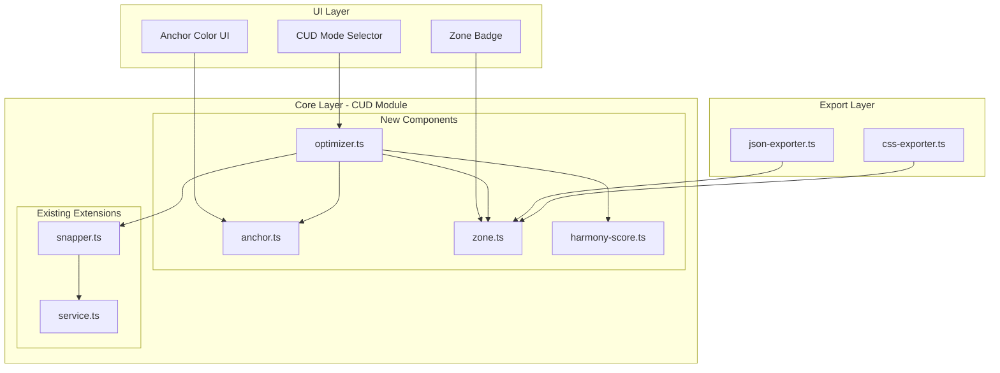
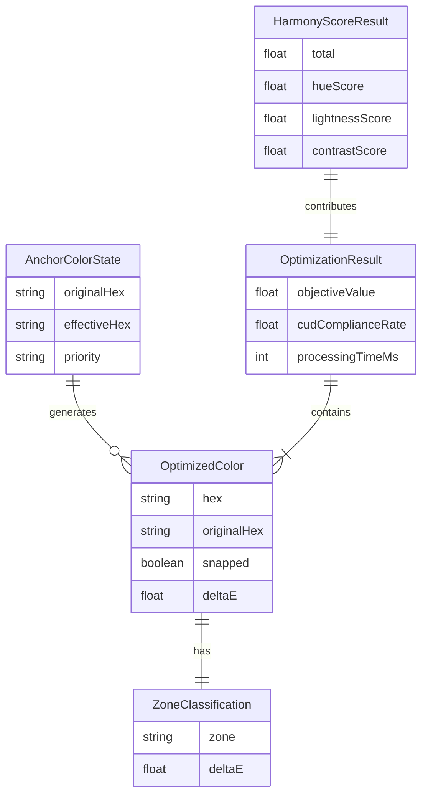

# Design Document: CUD-aware Harmony Generator

## Overview

**Purpose**: 本機能は、ブランドカラーを核にCUD（カラーユニバーサルデザイン）推奨配色に寄せつつ、ブランド調とも破綻しないハーモニー生成を実現する。既存の表示時スナップ機能を拡張し、**生成時**にCUD最適化を行う新しいアルゴリズムを提供する。

**Users**: デザイナーおよび開発者は、アクセシビリティ要件（色覚多様性対応）を満たしながら、ブランドアイデンティティを維持したカラーパレットを効率的に作成できる。

**Impact**: 既存のCUDモジュール（service, snapper, validator）およびUIコンポーネントを拡張し、4段階のCUD対応モード（Off/Guide/Soft Snap/Strict）を導入する。

### Goals
- ブランドカラーを基準（アンカー）としたCUD最適化パレット生成
- CUD距離とブランド調和のバランスを取る多目的最適化
- 4段階モードによる柔軟なCUD対応レベル選択
- 20色パレットで200ms以内の最適化パフォーマンス

### Non-Goals
- CUD PDFの全表完全再現
- JPMA/CMYKデータの完全サポート
- 生成アルゴリズム自体の変更（既存HCTベース生成は維持）
- 遺伝的アルゴリズム等の高度な最適化手法（将来検討）

## Architecture

### Existing Architecture Analysis

現行システムは以下の3層アーキテクチャで構成されている：

```
src/core/cud/
├── colors.ts      # CUD 20色定義（OKLCH/OKLab値含む）
├── service.ts     # findNearestCudColor(), MatchLevel判定
├── snapper.ts     # snapToCudColor(), strict/preferモード
├── validator.ts   # validatePalette(), 各種検証チェック
├── cvd.ts         # CVDシミュレーター
└── classifier.ts  # 色分類器

src/core/harmony.ts  # HCTベースハーモニー生成
src/ui/cud-components.ts  # 3モードUI（off/guide/strict）
```

**統合ポイント**:
- `findNearestCudColor()`: CUD色検索の基盤関数（再利用）
- `snapToCudColor()`: スナップ処理（Soft Snap拡張対象）
- `CudCompatibilityMode`: モード型定義（4モードに拡張）

### Architecture Pattern & Boundary Map



**Architecture Integration**:
- **Selected Pattern**: ハイブリッド（新規モジュール4件 + 既存拡張4件）
- **Domain Boundaries**: CUD最適化ロジックを`src/core/cud/`に集約、UIは`src/ui/`に分離
- **Existing Patterns Preserved**: deltaEokベース色差計算、TypeScript strict mode
- **New Components Rationale**: 責務分離（anchor, zone, optimizer, harmony-score）
- **Steering Compliance**: 依存方向（UI→Core→Utils）を維持

### Technology Stack

| Layer | Choice / Version | Role in Feature | Notes |
|-------|------------------|-----------------|-------|
| Frontend | Vanilla TS + Web Components | モードセレクター、バッジUI | 既存パターン踏襲 |
| Core Logic | TypeScript 5.3+ strict | 最適化アルゴリズム、スコア計算 | culori.js依存 |
| Color Math | culori.js | deltaEok, OKLCH/OKLab変換 | 既存依存を継続 |
| Storage | LocalStorage | モード設定永続化 | 新規追加 |

## System Flows

### CUD-aware Palette Generation Flow

```mermaid
sequenceDiagram
    participant User
    participant UI as Mode Selector
    participant Opt as Optimizer
    participant Anchor as Anchor Manager
    participant Zone as Zone Classifier
    participant Score as Harmony Scorer
    participant Snap as Snapper

    User->>UI: Set anchor color + mode
    UI->>Anchor: createAnchorColor(hex)
    Anchor-->>UI: AnchorColorState

    alt Mode is Soft Snap or Strict
        UI->>Opt: optimizePalette(candidates, anchor, options)
        Opt->>Zone: classifyZone(deltaE)
        Zone-->>Opt: CudZone
        Opt->>Score: calculateHarmonyScore(anchor, palette)
        Score-->>Opt: HarmonyScoreResult

        loop For each color
            alt Soft Snap Mode
                Opt->>Snap: softSnapToCudColor(hex, options)
            else Strict Mode
                Opt->>Snap: snapToCudColor(hex, strict)
            end
            Snap-->>Opt: SnapResult
        end

        Opt-->>UI: OptimizationResult
    else Mode is Guide
        UI->>Zone: classifyZone(deltaE)
        Zone-->>UI: Zone badges only
    end

    UI-->>User: Display optimized palette
```

**Key Decisions**:
- Soft SnapはZone判定結果に基づいて戻り係数を適用
- Strictは全色をCUD推奨色にハードスナップ
- Guideは検証表示のみでスナップなし

## Requirements Traceability

| Requirement | Summary | Components | Interfaces | Flows |
|-------------|---------|------------|------------|-------|
| 1.1-1.6 | アンカーカラー設定 | Anchor, AnchorUI | AnchorColorState, createAnchorColor | Anchor Setup |
| 2.1-2.6 | CUD許容ゾーン定義 | Zone | CudZone, ZoneThresholds, classifyZone | Zone Classification |
| 3.1-3.6 | CUD-aware最適化 | Optimizer | OptimizationOptions, optimizePalette | Optimization Flow |
| 4.1-4.6 | ブランド調和スコア | HarmonyScore | HarmonyScoreResult, calculateHarmonyScore | Score Calculation |
| 5.1-5.6 | Soft Snapモード | Snapper | SoftSnapOptions, softSnapToCudColor | Soft Snap Flow |
| 6.1-6.7 | 4段階モードセレクター | ModeSelector | CudCompatibilityMode | Mode Switch Flow |
| 7.1-7.5 | エクスポート拡張 | JSONExporter, CSSExporter | CudExportMetadata | Export Flow |
| 8.1-8.6 | 非機能要件 | All | - | Performance Tests |

## Components and Interfaces

### Component Summary

| Component | Domain/Layer | Intent | Req Coverage | Key Dependencies | Contracts |
|-----------|--------------|--------|--------------|------------------|-----------|
| Anchor | Core/CUD | アンカーカラー状態管理 | 1.1-1.6 | Service (P0) | Service |
| Zone | Core/CUD | ゾーン判定・閾値管理 | 2.1-2.6 | None | Service |
| Optimizer | Core/CUD | CUD最適化アルゴリズム | 3.1-3.6 | Anchor, Zone, HarmonyScore, Snapper (P0) | Service |
| HarmonyScore | Core/CUD | 調和スコア計算 | 4.1-4.6 | color-space (P1) | Service |
| Snapper (ext) | Core/CUD | Soft Snap機能追加 | 5.1-5.6 | Zone, Service (P0) | Service |
| ModeSelector (ext) | UI | 4モードUI | 6.1-6.7 | Optimizer (P1) | State |
| JSONExporter (ext) | Export | CUDメタデータ追加 | 7.1-7.5 | Zone (P1) | Service |

### Core Layer - CUD Module

#### Anchor (anchor.ts)

| Field | Detail |
|-------|--------|
| Intent | ブランドカラーをアンカーとして管理し、CUD優先度設定を保持 |
| Requirements | 1.1, 1.2, 1.3, 1.4, 1.5, 1.6 |

**Responsibilities & Constraints**
- ブランドカラーの入力とCUD最近接色の検索を統合
- 優先度（brand/cud）に基づく実効色の決定
- 状態のイミュータブル管理

**Dependencies**
- Inbound: UI components — アンカー設定 (P0)
- Outbound: Service — findNearestCudColor (P0)

**Contracts**: Service [x]

##### Service Interface
```typescript
/** アンカーカラー優先度 */
type AnchorPriority = "brand" | "cud";

/** アンカーカラー状態 */
interface AnchorColorState {
  /** 元のブランドカラー（HEX） */
  originalHex: string;
  /** CUD最近接色の検索結果 */
  nearestCud: CudSearchResult;
  /** 優先度設定 */
  priority: AnchorPriority;
  /** 実効色（優先度に応じた使用色） */
  effectiveHex: string;
}

interface AnchorService {
  /** アンカーカラー状態を作成 */
  createAnchorColor(hex: string): AnchorColorState;

  /** 優先度を変更 */
  setAnchorPriority(
    anchor: AnchorColorState,
    priority: AnchorPriority
  ): AnchorColorState;

  /** 自動優先度判定（exact/nearならcud、それ以外はbrand） */
  suggestPriority(anchor: AnchorColorState): AnchorPriority;
}
```
- Preconditions: hex は有効な6桁HEXカラーコード
- Postconditions: effectiveHex は priority に基づいて決定される
- Invariants: nearestCud.deltaE >= 0

---

#### Zone (zone.ts)

| Field | Detail |
|-------|--------|
| Intent | CUD許容ゾーン（Safe/Warning/Off）の判定と閾値管理 |
| Requirements | 2.1, 2.2, 2.3, 2.4, 2.5, 2.6 |

**Responsibilities & Constraints**
- deltaE値からゾーンを判定
- カスタム閾値の検証と適用
- ゾーン判定結果のメタデータ生成

**Dependencies**
- Inbound: Optimizer, Snapper, Exporter — ゾーン判定 (P0)
- External: None

**Contracts**: Service [x]

##### Service Interface
```typescript
/** CUDゾーン */
type CudZone = "safe" | "warning" | "off";

/** ゾーン閾値設定 */
interface ZoneThresholds {
  /** Safe Zone上限（デフォルト: 0.05） */
  safe: number;
  /** Warning Zone上限（デフォルト: 0.12） */
  warning: number;
}

/** ゾーン判定結果 */
interface ZoneClassification {
  zone: CudZone;
  deltaE: number;
  thresholds: ZoneThresholds;
}

/** デフォルト閾値 */
const DEFAULT_ZONE_THRESHOLDS: ZoneThresholds = {
  safe: 0.05,
  warning: 0.12,
};

interface ZoneService {
  /** deltaE値からゾーンを判定 */
  classifyZone(
    deltaE: number,
    thresholds?: Partial<ZoneThresholds>
  ): CudZone;

  /** 詳細なゾーン分類結果を取得 */
  getZoneClassification(
    deltaE: number,
    thresholds?: Partial<ZoneThresholds>
  ): ZoneClassification;

  /** カスタム閾値を検証 */
  validateThresholds(thresholds: ZoneThresholds): boolean;
}
```
- Preconditions: deltaE >= 0, safe < warning
- Postconditions: zone は deltaE と thresholds に基づいて一意に決定
- Invariants: safe < warning (閾値の順序)

---

#### Optimizer (optimizer.ts)

| Field | Detail |
|-------|--------|
| Intent | CUD距離と調和スコアを最適化する貪欲法アルゴリズム |
| Requirements | 3.1, 3.2, 3.3, 3.4, 3.5, 3.6 |

**Responsibilities & Constraints**
- 候補色に対するCUD距離計算
- 目的関数（Σ CUD距離 + λ × (1 - 調和スコア)）の最小化
- モード別の最適化戦略適用

**Dependencies**
- Inbound: UI — 最適化リクエスト (P0)
- Outbound: Anchor — アンカー状態参照 (P0)
- Outbound: Zone — ゾーン判定 (P0)
- Outbound: HarmonyScore — スコア計算 (P0)
- Outbound: Snapper — スナップ処理 (P0)

**Contracts**: Service [x]

##### Service Interface
```typescript
/** 最適化オプション */
interface OptimizationOptions {
  /** CUD/Harmony重み係数（0-1, 高いほどCUD優先） */
  lambda: number;
  /** CUDモード */
  mode: "soft" | "strict";
  /** ゾーン閾値（オプション） */
  zoneThresholds?: Partial<ZoneThresholds>;
  /** Soft Snap戻り係数（0-1, デフォルト: 0.5） */
  returnFactor?: number;
}

/** 最適化された色 */
interface OptimizedColor {
  /** 最適化後のHEX */
  hex: string;
  /** 元のHEX */
  originalHex: string;
  /** ゾーン判定 */
  zone: CudZone;
  /** CUD推奨色との距離 */
  deltaE: number;
  /** スナップ適用有無 */
  snapped: boolean;
  /** スナップ先CUD色情報（スナップ時） */
  cudTarget?: CudColor;
}

/** 最適化結果 */
interface OptimizationResult {
  /** 最適化されたパレット */
  palette: OptimizedColor[];
  /** 目的関数値 */
  objectiveValue: number;
  /** CUD準拠率（Safe+Warning色の割合） */
  cudComplianceRate: number;
  /** 調和スコア */
  harmonyScore: HarmonyScoreResult;
  /** 処理時間（ms） */
  processingTimeMs: number;
}

interface OptimizerService {
  /** パレットをCUD最適化 */
  optimizePalette(
    candidates: Color[],
    anchor: AnchorColorState,
    options: OptimizationOptions
  ): OptimizationResult;

  /** 目的関数値を計算 */
  calculateObjective(
    palette: OptimizedColor[],
    harmonyScore: number,
    lambda: number
  ): number;
}
```
- Preconditions: candidates.length > 0, 0 <= lambda <= 1
- Postconditions: palette.length === candidates.length
- Invariants: processingTimeMs は実行時間を正確に反映

---

#### HarmonyScore (harmony-score.ts)

| Field | Detail |
|-------|--------|
| Intent | アンカーカラーとパレットの視覚的調和度を数値化 |
| Requirements | 4.1, 4.2, 4.3, 4.4, 4.5, 4.6 |

**Responsibilities & Constraints**
- 色相距離スコアの計算（円周上の距離）
- 明度差スコアの計算
- コントラスト適合度スコアの計算
- 加重平均による総合スコア算出

**Dependencies**
- Inbound: Optimizer — スコア計算 (P0)
- Outbound: color-space — deltaEok, toOklch (P1)

**Contracts**: Service [x]

##### Service Interface
```typescript
/** 調和スコア重み設定 */
interface HarmonyScoreWeights {
  /** 色相距離の重み（デフォルト: 0.4） */
  hue: number;
  /** 明度差の重み（デフォルト: 0.3） */
  lightness: number;
  /** コントラスト適合度の重み（デフォルト: 0.3） */
  contrast: number;
}

/** 調和スコア結果 */
interface HarmonyScoreResult {
  /** 総合スコア（0-100） */
  total: number;
  /** 内訳 */
  breakdown: {
    hueScore: number;
    lightnessScore: number;
    contrastScore: number;
  };
  /** 使用した重み */
  weights: HarmonyScoreWeights;
}

/** デフォルト重み */
const DEFAULT_HARMONY_WEIGHTS: HarmonyScoreWeights = {
  hue: 0.4,
  lightness: 0.3,
  contrast: 0.3,
};

/** 調和スコア警告閾値（デフォルト: 70） */
const HARMONY_SCORE_WARNING_THRESHOLD = 70;

interface HarmonyScoreService {
  /** 調和スコアを計算 */
  calculateHarmonyScore(
    anchor: Color,
    palette: Color[],
    weights?: Partial<HarmonyScoreWeights>
  ): HarmonyScoreResult;

  /** スコアが警告閾値以下か判定 */
  isScoreBelowThreshold(
    score: number,
    threshold?: number
  ): boolean;
}
```
- Preconditions: palette.length > 0, 各weight >= 0, sum(weights) = 1
- Postconditions: 0 <= total <= 100
- Invariants: breakdown の各スコアは 0-100 の範囲

---

#### Snapper Extension (snapper.ts)

| Field | Detail |
|-------|--------|
| Intent | 既存スナップ機能にSoft Snap（戻り係数付き補正）を追加 |
| Requirements | 5.1, 5.2, 5.3, 5.4, 5.5, 5.6 |

**Responsibilities & Constraints**
- ゾーン別のスナップ戦略適用
- OKLab空間での線形補間によるソフトスナップ
- 説明文の自動生成

**Dependencies**
- Inbound: Optimizer — スナップ処理 (P0)
- Outbound: Zone — ゾーン判定 (P0)
- Outbound: Service — findNearestCudColor (P0)

**Contracts**: Service [x]

##### Service Interface
```typescript
/** Soft Snapオプション（既存SnapOptionsを拡張） */
interface SoftSnapOptions {
  mode: "strict" | "prefer" | "soft";
  /** 戻り係数（0.0-1.0, デフォルト: 0.5） */
  returnFactor?: number;
  /** ゾーン閾値 */
  zoneThresholds?: Partial<ZoneThresholds>;
}

/** Soft Snap結果（既存SnapResultを拡張） */
interface SoftSnapResult {
  /** スナップ後のHEX */
  hex: string;
  /** 元のHEX */
  originalHex: string;
  /** スナップ先CUD色 */
  cudColor: CudColor;
  /** スナップ適用有無 */
  snapped: boolean;
  /** 元の色との距離 */
  deltaE: number;
  /** ゾーン判定 */
  zone: CudZone;
  /** 説明文（UI表示用） */
  explanation: string;
  /** deltaE変化量（スナップ前後） */
  deltaEChange: number;
}

/** 既存API（後方互換性維持） */
function snapToCudColor(hex: string, options?: SnapOptions): SnapResult;

/** 新規API */
function softSnapToCudColor(hex: string, options: SoftSnapOptions): SoftSnapResult;

/** パレット全体のSoft Snap */
function softSnapPalette(
  palette: string[],
  options: SoftSnapOptions
): SoftSnapResult[];
```
- Preconditions: 0 <= returnFactor <= 1
- Postconditions: Safe Zone色はスナップなし、Off Zone色はWarning境界までスナップ
- Invariants: explanation は常に非空文字列

**Implementation Notes**
- Integration: 既存`snapToCudColor()`は変更せず、新規`softSnapToCudColor()`を追加
- Validation: returnFactor範囲チェック、ゾーン閾値検証
- Risks: OKLab補間後のガマットクランプが必要

---

### UI Layer

#### ModeSelector Extension (cud-components.ts)

| Field | Detail |
|-------|--------|
| Intent | 4段階CUDモード選択UI、LocalStorage永続化 |
| Requirements | 6.1, 6.2, 6.3, 6.4, 6.5, 6.6, 6.7 |

**Responsibilities & Constraints**
- モード切替UIの提供
- モード状態のLocalStorage永続化
- モード別バッジ表示ロジック

**Dependencies**
- Inbound: User interaction (P0)
- Outbound: Optimizer — モード変更通知 (P1)

**Contracts**: State [x]

##### State Management
```typescript
/** 拡張CUDモード（既存3モード + soft） */
type CudCompatibilityMode = "off" | "guide" | "soft" | "strict";

/** モード説明 */
const CUD_MODE_DESCRIPTIONS: Record<CudCompatibilityMode, {
  label: string;
  description: string;
  icon: string;
}> = {
  off: { label: "通常モード", description: "CUD検証なし", icon: "○" },
  guide: { label: "ガイドモード", description: "参考表示のみ", icon: "◐" },
  soft: { label: "ソフトスナップ", description: "自動補正", icon: "◉" },
  strict: { label: "CUD互換", description: "完全準拠", icon: "●" },
};

/** LocalStorageキー */
const CUD_MODE_STORAGE_KEY = "leonardo-cud-mode";

/** モード永続化 */
function saveCudMode(mode: CudCompatibilityMode): void;
function loadCudMode(): CudCompatibilityMode;

/** 拡張セレクター生成 */
function createCudModeSelector(
  onModeChange: (mode: CudCompatibilityMode) => void,
  initialMode?: CudCompatibilityMode
): HTMLElement;
```

**Implementation Notes**
- Integration: 既存`createCudModeSelector`を4モード対応に拡張
- Validation: LocalStorage読み込み時の値検証
- Risks: 旧3モード値との後方互換性

---

### Export Layer

#### JSONExporter Extension (json-exporter.ts)

| Field | Detail |
|-------|--------|
| Intent | CUDメタデータ（準拠率、ゾーン情報、モード）の追加 |
| Requirements | 7.1, 7.2, 7.4, 7.5 |

**Contracts**: Service [x]

##### Service Interface
```typescript
/** 拡張CUDメタデータ */
interface ExtendedCudMetadata extends CudMetadata {
  /** ゾーン判定 */
  zone: CudZone;
}

/** エクスポートCUDサマリー */
interface CudExportSummary {
  /** CUD準拠率（%） */
  complianceRate: number;
  /** 使用モード */
  mode: CudCompatibilityMode;
  /** ゾーン別色数 */
  zoneDistribution: Record<CudZone, number>;
  /** Strict時の完全準拠フラグ */
  isFullyCompliant: boolean;
}

/** 拡張エクスポートオプション */
interface ExtendedJSONExportOptions extends JSONExportOptions {
  /** CUDサマリーを含める */
  includeCudSummary?: boolean;
  /** 使用モード */
  cudMode?: CudCompatibilityMode;
}
```

---

#### CSSExporter Extension (css-exporter.ts)

| Field | Detail |
|-------|--------|
| Intent | CSSカスタムプロパティにCUD情報をコメントとして付加 |
| Requirements | 7.3 |

**Contracts**: Service [x]

##### Service Interface
```typescript
/** CSSエクスポート例 */
// --color-primary: #FF2800; /* CUD: 赤 (exact, ΔE=0.000) */
// --color-secondary: #35A16B; /* CUD: 緑 (safe, ΔE=0.032) */

interface CSSExportOptions {
  /** CUDコメントを含める */
  includeCudComments?: boolean;
}
```

## Data Models

### Domain Model



### Logical Data Model

**Entity Relationships**:
- AnchorColorState (1) → OptimizedColor (N): 1つのアンカーから複数の最適化色を生成
- OptimizedColor (1) → ZoneClassification (1): 各色は1つのゾーンに分類
- OptimizationResult (1) → HarmonyScoreResult (1): 最適化結果は1つの調和スコアを含む

**Indexes**:
- CUD色検索: id, hex によるO(1)ルックアップ（既存Map利用）

### Data Contracts & Integration

**LocalStorage Schema**:
```typescript
// Key: "leonardo-cud-mode"
// Value: "off" | "guide" | "soft" | "strict"
```

## Error Handling

### Error Categories and Responses

**User Errors (Validation)**:
- 無効なHEXカラー → フィールドレベルエラー「有効なカラーコードを入力してください」
- 無効な閾値設定 → バリデーションエラー「Safe閾値はWarning閾値より小さくしてください」

**System Errors**:
- 色変換失敗 → フォールバック値使用、コンソールログ
- LocalStorage アクセス失敗 → デフォルト値使用

**Business Logic Errors**:
- 調和スコア閾値以下 → 警告表示「調和スコアが{score}です（推奨: 70以上）」
- Off Zone色残存 → 警告表示「CUD非準拠の色が{count}色あります」

### Monitoring

- パフォーマンス: `processingTimeMs`を全最適化結果に含める
- エラー率: コンソールログでエラー発生時に記録

## Testing Strategy

### Unit Tests
- `anchor.ts`: createAnchorColor, setAnchorPriority, suggestPriority
- `zone.ts`: classifyZone境界値テスト、validateThresholds
- `optimizer.ts`: optimizePalette各モード、calculateObjective
- `harmony-score.ts`: calculateHarmonyScore重み変更、境界値
- `snapper.ts`: softSnapToCudColor各ゾーン、returnFactor効果

### Integration Tests
- 最適化フロー: Anchor → Optimizer → Snapper → Result
- UIフロー: ModeSelector → Optimizer → Preview更新
- エクスポートフロー: Optimizer → JSONExporter → CUDメタデータ検証

### E2E Tests
- モード切替: 4モード全ての切替とプレビュー更新
- パレット生成: ブランドカラー入力 → 最適化 → エクスポート

### Performance Tests
- 20色パレット最適化: < 200ms
- 100回連続最適化: メモリリークなし
- モード切替レスポンス: < 100ms

## Performance & Scalability

### Target Metrics
| Metric | Target | Measurement |
|--------|--------|-------------|
| 20色最適化 | < 200ms | `processingTimeMs` |
| モード切替 | < 100ms | UI応答時間 |
| メモリ使用 | < 10MB増加 | ヒープスナップショット |

### Optimization Techniques
- 貪欲法アルゴリズム: O(n×m) で十分高速
- CUD色データのモジュール初期化時キャッシュ
- 不要な再計算の回避（モード未変更時）

## Supporting References

### Zone Thresholds Decision Matrix

| Zone | ΔE Range | MatchLevel対応 | 処理方針 |
|------|----------|---------------|----------|
| Safe | ≤ 0.05 | exact + near境界 | スナップなし |
| Warning | 0.05 < ΔE ≤ 0.12 | near + moderate境界 | ソフトスナップ適用可 |
| Off | > 0.12 | moderate + off | 警告表示、Strictでハードスナップ |

### Soft Snap Interpolation Formula

```
// OKLab空間での線形補間
result_L = original_L + factor × (cudTarget_L - original_L)
result_a = original_a + factor × (cudTarget_a - original_a)
result_b = original_b + factor × (cudTarget_b - original_b)

// ガマットクランプ（必要に応じて）
result = clampToSrgbGamut(result)
```

### Objective Function

```
objective = Σ(deltaE_i) + λ × (1 - harmonyScore/100)

where:
- deltaE_i: 各色のCUD推奨色との距離
- λ: 重み係数（0-1, デフォルト: 0.5）
- harmonyScore: 調和スコア（0-100）
```
