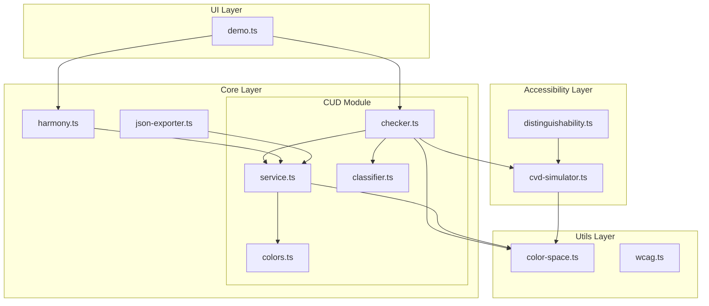
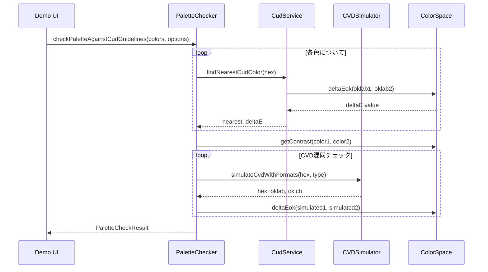
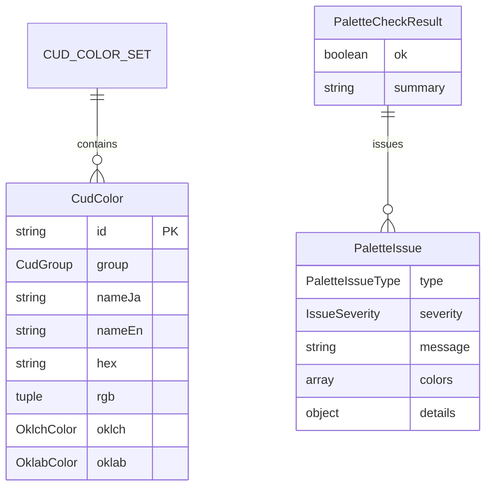

# Technical Design: CUD Color Integration

## Overview

**Purpose**: DADSハーモニーにCUD（カラーユニバーサルデザイン）推奨配色セット ver.4を統合し、色覚多様性への対応を検証可能な形でプロダクトに組み込む。

**Users**: デザイナー、アクセシビリティ担当者、開発者がパレット設計時にCUD準拠状況を確認し、色覚多様性に配慮した配色を実現する。

**Impact**: 既存DADSハーモニー機能にCUD検証レイヤーを追加し、エクスポートデータにCUDメタ情報を含める。

### Goals
- CUD推奨配色セット20色を正確にデータ化し、OKLCH/OKLab形式で提供
- 任意パレットをCUD/公的ガイドライン観点で自動検証するAPIを提供
- DADSハーモニーUIにCUD診断結果を統合表示

### Non-Goals
- CUD PDFの全文表完全再現（将来拡張用フックのみ確保）
- JPMA/CMYKデータの完全サポート（フィールドのみ空で保持）
- CUD色への自動スナップ機能（将来拡張）

## Architecture

### Existing Architecture Analysis

現在のアーキテクチャは3層構造:
- `src/core/` - 色生成コアロジック（harmony.ts, base-chroma.ts等）
- `src/accessibility/` - アクセシビリティ機能（cvd-simulator.ts, distinguishability.ts）
- `src/utils/` - 汎用ユーティリティ（color-space.ts, wcag.ts）

**維持すべきパターン**:
- 依存方向: `ui/ → core/ → utils/` / `ui/ → accessibility/ → core/`
- culori.jsによるOKLCH/OKLab変換
- TypeScript strict mode、`any`禁止

### Architecture Pattern & Boundary Map



**Architecture Integration**:
- **Selected pattern**: ハイブリッド（新規`src/core/cud/` + 既存utils拡張）
- **Domain boundaries**: CUD固有ロジックは`cud/`に集約、汎用関数は`utils/`に配置
- **Existing patterns preserved**: culori.js依存、Color class活用、UPPER_SNAKE_CASE定数
- **New components rationale**: CUD 20色データ、検証ロジック、分類器は独立したドメインとして分離
- **Steering compliance**: TypeScript strict、単一責任、循環依存禁止を維持

### Technology Stack

| Layer | Choice / Version | Role in Feature | Notes |
|-------|------------------|-----------------|-------|
| Core Logic | TypeScript 5.3+ | CUDデータ管理、検証ロジック | strict mode必須 |
| Color Library | culori.js | OKLCH/OKLab変換、deltaE計算 | 既存依存を継続 |
| Testing | Vitest | スナップショット、ゴールデンパターン | 90%カバレッジ目標 |

## System Flows

### パレット検証フロー



**Key Decisions**:
- 各チェックは独立して実行し、全issueを収集
- CVDシミュレーションはprotan/deutanの2タイプをデフォルトで実行
- コントラストチェックはrole指定がある色ペアのみ対象

## Requirements Traceability

| Requirement | Summary | Components | Interfaces | Flows |
|-------------|---------|------------|------------|-------|
| 1.1-1.5 | CUDカラーデータ管理 | CudColors | CudColor, CUD_COLOR_SET | - |
| 2.1-2.6 | CUDカラーサービスAPI | CudService | getCudColorSet, findNearestCudColor | - |
| 3.1-3.4 | CVDシミュレーション | CVDSimulator拡張 | simulateCvdWithFormats | - |
| 4.1-4.10 | パレット検証エンジン | CudChecker | checkPaletteAgainstCudGuidelines | パレット検証フロー |
| 5.1-5.4 | 色相・明度分類 | CudClassifier | classifyHue, classifyLightness | - |
| 6.1-6.4 | DADS UI統合 | DemoUI拡張 | - | - |
| 7.1-7.3 | アクセシビリティビュー統合 | DemoUI拡張 | - | - |
| 8.1-8.2 | エクスポート拡張 | Exporter拡張 | CudMetadata | - |
| 9.1-9.3 | deltaEok計算 | ColorSpace拡張 | toOklab, deltaEok | - |
| 10.1-10.4 | テスト/ドキュメント | TestSuite, Docs | - | - |

## Components and Interfaces

| Component | Domain/Layer | Intent | Req Coverage | Key Dependencies | Contracts |
|-----------|--------------|--------|--------------|------------------|-----------|
| CudColors | Core/CUD | CUD 20色定数とOKLCH/OKLabキャッシュ | 1.1-1.5 | ColorSpace (P0) | State |
| CudService | Core/CUD | CUD色の検索・比較API | 2.1-2.6 | CudColors (P0), ColorSpace (P0) | Service |
| CudClassifier | Core/CUD | 色相クラスター・明度バケット分類 | 5.1-5.4 | - | Service |
| CudChecker | Core/CUD | パレット検証エンジン | 4.1-4.10 | CudService (P0), CVDSimulator (P0), WCAG (P1) | Service |
| ColorSpace拡張 | Utils | toOklab, deltaEok追加 | 9.1-9.3 | culori.js (P0) | Service |
| CVDSimulator拡張 | Accessibility | simulateCvdWithFormats追加 | 3.1-3.4 | ColorSpace (P0) | Service |
| Exporter拡張 | Core/Export | cudMetadataオプション追加 | 8.1-8.2 | CudService (P1) | Service |
| DemoUI拡張 | UI | CUDバッジ、診断結果表示 | 6.1-6.4, 7.1-7.3 | CudChecker (P0) | - |

### Core/CUD Domain

#### CudColors

| Field | Detail |
|-------|--------|
| Intent | CUD推奨配色セット20色の定数定義とOKLCH/OKLabキャッシュ |
| Requirements | 1.1, 1.2, 1.3, 1.4, 1.5 |

**Responsibilities & Constraints**
- CUD ver.4の20色（アクセント9、ベース7、無彩色4）を定数として保持
- HEX→OKLCH/OKLab変換はモジュール初期化時に実行・キャッシュ
- 統計情報（lRange, cRange, hueMean, hueStd）をグループ別に計算

**Dependencies**
- Outbound: ColorSpace — toOklch, toOklab変換 (P0)

**Contracts**: State [x]

##### State Management

```typescript
/** CUDカラーグループ */
type CudGroup = "accent" | "base" | "neutral";

/** OKLCHカラー値 */
interface OklchColor {
  l: number;  // 0-1
  c: number;  // 0-0.4
  h: number;  // 0-360
}

/** OKLabカラー値 */
interface OklabColor {
  l: number;  // 0-1
  a: number;  // -0.4 to 0.4
  b: number;  // -0.4 to 0.4
}

/** CUDカラー定義 */
interface CudColor {
  id: string;
  group: CudGroup;
  nameJa: string;
  nameEn: string;
  hex: string;
  rgb: [number, number, number];
  oklch: OklchColor;
  oklab: OklabColor;
  jpmaCode?: string;       // 将来用
  cmykProcessNote?: string; // 将来用
  munsell?: string;        // 将来用
}

/** OKLCH統計情報 */
interface OklchStats {
  lRange: [number, number];
  cRange: [number, number];
  hueMean: number;
  hueStd: number;
}

/** エクスポート定数 */
const CUD_ACCENT_COLORS: readonly CudColor[];
const CUD_BASE_COLORS: readonly CudColor[];
const CUD_NEUTRAL_COLORS: readonly CudColor[];
const CUD_COLOR_SET: readonly CudColor[];  // 全20色
```

**Implementation Notes**
- 各色のHEX/RGB値は公式ガイドブックから抽出
- OKLCH/OKLab値はculori.jsで計算、readonly配列で不変性を保証
- 統計情報は遅延計算（初回アクセス時にキャッシュ）

---

#### CudService

| Field | Detail |
|-------|--------|
| Intent | CUD色セットの検索・比較API提供 |
| Requirements | 2.1, 2.2, 2.3, 2.4, 2.5, 2.6 |

**Responsibilities & Constraints**
- CUD色セットの取得（全体、グループ別）
- HEXによる完全一致検索
- 最近接CUD色の検索とdeltaE計算
- 入力HEXの正規化（大文字/小文字、#有無）

**Dependencies**
- Inbound: CudChecker, Harmony, Exporter — CUD色参照 (P0)
- Outbound: CudColors — 色データ取得 (P0)
- Outbound: ColorSpace — deltaEok計算 (P0)

**Contracts**: Service [x]

##### Service Interface

```typescript
interface CudPaletteService {
  /** 全20色を取得 */
  getCudColorSet(): readonly CudColor[];

  /** グループ別に色を取得 */
  getCudColorsByGroup(group: CudGroup): readonly CudColor[];

  /** HEXで完全一致するCUD色を検索 */
  findExactCudColorByHex(hex: string): CudColor | null;

  /** 最も近いCUD色を検索 */
  findNearestCudColor(hex: string): NearestCudColorResult;

  /** グループ別統計情報を取得 */
  computeOklchStats(group: CudGroup): OklchStats;
}

interface NearestCudColorResult {
  nearest: CudColor;
  deltaE: number;
  matchLevel: "exact" | "near" | "off";  // ≤0.03, 0.03-0.06, >0.06
}
```
- Preconditions: hexは有効な色文字列（#RRGGBB or RRGGBB）
- Postconditions: NearestCudColorResultは常に有効なCudColorを含む
- Invariants: deltaE閾値: exact≤0.03, near≤0.06, off>0.06

---

#### CudClassifier

| Field | Detail |
|-------|--------|
| Intent | 色相クラスターと明度バケットによる色分類 |
| Requirements | 5.1, 5.2, 5.3, 5.4 |

**Responsibilities & Constraints**
- OKLCH色相値から9つのHueClusterに分類
- 彩度0.03未満はneutralに強制分類
- OKLCH明度値から4つのLightnessBucketに分類
- 特定の色相×明度組み合わせを警告対象としてフラグ

**Dependencies**
- Inbound: CudChecker — 色分類 (P0)

**Contracts**: Service [x]

##### Service Interface

```typescript
type HueCluster =
  | "warm_red_orange"
  | "yellow"
  | "yellow_green"
  | "green"
  | "cyan_sky"
  | "blue"
  | "magenta_purple"
  | "brown"
  | "neutral";

type LightnessBucket = "very_light" | "light" | "medium" | "dark";

interface ColorClassification {
  hueCluster: HueCluster;
  lightnessBucket: LightnessBucket;
  isHighRiskCombination: boolean;  // yellow×yellow_green×high_lightness等
}

interface CudClassifierService {
  /** 色相クラスターを判定 */
  classifyHue(oklch: OklchColor): HueCluster;

  /** 明度バケットを判定 */
  classifyLightness(l: number): LightnessBucket;

  /** 総合分類 */
  classifyColor(oklch: OklchColor): ColorClassification;

  /** 2色が同クラスター・同バケットか判定 */
  isSimilarClassification(c1: ColorClassification, c2: ColorClassification): boolean;
}
```
- Preconditions: oklchは有効な値範囲内
- Postconditions: 必ずいずれかのクラスター/バケットに分類される
- Invariants: c < 0.03 → neutral、l >= 0.9 → very_light、l >= 0.7 → light、l >= 0.45 → medium、else → dark

---

#### CudChecker

| Field | Detail |
|-------|--------|
| Intent | パレット全体をCUD/公的ガイドライン観点で検証 |
| Requirements | 4.1, 4.2, 4.3, 4.4, 4.5, 4.6, 4.7, 4.8, 4.9, 4.10 |

**Responsibilities & Constraints**
- 7種類のissue検出（not_in_cud_set, low_contrast, small_text_low_contrast, cvd_confusion_risk, too_many_similar_hues, ambiguous_role, cud_good_example_like）
- contextオプションによる閾値調整（chart/map/ui/text-heavy）
- 全issueを収集し、ok/summary/issuesとして返却

**Dependencies**
- Inbound: DemoUI — パレット検証 (P0)
- Outbound: CudService — CUD色比較 (P0)
- Outbound: CudClassifier — 色分類 (P0)
- Outbound: CVDSimulator — CVDシミュレーション (P0)
- Outbound: ColorSpace — deltaEok (P0)
- Outbound: WCAG — getContrast (P1)

**Contracts**: Service [x]

##### Service Interface

```typescript
interface PaletteColor {
  hex: string;
  role?: "accent" | "base" | "neutral" | "text" | "border" | "background";
  label?: string;
}

type IssueSeverity = "info" | "warning" | "error";

type PaletteIssueType =
  | "not_in_cud_set"
  | "low_contrast"
  | "small_text_low_contrast"
  | "cvd_confusion_risk"
  | "too_many_similar_hues"
  | "ambiguous_role"
  | "cud_good_example_like";

interface PaletteIssue {
  type: PaletteIssueType;
  severity: IssueSeverity;
  message: string;
  colors: PaletteColor[];
  details?: Record<string, unknown>;
}

interface PaletteCheckOptions {
  context?: "chart" | "map" | "ui" | "text-heavy";
  assumeSmallText?: boolean;
  backgroundHex?: string;  // コントラストチェック用
}

interface PaletteCheckResult {
  ok: boolean;
  summary: string;
  issues: PaletteIssue[];
}

interface CudCheckerService {
  checkPaletteAgainstCudGuidelines(
    colors: PaletteColor[],
    options?: PaletteCheckOptions
  ): PaletteCheckResult;
}
```
- Preconditions: colors配列は1色以上
- Postconditions: issuesは空配列も含め常に返却、okはerror/warningがない場合true
- Invariants:
  - コントラスト閾値: 通常4.5:1、smallText/chart時7:1
  - CVD混同: normal ΔE≥0.15 かつ simulated ΔE<0.10 で warning
  - 類似色: 同クラスター・同バケット・ΔE<0.04 で warning

**Implementation Notes**
- 各チェックロジックは個別の内部関数として実装
- issueのmessageは日本語で具体的なガイダンスを含む
- details にはdeltaE、contrastRatio等の数値情報を含める

---

### Utils Layer Extension

#### ColorSpace拡張

| Field | Detail |
|-------|--------|
| Intent | OKLab変換とdeltaEok計算の追加 |
| Requirements | 9.1, 9.2, 9.3 |

**Responsibilities & Constraints**
- toOklab: OKLCH/HEX → OKLab変換
- deltaEok: OKLabユークリッド距離計算
- culori.jsとの整合性を維持

**Dependencies**
- External: culori.js — converter("oklab") (P0)

**Contracts**: Service [x]

##### Service Interface

```typescript
/** OKLab変換 */
const toOklab: (color: ColorObject | string) => OklabColor;

/** OKLab空間でのユークリッド距離（deltaE） */
function deltaEok(oklab1: OklabColor, oklab2: OklabColor): number;
```
- Preconditions: 入力色は有効な形式
- Postconditions: deltaEokは0以上の数値を返却
- Invariants: deltaEok = sqrt((L2-L1)² + (a2-a1)² + (b2-b1)²)

---

### Accessibility Layer Extension

#### CVDSimulator拡張

| Field | Detail |
|-------|--------|
| Intent | シミュレーション結果をOKLab/OKLCH形式でも返却 |
| Requirements | 3.1, 3.2, 3.3, 3.4 |

**Responsibilities & Constraints**
- 既存simulateCVDを内部利用
- 戻り値にhex/oklab/oklchを含む拡張形式を追加
- tritan型は将来拡張ポイントとして保持

**Dependencies**
- Inbound: CudChecker — CVDシミュレーション (P0)
- Outbound: ColorSpace — toOklab, toOklch (P0)

**Contracts**: Service [x]

##### Service Interface

```typescript
type SimpleCvdType = "protan" | "deutan";

interface CvdSimulationResult {
  hex: string;
  oklab: OklabColor;
  oklch: OklchColor;
}

function simulateCvdWithFormats(
  hex: string,
  type: SimpleCvdType
): CvdSimulationResult;
```
- Preconditions: hexは有効な色文字列
- Postconditions: 3形式すべてが有効な値を含む
- Invariants: 既存simulateCVDの結果と整合

---

### Core/Export Extension

#### Exporter拡張

| Field | Detail |
|-------|--------|
| Intent | エクスポートデータにCUDメタ情報を含める |
| Requirements | 8.1, 8.2 |

**Responsibilities & Constraints**
- JSONExportOptionsにincludeCudMetadataオプション追加
- 各色にcudMetadata（nearestId, deltaE, group）を付加
- オプションがfalseの場合は従来通り

**Dependencies**
- Outbound: CudService — findNearestCudColor (P1)

**Contracts**: Service [x]

##### Service Interface

```typescript
interface CudMetadata {
  nearestId: string;
  deltaE: number;
  group: CudGroup;
  matchLevel: "exact" | "near" | "off";
}

interface JSONExportOptionsExtended extends JSONExportOptions {
  includeCudMetadata?: boolean;
}

interface ExportedColorDataExtended extends ExportedColorData {
  cudMetadata?: CudMetadata;
}
```

---

## Data Models

### Domain Model

**Aggregates**:
- `CUD_COLOR_SET`: 20色のイミュータブル配列（Aggregate Root）
- `PaletteCheckResult`: 検証結果の値オブジェクト

**Entities**:
- `CudColor`: id, group, names, color valuesを持つエンティティ

**Value Objects**:
- `OklchColor`, `OklabColor`: 色値
- `ColorClassification`: 分類結果
- `PaletteIssue`: 検証issue

**Business Rules**:
- CUD色は20色固定、変更不可
- deltaE閾値は固定（exact≤0.03, near≤0.06, off>0.06）
- コントラスト閾値はcontextで可変

### Logical Data Model



## Error Handling

### Error Strategy

- **入力バリデーション**: 無効なHEX形式は早期にエラー返却
- **グレースフルデグラデーション**: CUD色が見つからない場合も最近接色を返却
- **ユーザーフィードバック**: issueのmessageに具体的な改善提案を含める

### Error Categories and Responses

**User Errors (Validation)**:
- 無効なHEX形式 → 「有効な色コード（#RRGGBB）を入力してください」
- 空のパレット → 「1色以上の色を追加してください」

**Business Logic Errors**:
- コントラスト不足 → 「{color1}と{color2}のコントラスト比{ratio}:1は基準{threshold}:1を下回っています」
- CVD混同リスク → 「{type}型色覚でこの2色は識別困難になる可能性があります」

## Testing Strategy

### Unit Tests
- `colors.test.ts`: CUD 20色のHEX/RGB/OKLCH値スナップショット検証
- `service.test.ts`: findNearestCudColorの閾値境界テスト
- `classifier.test.ts`: HueCluster/LightnessBucket分類の境界値テスト
- `checker.test.ts`: 各issueタイプの検出ゴールデンパターン
- `color-space.test.ts`: deltaEok計算精度検証

### Integration Tests
- CudChecker + CVDSimulator: CVD混同リスク検出の統合テスト
- Exporter + CudService: cudMetadata付きエクスポートの検証
- DemoUI + CudChecker: UIでの診断結果表示統合テスト

### Performance Tests
- 20色パレットの検証処理時間 < 100ms
- 1000色パレットでのスケーラビリティ確認

## Optional Sections

### Security Considerations

- ユーザー入力（HEX文字列）は正規表現でバリデーション
- 外部データ（CUD色値）はハードコードで管理、動的読み込みなし

### Performance & Scalability

- 統計情報の遅延計算とキャッシュ
- deltaEok計算は純粋関数でメモ化可能
- 大規模パレット（100色超）は警告表示

## Supporting References

詳細な調査結果と設計判断の根拠は `research.md` を参照。

- CUD ver.4 公式色データの出典確認
- 既存CVDシミュレーターの評価
- deltaE閾値の設定根拠
- UI表示パターンの検討結果
