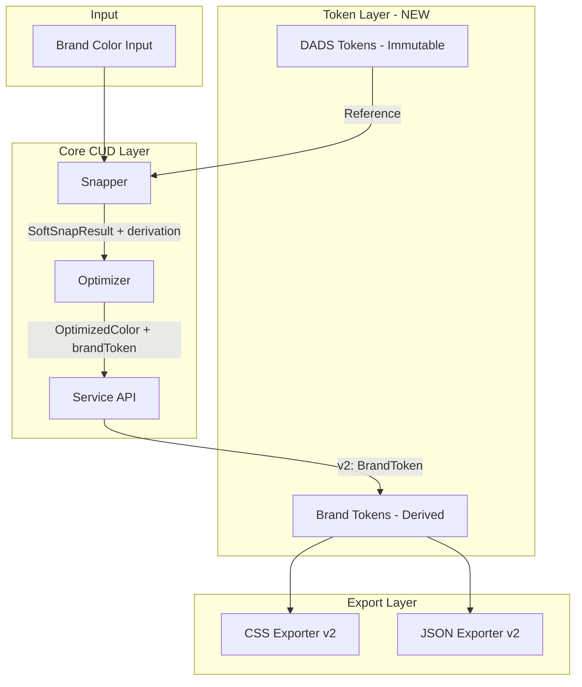
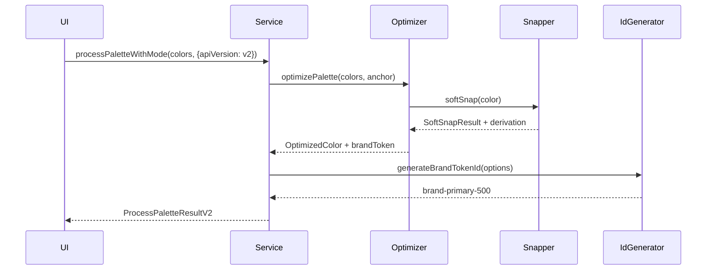
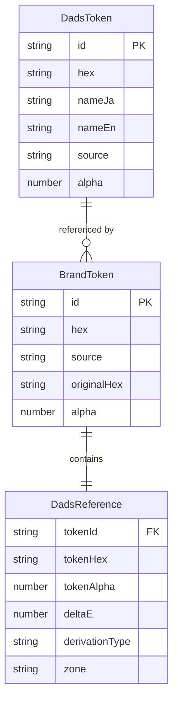
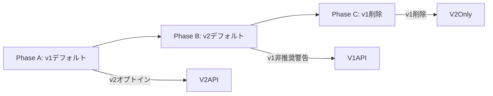

# Design Document: DADSカラートークン不変性対応

## Overview

**Purpose**: DADSプリミティブカラーを不変の基盤として保持しつつ、ブランドカラーを派生トークンとして生成する機能を提供する。

**Users**: デザインシステム構築者、フロントエンド開発者がカラーパレット生成時に利用。

**Impact**: 既存のCUD-awareジェネレーターを拡張し、トークンの出自（DADS/Brand）を明確化。v1 APIとの後方互換性を維持しながらv2 APIを追加。

### Goals
- DADSプリミティブカラーの不変性を型システムで保証
- ブランドトークンとDADS参照の関係を明示的に表現
- v1/v2 API並行運用による段階的移行
- CSS/JSON/DTCG形式でのエクスポート対応

### Non-Goals
- Key100〜Key1000のフルスケール生成機能（将来検討）
- ブランド/セマンティックカラーの空間的ガイド（UI距離ルール等）
- WCAGコントラスト評価・アクセシビリティ全般（既存機能で対応）
- 「プリミティブカラー」概念の非技術的定義

## Architecture

### Existing Architecture Analysis

**現行フロー（問題点）**:
```
ブランドカラー → Snapper/Optimizer → 出力色
                      ↓
              "DADSトークンを上書き"
```

**問題箇所**:
- `snapper.ts`: SnapResultに派生/置換の区別なし
- `optimizer.ts`: OptimizedColorにDADS/Brand区別なし
- `css-exporter.ts`: 変数名の出自不明

### Architecture Pattern & Boundary Map



**Architecture Integration**:
- Selected pattern: Discriminated Union（DadsToken | BrandToken）
- Domain boundaries: Token層（新規）、Core CUD層（拡張）、Export層（拡張）
- Existing patterns preserved: 3段階ゾーン分類、Soft Snap、貪欲法最適化
- New components rationale: 型定義の分離により不変性を型レベルで保証
- Steering compliance: TypeScript strict mode、依存性方向（UI→Core→Utils）

### Technology Stack

| Layer | Choice / Version | Role in Feature | Notes |
|-------|------------------|-----------------|-------|
| Core | TypeScript 5.3+ | 型定義、API実装 | strict mode必須 |
| Runtime | Bun 1.0+ | テスト、ビルド | 既存環境 |
| Color | culori.js | deltaE計算 | 既存依存 |
| Test | Vitest | ユニットテスト | 90%カバレッジ |

## System Flows

### BrandToken生成フロー



**Key Decisions**:
- v2指定時のみBrandToken配列を返却
- ID生成はService層で一元管理
- derivation情報はSnapper→Optimizer→Serviceと伝播

## Requirements Traceability

| Requirement | Summary | Components | Interfaces | Flows |
|-------------|---------|------------|------------|-------|
| 1.1-1.7 | DADSトークン型定義 | TokenTypes | DadsToken, BrandToken | - |
| 2.1-2.6 | DADSインポート | DadsImporter | importDadsPrimitives | - |
| 3.1-3.3 | セマンティック解決 | SemanticResolver | resolveSemanticReference | - |
| 4.1-4.3 | CUDマッピング | CudMapper | enrichWithCudMapping | - |
| 5.1-5.5 | ブランドトークン生成 | BrandTokenGenerator | createBrandToken | BrandToken生成 |
| 6.1-6.5 | ID生成 | IdGenerator | generateBrandTokenId | - |
| 7.1-7.3 | Snapper拡張 | Snapper | SoftSnapResult.derivation | - |
| 8.1-8.3 | Optimizer拡張 | Optimizer | OptimizedColor.brandToken | - |
| 9.1-9.6 | API互換性 | ServiceAPI | processPaletteWithMode | v1/v2分岐 |
| 10.1-10.5 | CSSエクスポート | CSSExporter | exportToCSSv2 | - |
| 11.1-11.6 | JSONエクスポート | JSONExporter | exportToJSONv2 | - |
| 12.1-12.4 | UI保護 | UIGuard | checkTokenEditability | - |
| 13.1-13.4 | マイグレーション | Migration | migrateOptimizedColors | - |

## Components and Interfaces

| Component | Domain/Layer | Intent | Req Coverage | Key Dependencies | Contracts |
|-----------|--------------|--------|--------------|------------------|-----------|
| TokenTypes | Core/Tokens | 型定義 | 1.1-1.7 | - | Service |
| DadsImporter | Core/Tokens | CSSパース | 2.1-2.6 | - | Service |
| SemanticResolver | Core/Tokens | var()解決 | 3.1-3.3 | TokenTypes (P0) | Service |
| CudMapper | Core/Tokens | deltaE計算 | 4.1-4.3 | culori.js (P0) | Service |
| IdGenerator | Core/Tokens | ID生成 | 6.1-6.5 | - | Service |
| Snapper | Core/CUD | Snap拡張 | 7.1-7.3 | zone.ts (P0) | Service |
| Optimizer | Core/CUD | 最適化拡張 | 8.1-8.3 | Snapper (P0) | Service |
| ServiceAPI | Core/CUD | API層 | 9.1-9.6 | Optimizer (P0), IdGenerator (P1) | API |
| CSSExporter | Core/Export | CSS出力 | 10.1-10.5 | TokenTypes (P0) | - |
| JSONExporter | Core/Export | JSON出力 | 11.1-11.6 | TokenTypes (P0) | - |
| UIGuard | UI | 保護 | 12.1-12.4 | TokenTypes (P0) | - |
| Migration | Utils | 移行 | 13.1-13.4 | TokenTypes (P0) | - |

### Core/Tokens

#### TokenTypes

| Field | Detail |
|-------|--------|
| Intent | DADSトークンとブランドトークンの型定義 |
| Requirements | 1.1, 1.2, 1.3, 1.4, 1.5, 1.6, 1.7 |

**Responsibilities & Constraints**
- DadsToken/BrandTokenのDiscriminated Union定義
- readonly修飾子による不変性保証
- 型ガード関数（isDadsToken, isBrandToken）提供

**Dependencies**
- External: なし

**Contracts**: Service [x]

##### Service Interface
```typescript
// src/core/tokens/types.ts

export type TokenSource = "dads" | "brand";

export type DadsColorHue =
  | "blue" | "light-blue" | "cyan" | "green" | "lime"
  | "yellow" | "orange" | "red" | "magenta" | "purple";

export type DadsColorCategory = "chromatic" | "neutral" | "semantic";

export type DadsChromaScale =
  | 50 | 100 | 200 | 300 | 400 | 500
  | 600 | 700 | 800 | 900 | 1000 | 1100 | 1200;

export type DadsNeutralScale =
  | 50 | 100 | 200 | 300 | 400 | 420 | 500 | 536
  | 600 | 700 | 800 | 900;

export interface DadsColorClassification {
  category: DadsColorCategory;
  hue?: DadsColorHue;
  scale?: DadsChromaScale | DadsNeutralScale;
  cudMapping?: { nearestCudId: string; deltaE: number };
}

export type DerivationType = "strict-snap" | "soft-snap" | "reference" | "manual";

export interface DadsToken {
  readonly id: string;
  readonly hex: string;
  readonly nameJa: string;
  readonly nameEn: string;
  readonly classification: DadsColorClassification;
  readonly source: "dads";
  readonly alpha?: number;
}

export interface DadsReference {
  tokenId: string;
  tokenHex: string;
  tokenAlpha?: number;
  deltaE: number;
  derivationType: DerivationType;
  zone: CudZone;
}

export interface BrandToken {
  id: string;
  hex: string;
  alpha?: number;
  source: "brand";
  dadsReference: DadsReference;
  originalHex?: string;
}

export type ColorToken = DadsToken | BrandToken;

export function isDadsToken(token: ColorToken): token is DadsToken;
export function isBrandToken(token: ColorToken): token is BrandToken;
```

#### IdGenerator

| Field | Detail |
|-------|--------|
| Intent | ブランドトークンIDの一意生成 |
| Requirements | 6.1, 6.2, 6.3, 6.4, 6.5 |

**Responsibilities & Constraints**
- `brand-{namespace}-{role}-{shade}` 形式のID生成
- 重複時は数値サフィックス付加
- 入力サニタイズ（小文字化、特殊文字除去）

**Dependencies**
- Inbound: ServiceAPI — ID生成リクエスト (P1)

**Contracts**: Service [x]

##### Service Interface
```typescript
// src/core/tokens/id-generator.ts

export interface BrandTokenIdOptions {
  namespace?: string;
  role: string;
  shade?: number;
  existingIds?: Set<string>;
}

export function generateBrandTokenId(options: BrandTokenIdOptions): string;
```
- Preconditions: `role` は非空文字列
- Postconditions: 一意なID文字列を返却
- Invariants: `shade` デフォルトは500

### Core/CUD

#### Snapper（拡張）

| Field | Detail |
|-------|--------|
| Intent | SoftSnapResultにderivation情報を追加 |
| Requirements | 7.1, 7.2, 7.3 |

**Responsibilities & Constraints**
- 既存フィールド（hex, originalHex, cudColor等）は変更なし
- 新規`derivation`プロパティ追加

**Dependencies**
- Inbound: Optimizer — Snap結果取得 (P0)
- External: zone.ts — CudZone型 (P0)

**Contracts**: Service [x]

##### Service Interface
```typescript
// src/core/cud/snapper.ts (拡張)

export interface SoftSnapResult {
  // 既存フィールド（後方互換）
  hex: string;
  originalHex: string;
  cudColor: CudColor;
  snapped: boolean;
  deltaE: number;
  zone: CudZone;
  deltaEChange: number;
  explanation: string;

  // 新規フィールド
  derivation: {
    type: DerivationType;
    dadsTokenId: string;
    dadsTokenHex: string;
    brandTokenHex: string;
  };
}
```

#### Optimizer（拡張）

| Field | Detail |
|-------|--------|
| Intent | OptimizedColorにbrandToken情報を追加 |
| Requirements | 8.1, 8.2, 8.3 |

**Responsibilities & Constraints**
- 既存フィールド維持
- 新規`brandToken`プロパティ追加

**Dependencies**
- Inbound: ServiceAPI — 最適化結果取得 (P0)
- Outbound: Snapper — Snap実行 (P0)

**Contracts**: Service [x]

##### Service Interface
```typescript
// src/core/cud/optimizer.ts (拡張)

export interface OptimizedColor {
  // 既存フィールド
  hex: string;
  originalHex: string;
  zone: CudZone;
  deltaE: number;
  snapped: boolean;
  cudTarget?: CudColor;

  // 新規フィールド
  brandToken: {
    suggestedId: string;
    dadsReference: DadsReference;
  };
}
```

#### ServiceAPI（拡張）

| Field | Detail |
|-------|--------|
| Intent | v1/v2 API並行運用 |
| Requirements | 9.1, 9.2, 9.3, 9.4, 9.5, 9.6 |

**Responsibilities & Constraints**
- apiVersion引数でv1/v2分岐
- v1: ProcessPaletteResultV1（後方互換）
- v2: ProcessPaletteResultV2（BrandToken配列）
- isFixed=false は警告出力して無視

**Dependencies**
- Outbound: Optimizer — パレット最適化 (P0)
- Outbound: IdGenerator — ID生成 (P1)

**Contracts**: Service [x] / API [x]

##### Service Interface
```typescript
// src/core/cud/service.ts (拡張)

export type ApiVersion = "v1" | "v2";

export interface ProcessPaletteResultV1 {
  palette: OptimizedColor[];
  cudComplianceRate: number;
  harmonyScore: HarmonyScoreResult;
  warnings: string[];
}

export interface ProcessPaletteResultV2 {
  brandTokens: BrandToken[];
  dadsReferences: Map<string, DadsToken>;
  cudComplianceRate: number;
  harmonyScore: HarmonyScoreResult;
  warnings: string[];
}

export type ProcessPaletteResult<V extends ApiVersion> =
  V extends "v1" ? ProcessPaletteResultV1 : ProcessPaletteResultV2;

export interface AnchorSpecification {
  anchorHex?: string;
  anchorIndex?: number;
  isFixed?: boolean;
}

export interface ProcessPaletteOptions {
  mode: CudCompatibilityMode;
  apiVersion?: ApiVersion;
  anchor?: AnchorSpecification;
  generationContext?: PaletteGenerationContext;
}

export function processPaletteWithMode<V extends ApiVersion = "v1">(
  colors: string[],
  options: ProcessPaletteOptions & { apiVersion?: V }
): ProcessPaletteResult<V>;
```

##### API Contract
| Method | Endpoint | Request | Response | Errors |
|--------|----------|---------|----------|--------|
| - | processPaletteWithMode | colors[], options | ProcessPaletteResult | InvalidColor |

### Core/Export

#### CSSExporter（拡張）

| Field | Detail |
|-------|--------|
| Intent | DADS/Brandトークンを分離したCSS出力 |
| Requirements | 10.1, 10.2, 10.3, 10.4, 10.5 |

**Responsibilities & Constraints**
- `--dads-{color}` / `--brand-{role}-{shade}` 命名規則
- alpha値はrgba()形式で出力
- derivationコメント付加

**Dependencies**
- Inbound: UI/CLI — エクスポート要求

**Contracts**: Service [x]

##### Service Interface
```typescript
// src/core/export/css-exporter.ts (拡張)

export interface CSSExportOptionsV2 {
  outputVersion?: "v1" | "v2";
  includeDadsTokens?: boolean;
  includeComments?: boolean;
}

export function exportToCSSv2(
  brandTokens: BrandToken[],
  dadsTokens?: DadsToken[],
  options?: CSSExportOptionsV2
): string;
```

#### JSONExporter（拡張）

| Field | Detail |
|-------|--------|
| Intent | 機械可読なJSON形式でトークン出力 |
| Requirements | 11.1, 11.2, 11.3, 11.4, 11.5, 11.6 |

**Responsibilities & Constraints**
- dadsTokens / brandTokens / cudSummary / metadata構造
- alpha値を含む場合はalphaプロパティ追加

**Dependencies**
- Inbound: UI/CLI — エクスポート要求

**Contracts**: Service [x]

##### Service Interface
```typescript
// src/core/export/json-exporter.ts (拡張)

export interface JSONExportOptionsV2 {
  outputVersion?: "v1" | "v2";
  includeDadsTokens?: boolean;
  brandNamespace?: string;
}

export interface JSONExportResultV2 {
  metadata: {
    version: string;
    generatedAt: string;
    tokenSchema: string;
  };
  dadsTokens: Record<string, DadsToken>;
  brandTokens: Record<string, BrandToken>;
  cudSummary: {
    complianceRate: number;
    mode: string;
    zoneDistribution: Record<CudZone, number>;
  };
}

export function exportToJSONv2(
  brandTokens: BrandToken[],
  options?: JSONExportOptionsV2
): JSONExportResultV2;
```

### UI

#### UIGuard

| Field | Detail |
|-------|--------|
| Intent | DADSトークン編集の保護 |
| Requirements | 12.1, 12.2, 12.3, 12.4 |

**Responsibilities & Constraints**
- isDadsToken判定で編集可否を決定
- 不変性違反時のメッセージ表示

**Dependencies**
- External: TokenTypes — 型ガード (P0)

**Contracts**: Service [x]

##### Service Interface
```typescript
// src/ui/guards/token-edit-guard.ts

export interface TokenEditGuard {
  canEdit: boolean;
  reason?: string;
  suggestion?: string;
}

export function checkTokenEditability(token: ColorToken): TokenEditGuard;
```

### Utils

#### Migration

| Field | Detail |
|-------|--------|
| Intent | v1→v2形式への移行支援 |
| Requirements | 13.1, 13.2, 13.3, 13.4 |

**Responsibilities & Constraints**
- OptimizedColor[]をBrandToken[]に変換
- 移行不可の色はunmigratedに記録

**Dependencies**
- External: TokenTypes — 型定義 (P0)
- External: IdGenerator — ID生成 (P1)

**Contracts**: Service [x]

##### Service Interface
```typescript
// src/utils/migration.ts

export interface MigrationResult {
  brandTokens: BrandToken[];
  warnings: string[];
  unmigrated: string[];
}

export interface MigrationOptions {
  brandPrefix?: string;
  roles?: string[];
}

export function migrateOptimizedColors(
  colors: OptimizedColor[],
  options?: MigrationOptions
): MigrationResult;
```

## Data Models

### Domain Model



**Aggregates**:
- DadsToken: 不変の参照データ（readonly）
- BrandToken: プロダクト所有の派生データ

**Invariants**:
- DadsToken.sourceは常に"dads"
- BrandToken.sourceは常に"brand"
- DadsReference.tokenIdはDadsToken.idを参照

### Logical Data Model

**Structure Definition**:
- ColorToken = DadsToken | BrandToken（Discriminated Union）
- source フィールドで判別

**Consistency & Integrity**:
- DadsToken: readonly修飾子で不変性保証
- BrandToken: dadsReferenceは必須

## Error Handling

### Error Categories and Responses

**User Errors (4xx)**:
- 無効なHEX形式 → ValidationError + フィールドレベル指摘
- 存在しないトークンID → NotFoundError + ID一覧提示

**System Errors (5xx)**:
- CSSパース失敗 → ParseError + 警告ログ出力 + スキップ継続

**Business Logic Errors (422)**:
- isFixed=false指定 → 警告出力 + trueとして処理
- rgba()パース失敗 → 警告出力 + スキップ

## Testing Strategy

### Unit Tests
- `types.test.ts`: 型ガード関数（isDadsToken, isBrandToken）
- `id-generator.test.ts`: ID生成、重複回避、サニタイズ
- `snapper.test.ts`: derivationフィールド追加
- `optimizer.test.ts`: brandTokenフィールド追加
- `service.test.ts`: v1/v2 API分岐

### Integration Tests
- `dads-import.test.ts`: CSS→DadsToken配列変換
- `brand-generation.test.ts`: 入力色→BrandToken生成フロー
- `export-v2.test.ts`: CSS/JSONエクスポートv2形式

### E2E Tests
- パレット生成→エクスポート完全フロー（v2 API）
- UIでのDADSトークン編集保護

## Optional Sections

### Migration Strategy



**Phase A（〜v2.0）**: v1デフォルト、v2オプトイン
**Phase B（v2.0〜v2.x）**: v2デフォルト、v1非推奨警告
**Phase C（v3.0〜）**: v1削除

**Rollback Triggers**: v2でのバグ発覚時はv1にフォールバック
**Validation Checkpoints**: 各フェーズでテストカバレッジ90%以上

## Supporting References

詳細な型定義、実装例、CSS/JSON出力サンプルは [Design Doc v0.6](../../docs/design/dads-immutable-tokens.md) を参照。
