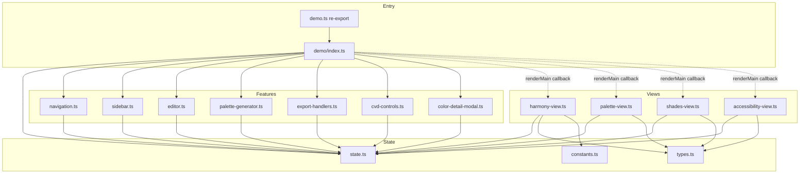
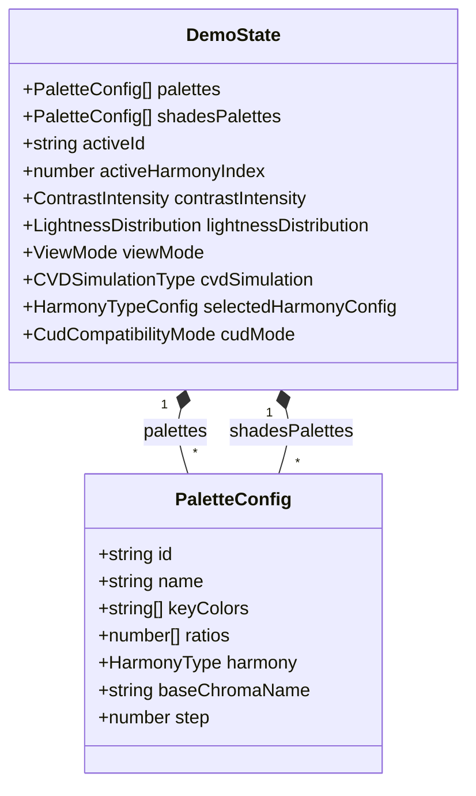

# Technical Design Document: demo.ts リファクタリング

## Overview

**Purpose**: 3,429行の単一ファイル `src/ui/demo.ts` を機能単位で分割し、保守性・テスタビリティを向上させる。

**Users**: 開発者がカラーパレットデモ機能を修正・拡張する際に、影響範囲を限定し、コード理解を容易にする。

**Impact**: 既存の `runDemo` APIインターフェースおよびDOM構造を維持しつつ、内部実装を12個のモジュールに分割する。

### Goals
- `demo.ts` を機能別モジュール（views, state, export等）に分割
- 各ファイルを500行以下に抑制（目標）
- 循環依存を排除し、依存方向を明確化
- 既存E2Eテストが全てパスすること

### Non-Goals
- 状態管理ライブラリ（Zustand等）の導入
- UIの挙動変更・機能追加
- DOM構造・class名の変更
- パフォーマンス最適化

## Architecture

### Existing Architecture Analysis

現在の `demo.ts` は以下の問題を抱える:
- **単一責任違反**: 状態管理、4つのビュー、エクスポート、CVD、モーダル等が1ファイルに混在
- **テスト困難**: 全機能がrunDemo()内のクロージャとして定義され、個別テスト不可
- **変更影響範囲の拡大**: 1箇所の修正が他機能に波及するリスク

既存の依存関係:
- `demo.ts` → `@/core/*`（色生成、エクスポート、CUD）
- `demo.ts` → `@/accessibility/*`（CVD、WCAG）
- `demo.ts` → `./cud-components`、`./semantic-role/*`

### Architecture Pattern & Boundary Map

**Selected Pattern**: モジュール分割 + シングルトン状態



**図の凡例**:
- 実線（→）: 直接import依存
- 点線（-.->）: コールバック経由の呼び出し（importではない）
- View → Feature の直接依存は存在しない（コールバックで解決）

**Architecture Integration**:
- **Selected pattern**: モジュール分割 + シングルトン状態（最小変更でリファクタリング実現）
- **Domain/feature boundaries**: State/Types/Constantsが基盤層、Views/Featuresが機能層
- **Existing patterns preserved**: runDemo()エントリポイント、DOM操作パターン
- **New components rationale**: 各モジュールは単一責任を持ち、独立してテスト可能
- **Steering compliance**: 依存方向 UI層 → Core層 → Utils層 を維持

### Dependency Direction Rules（依存方向ルール）

本リファクタリングにおける依存方向は以下の通り:

```
Entry Layer (index.ts)
    ↓ 初期化・ハンドラ登録
Feature Layer (navigation, sidebar, editor, palette-generator, export-handlers, cvd-controls, color-detail-modal)
    ↓ ビューレンダリング呼び出し
View Layer (views/*)
    ↓ 状態・型・定数参照
State Layer (state.ts, types.ts, constants.ts)
    ↓ 外部依存
External Layer (@/core/*, @/accessibility/*)
```

**依存許可マトリクス**:

| From \ To | State Layer | Feature Layer | View Layer | External |
|-----------|-------------|---------------|------------|----------|
| Entry Layer | ✅ | ✅ | ✅（renderMainでの呼び出しのみ） | ❌ |
| Feature Layer | ✅ | ❌（循環禁止） | ✅ | ✅ |
| View Layer | ✅ | ❌（コールバック経由のみ、直接import禁止） | ❌（循環禁止） | ✅ |
| State Layer | ❌（循環禁止） | ❌ | ❌ | ✅（型のみ） |

**Entry → View 依存の許可理由**:
- index.ts の renderMain 関数はビューのルーティングハブとして、各 View 関数を直接呼び出す
- これは「呼び出し」であり「機能依存」ではないため、アーキテクチャ上許容する
- View を呼び出す際は、コールバックを渡してFeature機能（モーダル等）と接続する

**View → Feature 依存の禁止と解決策**:
- Views から color-detail-modal や cvd-controls への**直接import は禁止**
- View関数は `onColorClick: (options: ColorDetailModalOptions) => void` のようなコールバックを受け取る
- 実際のモーダル呼び出しは index.ts（Entry Layer）でコールバックとして接続する
- コールバック型で使用する `ColorDetailModalOptions` 等は **types.ts（共有層）** に定義する

### DOM要素のNull取り扱い標準

**原則**: 必須DOM要素は index.ts でガードし、非nullのみをモジュールに渡す

```typescript
// index.ts での検証パターン
const app = document.getElementById("app");
const paletteListEl = document.getElementById("palette-list");
if (!app || !paletteListEl) return; // 必須要素がなければ早期リターン

// モジュールには非null保証された要素を渡す
renderSidebar(paletteListEl, onPaletteSelect);  // paletteListEl: HTMLElement
```

**要素カテゴリ**:
- **必須要素**: `app`, `palette-list` - 存在しなければ runDemo() 全体を終了
- **オプション要素**: `live-region`, `cvd-controls` - 存在しない場合は機能をスキップ

**インターフェース設計**:
- 必須要素を受け取るパラメータ: `HTMLElement`（非null）
- オプション要素を受け取るパラメータ: `HTMLElement | null` として明示し、関数内で防御的に処理

### Technology Stack

| Layer | Choice / Version | Role in Feature | Notes |
|-------|------------------|-----------------|-------|
| Frontend | TypeScript 5.3+ | モジュール分割、型定義 | strict mode必須 |
| Build | Vite | ESモジュール解決、パス解決 | `@/ui/demo/*` エイリアス追加不要（相対パス使用） |
| Test | Playwright | E2Eテストによるリグレッション検出 | 既存テストをそのまま使用 |
| Lint | Biome | コード品質、循環依存警告 | 既存設定を使用 |

## System Flows

本リファクタリングは内部構造の変更のみであり、新しいフローは発生しない。既存のフローを維持する。

## Requirements Traceability

| Requirement | Summary | Components | Interfaces | Flows |
|-------------|---------|------------|------------|-------|
| 1.1, 1.2, 1.3, 1.4 | 状態管理モジュール分離 | state.ts | DemoState, getActivePalette | - |
| 2.1, 2.2, 2.3, 2.4 | ビューレンダリング分離 | views/* | renderHarmonyView等 | renderMain |
| 3.1, 3.2, 3.3 | エクスポート機能分離 | export-handlers.ts | generateExportColors等 | - |
| 4.1, 4.2, 4.3 | 色詳細モーダル分離 | color-detail-modal.ts | ColorDetailModalOptions等 | - |
| 5.1, 5.2, 5.3 | CVD関連整理 | cvd-controls.ts | applySimulation等 | - |
| 6.1, 6.2, 6.3 | 定数・型分離 | types.ts, constants.ts | 型定義、HARMONY_TYPES等 | - |
| 7.1, 7.2, 7.3 | サイドバー・エディタ分離 | sidebar.ts, editor.ts | renderSidebar等 | - |
| 8.1, 8.2, 8.3 | ナビゲーション分離 | navigation.ts | updateViewButtons等 | - |
| 9.1, 9.2, 9.3 | パレット生成分離 | palette-generator.ts | handleGenerate | - |
| 10.1, 10.2, 10.3, 10.4, 10.5 | エントリポイント整理 | index.ts | runDemo | - |
| 11.1, 11.2, 11.3, 11.4 | ディレクトリ構造整備 | 全モジュール | - | - |
| 12.1, 12.2, 12.3, 12.4 | テスト互換性維持 | 全モジュール | - | 既存E2E |

## Components and Interfaces

### Component Summary

| Component | Domain/Layer | Intent | Req Coverage | Key Dependencies | Contracts |
|-----------|--------------|--------|--------------|------------------|-----------|
| types.ts | State | 型定義を一元管理 | 6.1 | - | - |
| constants.ts | State | 定数を一元管理 | 6.2 | types.ts (P0) | - |
| state.ts | State | グローバル状態管理 | 1.1-1.4 | types.ts (P0), constants.ts (P0) | State |
| navigation.ts | Feature | ビュー切替制御 | 8.1-8.3 | state.ts (P0) | Service |
| sidebar.ts | Feature | サイドバーレンダリング | 7.1, 7.3 | state.ts (P0) | Service |
| editor.ts | Feature | エディタUI管理 | 7.2, 7.3 | state.ts (P0) | Service |
| palette-generator.ts | Feature | パレット生成ロジック | 9.1-9.3 | state.ts (P0), @/core/harmony (P0) | Service |
| export-handlers.ts | Feature | エクスポート機能 | 3.1-3.3 | state.ts (P0), @/core/export/* (P0) | Service |
| cvd-controls.ts | Feature | CVDシミュレーション | 5.1-5.3 | state.ts (P0), @/accessibility/* (P0) | Service |
| color-detail-modal.ts | Feature | 色詳細モーダル | 4.1-4.3 | state.ts (P0), @/core/color (P0) | Service |
| harmony-view.ts | View | ハーモニー選択ビュー | 2.1-2.4 | state.ts (P0), types.ts (P0), constants.ts (P1) | Service |
| palette-view.ts | View | パレット表示ビュー | 2.1-2.4 | state.ts (P0), types.ts (P0) | Service |
| shades-view.ts | View | シェード表示ビュー | 2.1-2.4 | state.ts (P0), types.ts (P0) | Service |
| accessibility-view.ts | View | アクセシビリティビュー | 2.1-2.4 | state.ts (P0), types.ts (P0) | Service |
| index.ts | Entry | エントリポイント・初期化 | 10.1-10.5 | 全モジュール (P0) | Service |

### State Layer

#### types.ts

| Field | Detail |
|-------|--------|
| Intent | デモ機能で使用する型定義を一元管理 |
| Requirements | 6.1 |

**Responsibilities & Constraints**
- 型定義のみを含む（実装コードなし）
- 他モジュールから参照される基盤モジュール

**Dependencies**
- Inbound: 全モジュール — 型参照 (P0)
- External: @/core/harmony — HarmonyType (P0)
- External: @/core/color — Color (P0)（ColorDetailModalOptionsで使用）

**Contracts**: State [ ]

##### Service Interface
```typescript
// 型定義のみ（インターフェース）
export interface KeyColorWithStep {
  color: string;
  step?: number;
}

export interface PaletteConfig {
  id: string;
  name: string;
  keyColors: string[];
  ratios: number[];
  harmony: HarmonyType;
  baseChromaName?: string;
  step?: number;
}

export type LightnessDistribution = "linear" | "easeIn" | "easeOut";
export type ViewMode = "harmony" | "palette" | "shades" | "accessibility";

export interface HarmonyTypeConfig {
  id: string;
  name: string;
  description: string;
  harmonyType: HarmonyType;
  detail: string;
}

export type CVDSimulationType = "normal" | CVDType;

// View→Feature間のコールバック型で使用するため、共有層（types.ts）に配置
export interface ColorDetailModalOptions {
  stepColor: Color;
  keyColor: Color;
  index: number;
  fixedScale: {
    colors: Color[];
    keyIndex: number;
    hexValues?: string[];
  };
  paletteInfo: {
    name: string;
    baseChromaName?: string;
  };
  readOnly?: boolean;
  originalHex?: string;
}

export interface DemoState {
  palettes: PaletteConfig[];
  shadesPalettes: PaletteConfig[];
  activeId: string;
  activeHarmonyIndex: number;
  contrastIntensity: ContrastIntensity;
  lightnessDistribution: LightnessDistribution;
  viewMode: ViewMode;
  cvdSimulation: CVDSimulationType;
  selectedHarmonyConfig: HarmonyTypeConfig | null;
  cudMode: CudCompatibilityMode;
}
```

**Implementation Notes**
- Integration: 外部型（HarmonyType, CVDType, ContrastIntensity, CudCompatibilityMode）を適切にインポート
- Validation: 型チェックは TypeScript コンパイラに委ねる

#### constants.ts

| Field | Detail |
|-------|--------|
| Intent | 定数値を一元管理 |
| Requirements | 6.2 |

**Responsibilities & Constraints**
- 変更頻度の低い設定値を定義
- 型定義はtypes.tsからインポート

**Dependencies**
- Inbound: harmony-view.ts, palette-generator.ts — 定数参照 (P1)
- Outbound: types.ts — HarmonyTypeConfig (P0)
- External: @/core/harmony — HarmonyType (P0)

**Contracts**: State [ ]

##### Service Interface
```typescript
export const HARMONY_TYPES: HarmonyTypeConfig[];
export const DEFAULT_STATE: DemoState;
```

#### state.ts

| Field | Detail |
|-------|--------|
| Intent | グローバル状態の保持とアクセスヘルパーを提供 |
| Requirements | 1.1, 1.2, 1.3, 1.4 |

**Responsibilities & Constraints**
- シングルトンとして状態オブジェクトをエクスポート
- 状態アクセス用のヘルパー関数を提供
- 状態の型安全性を保証

**Dependencies**
- Inbound: 全機能モジュール — 状態参照・更新 (P0)
- Outbound: types.ts — DemoState型 (P0), constants.ts — DEFAULT_STATE (P0)

**Contracts**: State [x]

##### State Management
```typescript
// 状態オブジェクト（シングルトン）
export const state: DemoState;

// ヘルパー関数
export function getActivePalette(): PaletteConfig | undefined;
export function parseKeyColor(input: string): KeyColorWithStep;
export function resetState(): void;
```

- State model: DemoState インターフェース
- Persistence & consistency: メモリ内のみ（永続化なし）
- Concurrency strategy: シングルスレッド（ブラウザ）

**Implementation Notes**
- Integration: DEFAULT_STATEで初期化、resetState()でリセット可能
- Risks: グローバル状態のため、テスト間での状態リークに注意

### Feature Layer

#### navigation.ts

| Field | Detail |
|-------|--------|
| Intent | ビュー切替とナビゲーションボタン制御 |
| Requirements | 8.1, 8.2, 8.3 |

**Responsibilities & Constraints**
- ビュー切替ボタンの状態管理
- スクリーンリーダー通知（announceViewChange）
- スクロール位置リセット

**Dependencies**
- Inbound: index.ts — 初期化時に呼び出し (P0)
- Outbound: state.ts — viewMode更新 (P0)
- **Note**: views/*への呼び出しは行わない。onRenderMainコールバックを受け取り、index.tsが実際のビュー呼び出しを担当する

**Contracts**: Service [x]

##### Service Interface
```typescript
// 公開API（関数エクスポート）
export function updateViewButtons(mode: ViewMode, onRenderMain: () => void): void;
export function announceViewChange(viewName: string): void;
export function setupNavigation(onRenderMain: () => void): void;

// 内部型定義（エクスポートしない）
// NavigationElements: 必須要素（harmonyViewEl, appEl）と任意要素を含む
// 必須要素がない場合は関数が早期リターンする
```

**Null取り扱い方針**:
- **必須要素（harmonyViewEl, appEl）**: 関数内部でガード、存在しない場合は早期リターン
- **オプション要素（ボタン類、liveRegion）**: 各関数内で防御的に処理（`if (el) { ... }`）
- **DOM取得の責務**: navigation.ts内部で行い、外部から要素を渡す必要なし

#### sidebar.ts

| Field | Detail |
|-------|--------|
| Intent | サイドバーのパレット一覧レンダリング |
| Requirements | 7.1, 7.3 |

**Dependencies**
- Outbound: state.ts — palettes, activeId参照 (P0)

**Contracts**: Service [x]

##### Service Interface
```typescript
export function renderSidebar(
  container: HTMLElement,
  onPaletteSelect: (id: string) => void
): void;
```

#### editor.ts

| Field | Detail |
|-------|--------|
| Intent | エディタUI（ハーモニー選択ボタン等）の更新 |
| Requirements | 7.2, 7.3 |

**Dependencies**
- Outbound: state.ts — getActivePalette (P0)
- **Note**: palette-generator.tsへの依存は**コールバック経由で解決**（直接import禁止、Feature→Feature依存回避）。index.tsでonHarmonyChangeコールバックとして接続する。

**Contracts**: Service [x]

##### Service Interface
```typescript
export function updateEditor(
  onHarmonyChange: () => void
): void;
```

#### palette-generator.ts

| Field | Detail |
|-------|--------|
| Intent | パレット生成ロジックの実行 |
| Requirements | 9.1, 9.2, 9.3 |

**Dependencies**
- Outbound: state.ts — palettes, shadesPalettes更新 (P0)
- External: @/core/harmony — generateSystemPalette, generateFullChromaPalette (P0)
- External: @/core/color — Color (P0)

**Contracts**: Service [x]

##### Service Interface
```typescript
export function handleGenerate(
  keyColorHex: string,
  harmonyType: HarmonyType,
  callbacks: {
    onComplete: () => void;
  }
): void;
```

#### export-handlers.ts

| Field | Detail |
|-------|--------|
| Intent | エクスポート機能（CSS/Tailwind/JSON）の処理 |
| Requirements | 3.1, 3.2, 3.3 |

**Dependencies**
- Outbound: state.ts — shadesPalettes, palettes参照 (P0)
- External: @/core/export/* — exportToCSS, exportToTailwind, exportToDTCG (P0)

**Contracts**: Service [x]

##### Service Interface
```typescript
export function generateExportColors(): Record<string, Color>;
export function downloadFile(content: string, filename: string, mimeType: string): void;
export function updateExportPreview(format: "css" | "tailwind" | "json"): string;
export function setupExportHandlers(elements: ExportElements): void;

interface ExportElements {
  exportBtn: HTMLElement | null;
  exportDialog: HTMLDialogElement | null;
  exportArea: HTMLTextAreaElement | null;
  exportFormatButtons: NodeListOf<Element>;
  exportCopyBtn: HTMLElement | null;
  exportDownloadBtn: HTMLElement | null;
}
```

#### cvd-controls.ts

| Field | Detail |
|-------|--------|
| Intent | CVDシミュレーション制御とスコア表示 |
| Requirements | 5.1, 5.2, 5.3 |

**Dependencies**
- Outbound: state.ts — cvdSimulation更新 (P0)
- External: @/accessibility/cvd-simulator — simulateCVD (P0)
- External: @/accessibility/distinguishability — calculateCVDScore (P0)

**Contracts**: Service [x]

##### Service Interface
```typescript
export function applySimulation(color: Color): Color;
export function generateKeyColors(): Record<string, Color>;
export function updateCVDScoreDisplay(): void;
export function setupCVDControls(
  buttons: NodeListOf<Element>,
  onSimulationChange: () => void
): void;
```

#### color-detail-modal.ts

| Field | Detail |
|-------|--------|
| Intent | 色詳細モーダルの表示とインタラクション |
| Requirements | 4.1, 4.2, 4.3 |

**Dependencies**
- Outbound: state.ts — palettes参照・更新 (P0)
- Outbound: types.ts — ColorDetailModalOptions型 (P0)
- External: @/core/color — Color (P0)
- External: @/core/solver — findColorForContrast (P0)

**Contracts**: Service [x]

##### Service Interface
```typescript
// ColorDetailModalOptionsはtypes.tsで定義（共有層）
// このモジュールはtypes.tsからインポートして使用
import { ColorDetailModalOptions } from "./types";

export function openColorDetailModal(options: ColorDetailModalOptions): void;
```

**Implementation Notes**
- Integration: スクラバーのキャンバス操作、色同期ロジックを含む
- Validation: readOnlyモードでは編集操作を無効化
- Risks: AbortControllerによるイベントリスナーのクリーンアップが必要

### View Layer

#### views/harmony-view.ts

| Field | Detail |
|-------|--------|
| Intent | ハーモニー選択画面のレンダリング |
| Requirements | 2.1, 2.2, 2.3, 2.4 |

**Dependencies**
- Outbound: state.ts — selectedHarmonyConfig, cudMode参照 (P0)
- Outbound: types.ts — HarmonyTypeConfig, ColorDetailModalOptions型 (P0)
- Outbound: constants.ts — HARMONY_TYPES (P0)
- External: @/core/harmony — generateSystemPalette (P0)
- **Note**: color-detail-modalへの依存はコールバック経由で解決（直接import禁止）

**Contracts**: Service [x]

##### Service Interface
```typescript
export function renderHarmonyView(
  container: HTMLElement,
  keyColorHex: string,
  callbacks: {
    onHarmonySelect: (config: HarmonyTypeConfig) => void;
    onColorClick: (options: ColorDetailModalOptions) => void;  // コールバック経由
  }
): void;
```

#### views/palette-view.ts

| Field | Detail |
|-------|--------|
| Intent | パレット詳細画面のレンダリング |
| Requirements | 2.1, 2.2, 2.3, 2.4 |

**Dependencies**
- Outbound: state.ts — palettes参照 (P0)
- Outbound: types.ts — ColorDetailModalOptions型 (P0)
- External: @/core/tokens/dads-data-provider — loadDadsTokens (P0)
- **Note**: color-detail-modalへの依存はコールバック経由で解決（直接import禁止）

**Contracts**: Service [x]

##### Service Interface
```typescript
export async function renderPaletteView(
  container: HTMLElement,
  callbacks: {
    onColorClick: (options: ColorDetailModalOptions) => void;  // コールバック経由
  }
): Promise<void>;
```

#### views/shades-view.ts

| Field | Detail |
|-------|--------|
| Intent | シェード一覧画面のレンダリング |
| Requirements | 2.1, 2.2, 2.3, 2.4 |

**Dependencies**
- Outbound: state.ts — shadesPalettes参照 (P0)
- Outbound: types.ts — ColorDetailModalOptions, PaletteConfig型 (P0)
- **Note**: color-detail-modalへの依存はコールバック経由で解決（直接import禁止）

**Contracts**: Service [x]

##### Service Interface
```typescript
export async function renderShadesView(
  container: HTMLElement,
  callbacks: {
    onColorClick: (options: ColorDetailModalOptions) => void;  // コールバック経由
  }
): Promise<void>;

export function renderDadsHueSection(
  container: HTMLElement,
  hue: DadsColorHue,
  colorScale: DadsColorScale,
  callbacks: {
    onColorClick: (options: ColorDetailModalOptions) => void;
  }
): void;

export function renderBrandColorSection(
  container: HTMLElement,
  palette: PaletteConfig,
  callbacks: {
    onColorClick: (options: ColorDetailModalOptions) => void;
  }
): void;
```

#### views/accessibility-view.ts

| Field | Detail |
|-------|--------|
| Intent | アクセシビリティ分析画面のレンダリング |
| Requirements | 2.1, 2.2, 2.3, 2.4 |

**Dependencies**
- Outbound: state.ts — palettes, cvdSimulation参照 (P0)
- Outbound: types.ts — Color型参照 (P0)
- External: @/accessibility/distinguishability — checkAdjacentShadesDistinguishability (P0)
- **Note**: cvd-controlsの`applySimulation`は**コールバック経由で渡す**（直接importは禁止、View→Feature依存回避）

**Contracts**: Service [x]

##### Service Interface
```typescript
export function renderAccessibilityView(
  container: HTMLElement,
  helpers: {
    applySimulation: (color: Color) => Color;  // 純粋関数として渡す
  }
): void;

export function renderDistinguishabilityAnalysis(
  container: HTMLElement,
  colors: Record<string, Color> | { name: string; color: Color }[]
): void;

export function renderAdjacentShadesAnalysis(
  container: HTMLElement,
  colors: Record<string, Color> | { name: string; color: Color }[]
): void;
```

### Entry Layer

#### index.ts

| Field | Detail |
|-------|--------|
| Intent | 真のエントリポイント、初期化とイベントハンドラ登録、ビューのルーティング |
| Requirements | 2.4, 10.1, 10.2, 10.3, 10.4, 10.5 |

**Responsibilities & Constraints**
- DOM要素の取得と検証（必須要素の存在確認）
- 各モジュールの初期化呼び出し
- イベントハンドラの登録
- **renderMain関数の実装**: ビューモードに応じたビュー切替ルーティング
- View→Featureのコールバック接続（循環依存回避）
- 300行以下を目標

**Dependencies**
- Outbound: 全モジュール — 初期化・ハンドラ登録 (P0)

**Contracts**: Service [x]

##### Service Interface
```typescript
// エントリポイント
export function runDemo(): void;

// ビューのルーティング（index.ts内部で定義）
// renderMainは外部にエクスポートせず、index.ts内のクロージャとして実装
// navigationモジュールはrenderMainコールバックを受け取る
function renderMain(): void {
  // state.viewModeに応じてビューを切り替え
  // - "harmony" → renderHarmonyView(container, keyColorHex, onHarmonySelect)
  // - "palette" → renderPaletteView(container, onColorClick)
  // - "shades" → renderShadesView(container)
  // - "accessibility" → renderAccessibilityView(container)
  //
  // onColorClick等のコールバックはopenColorDetailModalを呼び出す
}
```

**renderMainとnavigationの責務分担**:
- **renderMain（index.ts）**: ビュー関数の呼び出し、コールバック接続
- **navigation**: ビューボタンの状態更新、state.viewModeの更新、スクリーンリーダー通知
- navigation.updateViewButtons() の最後で renderMain() を呼び出す

**呼び出しフロー**:
```
ユーザーがビューボタンをクリック
    ↓
navigation.updateViewButtons(mode)  // state.viewMode更新、ボタン状態更新
    ↓
renderMain()  // ビュー関数呼び出し（コールバック付き）
    ↓
renderXxxView()  // 実際のDOM更新
```

**Implementation Notes**
- Integration: 各モジュールのsetup関数を順次呼び出し
- Validation: 必須DOM要素の存在チェック
- Callback Wiring: ViewからFeatureへのコールバックをindex.tsで接続

## Data Models

### Domain Model

本リファクタリングではデータモデルの変更はない。既存の `DemoState` インターフェースを維持する。



## Error Handling

### Error Strategy

本リファクタリングでは新しいエラーハンドリングパターンは導入しない。既存のパターンを維持する:
- DOM要素が見つからない場合は早期リターン
- 非同期処理のエラーは console.error でログ出力

### Error Categories and Responses

**User Errors**:
- 無効な色入力 → alert() で通知（既存動作維持）

**System Errors**:
- DADSトークン読み込み失敗 → console.error + フォールバック動作

## Testing Strategy

### Unit Tests

本リファクタリングでは既存のE2Eテストによる検証を主とする。各モジュールのユニットテストは将来的な課題とする。

### E2E Tests

既存のPlaywright E2Eテストを使用:
1. パレット生成テスト — `bun run test:e2e` で全シナリオをカバー
2. ビュー切替テスト — 各ビューへの遷移とDOM構造の検証
3. エクスポートテスト — CSS/Tailwind/JSON出力の検証
4. モーダルテスト — 色詳細モーダルのインタラクション検証
5. CVDシミュレーションテスト — シミュレーション切替と表示の検証

### Integration Tests

循環依存の検証:
```bash
madge --circular src/ui/demo
```

型チェック:
```bash
bun run type-check
```

リント:
```bash
bun run lint
```

## Supporting References

### Target Directory Structure

```
src/ui/demo/
├── index.ts              # 真のエントリポイント（runDemo実装）≤300行
├── state.ts              # 状態管理
├── types.ts              # 型定義
├── constants.ts          # 定数（HARMONY_TYPES, DEFAULT_STATE）
├── navigation.ts         # ビュー切替
├── sidebar.ts            # サイドバー
├── editor.ts             # エディタ
├── palette-generator.ts  # パレット生成
├── export-handlers.ts    # エクスポート
├── cvd-controls.ts       # CVD制御
├── color-detail-modal.ts # 色詳細モーダル
└── views/
    ├── index.ts          # ビューのre-export
    ├── harmony-view.ts
    ├── palette-view.ts
    ├── shades-view.ts
    └── accessibility-view.ts

src/ui/demo.ts            # 後方互換性のためのre-export
                          # export * from "./demo/index"
```

### Module Size Targets

| Module | Current Lines | Target Lines |
|--------|--------------|--------------|
| types.ts | - | ~50 |
| constants.ts | - | ~80 |
| state.ts | - | ~60 |
| navigation.ts | - | ~80 |
| sidebar.ts | - | ~50 |
| editor.ts | - | ~60 |
| palette-generator.ts | - | ~120 |
| export-handlers.ts | - | ~150 |
| cvd-controls.ts | - | ~100 |
| color-detail-modal.ts | - | ~500 |
| harmony-view.ts | - | ~300 |
| palette-view.ts | - | ~400 |
| shades-view.ts | - | ~400 |
| accessibility-view.ts | - | ~350 |
| index.ts | - | ~300 |
| **Total** | 3,429 | ~3,000 |

### Dependency Direction Rules（簡易版）

```
Entry Layer (index.ts)
    ↓ setup呼び出し + コールバック接続
Feature Layer (navigation, sidebar, editor, palette-generator, export-handlers, cvd-controls, color-detail-modal)
    ↓ ビューレンダリング（コールバック経由）
View Layer (views/*)
    ↓ 状態・型・定数参照
State Layer (state.ts, types.ts, constants.ts)
    ↓ 外部型のみ
External (@/core/*, @/accessibility/*)
```

**重要**: View → Feature の直接依存は禁止。コールバック経由で接続する。

循環依存は `madge --circular src/ui/demo` で検証可能。
