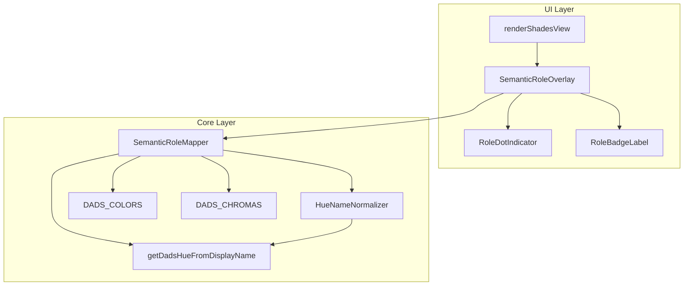
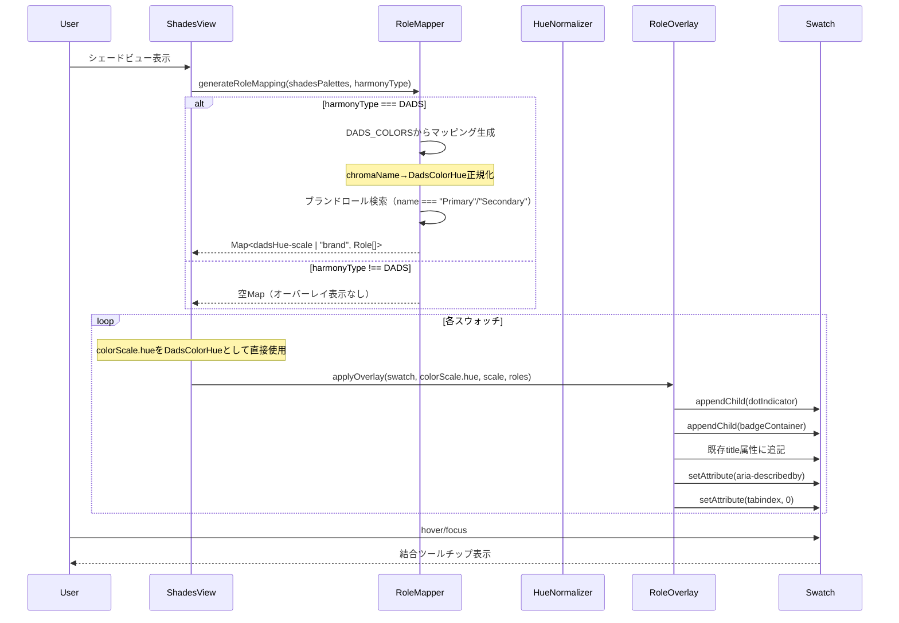

# Technical Design Document: シェードUI改善

## Overview

**Purpose**: シェードビューにおいて、各色シェードにどのセマンティックロール（Primary、Accent、Success、Error等）が割り当てられているかを視覚的に表示する機能を提供する。

**Users**: デザイナーがパレット設計時に、どの色がどのセマンティックロールに使用されているかを一目で把握できるようにする。

**Impact**: 既存のシェードビュー（`renderShadesView`）に対して、ドットインジケーターとバッジラベルのオーバーレイを追加。既存機能（CUDバッジ、ホバー表示）との共存を維持。

### Goals
- セマンティックロールの視覚的識別を可能にする
- ロール情報へのアクセシビリティを確保する（スクリーンリーダー対応）
- 既存UIとの整合性を維持する

### Non-Goals
- セマンティックロールの編集機能（本機能はビュー専用）
- ロールの自動割り当て最適化
- 既存のCUDバッジシステムの変更

### Open Questions Resolution

**Q1: ブランドロールの表示先とキー形式**
- **回答**: ブランドセクション（`renderBrandColorSection`）の単一スウォッチ上に表示。DADSスウォッチにはDADSセマンティックロールのみ表示。
- **キー形式**: `brand` 単一キーに全ブランドロール（Primary/Secondary）を集約。aria-describedbyのIDは `swatch-brand-desc`。
- **理由**: ブランドスウォッチは1つのため、集約キーにすることで実装・テスト・ARIAが一貫する。

**Q3: セマンティックロール表示の有効条件**
- **回答**: ハーモニー種別がDADS（HarmonyType.DADS）のときのみ表示する。
- **理由**: 要件1.1/1.2の「パレットにDADSロールが含まれる時」を満たす最小条件。

**Q4: ブランドロールの情報源**
- **回答**: state.shadesPalettesからname属性が"Primary"または"Secondary"のパレットを検索する。
- **理由**: 追加ステートなしで要件1.3を満たせる。DADS_COLORSにはブランドロール情報がないため。

**Q2: ツールチップ文字列フォーマット**
- **回答**: `"[カテゴリ名] ロール名"` 形式。例: `"[Semantic] Success-1"`, `"[Primary] Primary"`
- **理由**: カテゴリを先頭に置くことでスキャン性向上。既存title属性とは結合して表示。

## Architecture

### Existing Architecture Analysis

現在のシェードビュー（`src/ui/demo.ts:renderShadesView`）は以下の構造を持つ：
- `loadDadsTokens()` でDADSプリミティブカラーを取得
- `renderDadsHueSection()` で各色相セクションを描画
- 各スウォッチ（`.dads-swatch`）にscaleラベルとhexラベルを表示
- **既存title属性**: `${colorItem.hex} - ${colorItem.token.nameJa}` 形式（src/ui/demo.ts:1923-1925）
- ブランドカラーは `renderBrandColorSection()` で別途描画

**制約**:
- 既存スウォッチはCSSクラス `.dads-swatch--readonly` で識別
- CUDバッジシステム（`cud-components.ts`）との共存が必要
- 既存の`.dads-swatch__badges`は下中央配置（src/ui/styles/components.css:634-642）

**データソース整理**:
- UI層: `PaletteConfig[]` (src/ui/demo.ts) — UIステートとして`state.shadesPalettes`で直接参照
- Core層: `DADS_COLORS` (harmony.ts) — DADSセマンティックロール定義
- 参照: セマンティックロールマッピングは`state.shadesPalettes`の`name`属性と`DADS_COLORS`を直接参照

### Architecture Pattern & Boundary Map



**Architecture Integration**:
- Selected pattern: Overlay Component Pattern（既存UIへの非破壊的拡張）
- Domain/feature boundaries: UI Layer（表示）とCore Layer（データ変換）を分離
- Existing patterns preserved: CUDバッジのインラインスタイルパターンを継承
- New components rationale: オーバーレイとして分離することで既存コードへの影響を最小化
- Steering compliance: 単一責任原則に従い、各コンポーネントは1つの責務を持つ

### Technology Stack

| Layer | Choice / Version | Role in Feature | Notes |
|-------|------------------|-----------------|-------|
| Frontend | TypeScript 5.3+ | 型安全なDOM操作 | strict mode必須 |
| Runtime | Bun 1.0+ | テスト・ビルド | Vitest統合 |
| UI | Vanilla TS + DOM API | コンポーネント生成 | React不使用 |

## System Flows

### セマンティックロール表示フロー



## Requirements Traceability

| Requirement | Summary | Components | Interfaces | Flows |
|-------------|---------|------------|------------|-------|
| 1.1 | セマンティックロールマッピング生成 | SemanticRoleMapper | generateRoleMapping() | 表示フロー |
| 1.2 | DADSロールのhue-scale特定 | SemanticRoleMapper, HueNameNormalizer | lookupRoles(), chromaNameToDadsHue() | 表示フロー |
| 1.3 | ブランドロールのhue-scale特定 | SemanticRoleMapper | lookupBrandRoles() | 表示フロー |
| 1.4 | DADS_COLORS参照 | SemanticRoleMapper | - | 表示フロー |
| 1.5 | 複数ロール保持・表示制限 | RoleBadgeLabel | - | 表示フロー |
| 2.1 | 円形ドット右上配置 | RoleDotIndicator | createRoleDot() | 表示フロー |
| 2.2 | カテゴリ別ドット色 | RoleDotIndicator | ROLE_CATEGORY_COLORS | 表示フロー |
| 2.3 | ドットの視認性確保 | RoleDotIndicator | - | 表示フロー |
| 2.4 | ロールなし時はドット非表示 | RoleDotIndicator | - | 表示フロー |
| 3.1 | バッジラベル下部配置 | RoleBadgeLabel | createRoleBadge() | 表示フロー |
| 3.2 | バッジ情報内容 | RoleBadgeLabel | - | 表示フロー |
| 3.3 | バッジスタイル | RoleBadgeLabel | - | 表示フロー |
| 3.4 | 複数ロール縦スタック | RoleBadgeLabel | - | 表示フロー |
| 4.1 | ホバー/フォーカス時ツールチップ | SemanticRoleOverlay | mergeTooltipContent() | インタラクション |
| 4.2 | pointer-events無効化 | RoleDotIndicator, RoleBadgeLabel | - | インタラクション |
| 4.3 | CVDシミュレーション時の固定色 | RoleDotIndicator, RoleBadgeLabel | - | インタラクション |
| 5.1 | 計算200ms以内 | SemanticRoleMapper | - | パフォーマンス |
| 5.2 | DOM要素最小化 | SemanticRoleOverlay | - | パフォーマンス |

## Components and Interfaces

| Component | Domain/Layer | Intent | Req Coverage | Key Dependencies | Contracts |
|-----------|--------------|--------|--------------|------------------|-----------|
| SemanticRoleMapper | Core | ロールマッピング生成 | 1.1-1.5, 5.1 | DADS_COLORS (P0), DADS_CHROMAS (P0), getDadsHueFromDisplayName (P0), PaletteInfo[] (P0) | Service |
| HueNameNormalizer | Core | 色相名正規化 | 1.2 | getDadsHueFromDisplayName (P0) | Service |
| SemanticRoleOverlay | UI | オーバーレイ統括 | 4.1, 4.2, 5.2 | SemanticRoleMapper (P0), Swatch DOM (P0) | Service |
| RoleDotIndicator | UI | ドット表示 | 2.1-2.4, 4.3 | - | - |
| RoleBadgeLabel | UI | バッジ表示 | 3.1-3.4, 4.3 | - | - |

### Core Layer

#### HueNameNormalizer

| Field | Detail |
|-------|--------|
| Intent | DADS_CHROMAS.displayNameとDadsColorHue間の正規化 |
| Requirements | 1.2 |

**Responsibilities & Constraints**
- `DADS_CHROMAS.displayName`（例: "Light Blue"）を`DadsColorHue`（例: "light-blue"）に変換
- 逆変換（`DadsColorHue`→`displayName`）もサポート
- 変換不能な場合はundefinedを返却（フォールバック用）

**Key Mapping** (DADS_CHROMAS → DadsColorHue):
| DADS_CHROMAS.name | DADS_CHROMAS.displayName | DadsColorHue |
|-------------------|--------------------------|--------------|
| blue | Blue | blue |
| cyan | Light Blue | light-blue |
| teal | Cyan | cyan |
| green | Green | green |
| lime | Lime | lime |
| yellow | Yellow | yellow |
| orange | Orange | orange |
| red | Red | red |
| magenta | Magenta | magenta |
| purple | Purple | purple |

**Dependencies**
- External: getDadsHueFromDisplayName (dads-data-provider.ts:86-90) — 変換関数 (P0)

**Contracts**: Service [x] / API [ ] / Event [ ] / Batch [ ] / State [ ]

##### Service Interface

```typescript
import type { DadsColorHue } from "@/core/tokens/types";
import { getDadsHueFromDisplayName } from "@/core/tokens/dads-data-provider";
import { DADS_CHROMAS } from "@/core/base-chroma";

/**
 * DADS_CHROMAS.displayNameからDadsColorHueへ変換
 * @param displayName - 表示名（例: "Light Blue"）
 * @returns DadsColorHue または undefined
 */
function normalizeToDadsHue(displayName: string): DadsColorHue | undefined {
  return getDadsHueFromDisplayName(displayName);
}

/**
 * DADS_CHROMAS.nameからDadsColorHueへ変換
 * harmony.tsのDADS_COLORS.chromaNameはDADS_CHROMAS.nameを参照するため必要
 * @param chromaName - クロマ名（例: "cyan"）
 * @returns DadsColorHue または undefined
 */
function chromaNameToDadsHue(chromaName: string): DadsColorHue | undefined {
  const chroma = DADS_CHROMAS.find(c => c.name === chromaName);
  if (!chroma) return undefined;
  return getDadsHueFromDisplayName(chroma.displayName);
}
```

---

#### SemanticRoleMapper

| Field | Detail |
|-------|--------|
| Intent | パレット状態からセマンティックロールマッピングを生成 |
| Requirements | 1.1, 1.2, 1.3, 1.4, 1.5, 5.1 |

**Responsibilities & Constraints**
- DADS_COLORSとパレット状態を参照してロールマッピングを生成
- キー形式: `"${dadsHue}-${scale}"` （例: "blue-600", "light-blue-600"）
  - **重要**: キーには正規化後の`DadsColorHue`を使用（DADS_CHROMAS.displayNameではない）
- ブランドロールはstate.shadesPalettesからname属性が"Primary"/"Secondary"のパレットを検索
  - キー `"brand"` に全ブランドロール（Primary/Secondary）を配列として集約
  - baseChromaName/stepが存在する場合はhue-scaleも保持、無い場合はロール名のみ表示
- 計算時間200ms以内を保証

**Dependencies**
- Inbound: SemanticRoleOverlay — マッピング取得 (P0)
- External: DADS_COLORS (harmony.ts) — ロール定義 (P0)
- External: DADS_CHROMAS (base-chroma.ts) — chromaName→displayName変換 (P0)
- External: getDadsHueFromDisplayName — displayName→DadsColorHue変換 (P0)

**Contracts**: Service [x] / API [ ] / Event [ ] / Batch [ ] / State [ ]

##### Service Interface

```typescript
import type { DadsColorHue } from "@/core/tokens/types";

/** セマンティックロールのカテゴリ */
type RoleCategory = "primary" | "secondary" | "accent" | "semantic" | "link";

/** セマンティックロール情報 */
interface SemanticRole {
  /** ロール名（例: "Primary", "Success-1", "Accent-Blue"） */
  name: string;
  /** カテゴリ */
  category: RoleCategory;
  /** フル表示名（ツールチップ用、フォーマット: "[カテゴリ名] ロール名"） */
  fullName: string;
}

/** ロールマッピング結果 */
type RoleMapping = Map<string, SemanticRole[]>;

/** マッピングキー生成 */
type MappingKey = `${DadsColorHue}-${number}` | "brand";

/**
 * Core層用パレット情報（UI層PaletteConfigの最小サブセット）
 * UI層に依存しない形でブランドロール検索に必要な情報のみ定義
 */
interface PaletteInfo {
  /** パレット名（"Primary", "Secondary"等） */
  name: string;
  /** ベースクロマ名（オプション） */
  baseChromaName?: string;
  /** ステップ値（オプション） */
  step?: number;
}

interface SemanticRoleMapperService {
  /**
   * パレットからセマンティックロールマッピングを生成
   * @param palettes - PaletteInfo配列（UI層から渡される最小情報）
   * @param harmonyType - 現在のハーモニー種別
   * @returns dadsHue-scale → ロール配列のMap（DADS以外のハーモニー種別では空Map）
   *
   * 処理フロー:
   * 1. ハーモニー種別がDADSかチェック（DADS以外は空Mapを返却）
   * 2. DADS_COLORSをイテレート
   * 3. chromaName → DADS_CHROMAS.displayName → DadsColorHue に変換
   * 4. キー "${dadsHue}-${step}" でマッピング登録
   * 5. ブランドロール: palettesからname === "Primary"/"Secondary"を検索し、キー "brand" に集約
   */
  generateRoleMapping(palettes: PaletteInfo[], harmonyType: string): RoleMapping;

  /**
   * 特定のhue-scaleに対するロールを検索
   * @param dadsHue - DadsColorHue（例: "blue", "light-blue"）
   * @param scale - スケール値（例: 600）
   * @returns ロール配列（空配列は該当なし）
   */
  lookupRoles(dadsHue: DadsColorHue, scale: number): SemanticRole[];

  /**
   * ブランドロール配列を取得
   * @returns ブランドロール配列（Primary/Secondary）
   */
  lookupBrandRoles(): SemanticRole[];
}
```

- Preconditions: palettes配列がnullでないこと
- Postconditions: DADS以外のハーモニー種別では空Map、DADSの場合はMap内のキーは`"${dadsHue}-${scale}"`または`"brand"`形式
- Invariants: 計算時間200ms以内

**Implementation Notes**
- Integration:
  - DADSセマンティックロール: DADS_COLORSから直接マッピング生成
  - ブランドロール: state.shadesPalettesからname === "Primary"/"Secondary"のパレットを検索
- Validation: ハーモニー種別がDADSかどうかをチェック（DADS以外では空Mapを返却）
- Risks: パレット状態の同期タイミング

---

### UI Layer

#### SemanticRoleOverlay

| Field | Detail |
|-------|--------|
| Intent | スウォッチへのオーバーレイ要素統括 |
| Requirements | 4.1, 4.2, 5.2 |

**Responsibilities & Constraints**
- スウォッチDOM要素にドット・バッジを追加
- **ツールチップ**: 既存title属性と結合（上書きではない）
- aria-describedby属性の設定（要件準拠のID形式）
- tabindex="0"の設定（キーボード操作対応）

**Dependencies**
- Inbound: renderShadesView — オーバーレイ適用 (P0)
- Outbound: SemanticRoleMapper — ロール情報取得 (P0)
- Outbound: RoleDotIndicator — ドット生成 (P1)
- Outbound: RoleBadgeLabel — バッジ生成 (P1)

**Contracts**: Service [x] / API [ ] / Event [ ] / Batch [ ] / State [ ]

##### Service Interface

```typescript
import type { DadsColorHue } from "@/core/tokens/types";

interface SemanticRoleOverlayService {
  /**
   * スウォッチにセマンティックロールオーバーレイを適用
   * @param swatchElement - 対象のスウォッチDOM要素
   * @param dadsHue - DadsColorHue（DADSシェード用、ブランドスウォッチの場合はundefined）
   * @param scale - スケール値（DADSシェード用、ブランドスウォッチの場合はundefined）
   * @param roles - セマンティックロール配列
   * @param isBrand - ブランドスウォッチかどうか（trueの場合はbrandキーとして処理）
   */
  applyOverlay(
    swatchElement: HTMLElement,
    dadsHue: DadsColorHue | undefined,
    scale: number | undefined,
    roles: SemanticRole[],
    isBrand?: boolean
  ): void;

  /**
   * 既存title属性とロール情報を結合
   * @param existingTitle - 既存のtitle属性値
   * @param roles - セマンティックロール配列
   * @returns 結合後のtitle文字列
   *
   * フォーマット:
   * "${existingTitle}\n---\nセマンティックロール:\n${role.fullName}"
   */
  mergeTooltipContent(existingTitle: string, roles: SemanticRole[]): string;

  /**
   * アクセシビリティ用説明要素を生成
   * @param dadsHue - DadsColorHue（DADSシェード用、ブランドスウォッチの場合はundefined）
   * @param scale - スケール値（DADSシェード用、ブランドスウォッチの場合はundefined）
   * @param roles - セマンティックロール配列
   * @param isBrand - ブランドスウォッチかどうか（trueの場合はbrandキーとして処理）
   * @returns 説明用span要素のID
   *
   * ID形式（要件準拠）:
   * - DADSシェード: "swatch-{dadsHue}-{scale}-desc" (例: "swatch-blue-600-desc")
   * - ブランドロール: "swatch-brand-desc" (単一キーで全ブランドロールを集約)
   */
  createAccessibleDescription(
    dadsHue: DadsColorHue | undefined,
    scale: number | undefined,
    roles: SemanticRole[],
    isBrand?: boolean
  ): string;
}
```

**Implementation Notes**
- Integration: renderDadsHueSectionループ内で呼び出し
- Validation: rolesが空配列の場合は何も追加しない
- Risks: 既存CSSとの競合
- **tabindex設定**: スウォッチにtabindex="0"を追加してキーボードフォーカス可能に

---

#### RoleDotIndicator

| Field | Detail |
|-------|--------|
| Intent | 円形ドットインジケーターの生成 |
| Requirements | 2.1, 2.2, 2.3, 2.4, 4.3 |

**Responsibilities & Constraints**
- 直径12pxの円形ドットを生成
- カテゴリに応じた背景色を適用
- 白い境界線（2px）とドロップシャドウを適用
- pointer-eventsを無効化

**Dependencies**
- Inbound: SemanticRoleOverlay — ドット生成依頼 (P0)

**Contracts**: Service [ ] / API [ ] / Event [ ] / Batch [ ] / State [ ]

##### Function Interface

```typescript
/** カテゴリ別ドット色定義（要件2.2準拠） */
const ROLE_CATEGORY_COLORS: Record<RoleCategory, string> = {
  primary: "#6366f1",    // インディゴ
  secondary: "#8b5cf6",  // パープル
  accent: "#ec4899",     // ピンク
  semantic: "#10b981",   // エメラルド
  link: "#3b82f6",       // ブルー
};

/**
 * ロールドットインジケーターを生成
 * @param category - ロールカテゴリ
 * @returns ドット要素
 *
 * スタイル:
 * - position: absolute
 * - top: 4px, right: 4px
 * - width/height: 12px
 * - border-radius: 50%
 * - border: 2px solid white
 * - box-shadow: 0 1px 3px rgba(0,0,0,0.3)
 * - pointer-events: none
 * - z-index: 10 (既存バッジより上)
 */
function createRoleDot(category: RoleCategory): HTMLElement;
```

**Implementation Notes**
- スタイル: インラインCSS（`style.cssText`）
- 配置: position: absolute, top: 4px, right: 4px
- CVD対応: 色はCVDシミュレーション適用外（固定色）
- **z-index: 10** で既存の`.dads-swatch__badges`より上に配置

---

#### RoleBadgeLabel

| Field | Detail |
|-------|--------|
| Intent | バッジラベルの生成 |
| Requirements | 3.1, 3.2, 3.3, 3.4, 4.3 |

**Responsibilities & Constraints**
- ロール名とカテゴリ色のバッジを生成
- 最大2つまで表示、3つ以上は「+N」形式
- フォントサイズ9px、ウェイト600、角丸3px
- 長いテキストは省略記号で切り詰め

**Dependencies**
- Inbound: SemanticRoleOverlay — バッジ生成依頼 (P0)

**Contracts**: Service [ ] / API [ ] / Event [ ] / Batch [ ] / State [ ]

##### Function Interface

```typescript
/**
 * ロールバッジラベルコンテナを生成
 * @param roles - セマンティックロール配列
 * @returns バッジコンテナ要素
 *
 * 配置:
 * - position: absolute
 * - bottom: 4px, left: 4px (既存.dads-swatch__badgesの下中央と競合しない)
 * - z-index: 10
 * - pointer-events: none
 *
 * レイアウト:
 * - display: flex
 * - flex-direction: column
 * - gap: 2px
 * - align-items: flex-start
 */
function createRoleBadges(roles: SemanticRole[]): HTMLElement;

/**
 * 単一バッジを生成
 * @param role - セマンティックロール
 * @returns バッジ要素
 *
 * スタイル:
 * - font-size: 9px
 * - font-weight: 600
 * - border-radius: 3px
 * - padding: 1px 4px
 * - color: white
 * - background-color: ROLE_CATEGORY_COLORS[role.category]
 * - max-width: 60px
 * - overflow: hidden
 * - text-overflow: ellipsis
 * - white-space: nowrap
 */
function createSingleBadge(role: SemanticRole): HTMLElement;

/**
 * 「+N」バッジを生成
 * @param count - 残りのロール数
 * @returns 「+N」バッジ要素
 */
function createOverflowBadge(count: number): HTMLElement;
```

**Implementation Notes**
- 配置: position: absolute, bottom: 4px, **left: 4px**
  - 既存の`.dads-swatch__badges`は`bottom: 4px, left: 50%, transform: translateX(-50%)`なので競合しない
- 縦スタック: flexbox column, gap: 2px
- 省略: max-width設定、overflow: hidden, text-overflow: ellipsis
- **z-index: 10** で適切な重なり順を確保

## Data Models

### Domain Model

```typescript
import type { DadsColorHue } from "@/core/tokens/types";

/** セマンティックロールカテゴリ（要件2.2準拠） */
type RoleCategory = "primary" | "secondary" | "accent" | "semantic" | "link";

/** セマンティックロール情報 */
interface SemanticRole {
  name: string;           // 短縮名（バッジ表示用）
  category: RoleCategory; // カテゴリ
  fullName: string;       // フルネーム（ツールチップ用）
}

/** ロールマッピング（hue-scale → ロール配列） */
type RoleMapping = Map<string, SemanticRole[]>;

/** マッピングキー形式 */
type MappingKey = `${DadsColorHue}-${number}` | "brand";
```

### Logical Data Model

**構造定義**:
- キー形式: `"${dadsHue}-${scale}"` （例: "blue-600", "light-blue-600", "cyan-600"）
  - **重要**: `dadsHue`はDadsColorHue型（"light-blue"など）で、DADS_CHROMAS.displayName（"Light Blue"）ではない
- 値: SemanticRole配列（複数ロールが同一シェードを共有可能）
- ブランドロール: キー `"brand"` に全ブランドロール（Primary/Secondary）を集約

**正規化フロー**:
```
DADS_COLORS.chromaName (例: "cyan")
  → DADS_CHROMAS.find(c => c.name === "cyan").displayName (例: "Light Blue")
  → getDadsHueFromDisplayName("Light Blue") (例: "light-blue")
  → キー: "light-blue-600"
```

**一貫性**:
- DADS_COLORSは読み取り専用、パレット状態のみ変動
- マッピングはレンダリングごとに再計算（キャッシュ検討可）

## Error Handling

### Error Strategy

- 入力バリデーション: palette配列がnull/undefinedの場合は空Mapを返却
- DOM操作失敗: try-catchで捕捉し、コンソール警告のみ（UI崩壊防止）
- マッピング失敗: 該当シェードにオーバーレイを適用しない（グレースフル劣化）
- **色相正規化失敗**: `getDadsHueFromDisplayName`がundefinedを返す場合
  - DADSセマンティック: 該当ロールをスキップ（警告ログ出力）
  - ブランドロール: キー`"brand"`でマッピング、ロール名のみ表示

### Error Categories and Responses

**User Errors**: N/A（本機能はビュー専用）
**System Errors**: DOM操作失敗 → コンソール警告、処理続行
**Business Logic Errors**: 色相正規化失敗 → フォールバック処理

## Testing Strategy

### Unit Tests
- HueNameNormalizer: DADS_CHROMAS.displayName→DadsColorHue変換が正しいこと
- HueNameNormalizer: 未知の表示名でundefinedが返ること
- SemanticRoleMapper.generateRoleMapping: DADS_COLORSから正しいマッピングが生成されること
- SemanticRoleMapper.generateRoleMapping: キー形式が"${dadsHue}-${scale}"であること
- SemanticRoleMapper.lookupRoles: hue-scaleで正しいロールが返却されること
- createRoleDot: カテゴリに応じた正しい色のドットが生成されること
- createRoleBadges: 複数ロール時に最大2つ+「+N」形式で表示されること
- createAccessibleDescription: 一意のIDと正しいテキストが生成されること
- mergeTooltipContent: 既存titleとロール情報が正しく結合されること

### Integration Tests
- renderShadesView + SemanticRoleOverlay: スウォッチにドット・バッジが追加されること
- CVDシミュレーション時: ドット・バッジ色が固定されること
- 再描画時: マッピングが再生成されること（全面再描画方式のため差分更新は対象外）
- 既存title属性との結合: HEX/トークン名とロール情報が両方表示されること
- tabindex設定: スウォッチがキーボードフォーカス可能であること
- DADS以外のハーモニー種別: セマンティックロール表示がないこと

### E2E/UI Tests
- シェードビュー表示時、セマンティックロールが割り当てられたシェードにドットが表示されること
- ホバー時にツールチップが表示されること（既存情報+ロール情報）
- スクリーンリーダーでロール情報が読み上げられること
- キーボード操作（Tab）でスウォッチ間を移動できること

### Performance Tests
- 10色相 × 13スケール（130シェード）のマッピング生成が200ms以内であること
- DOM追加によるレンダリングブロッキングがないこと

## Optional Sections

### Performance & Scalability

**Target Metrics**:
- マッピング計算: 200ms以内（要件5.1）
- DOM操作: フレームレート60fps維持

**Optimization Techniques**:
- requestAnimationFrameを使用したDOM更新バッチ処理（必要に応じて）
- 現行のrenderMainは全面再描画のため、差分更新は対象外
