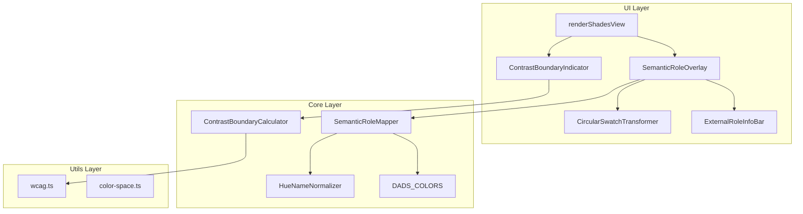
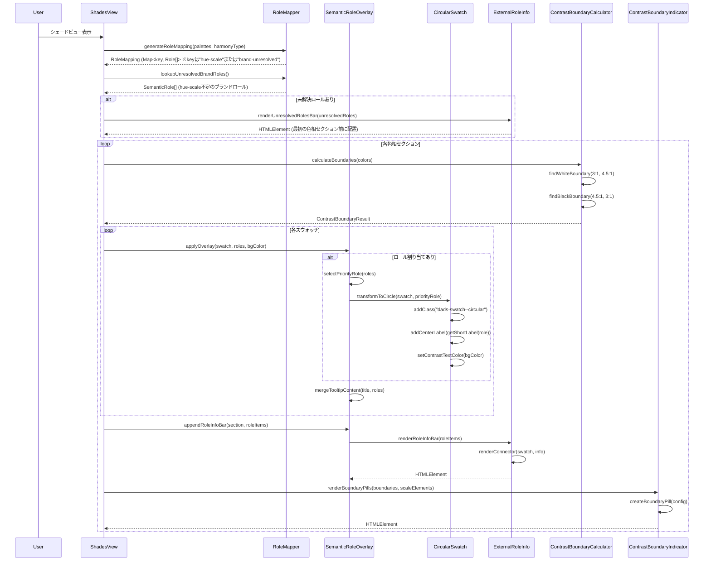

# Technical Design Document: シェードUI改善

## Overview

**Purpose**: シェードビューにおいて、セマンティックロール割り当てを円形スウォッチ、欄外ロール情報、コントラスト比境界表示で視覚化する機能を提供する。

**Users**: デザイナーがパレット設計時に、色の用途とWCAGコントラスト要件を一目で把握できるようにする。

**Impact**: 既存のシェードビュー（`renderShadesView`）に対して、スウォッチの円形化、欄外情報表示、コントラスト境界インジケーターを追加。旧実装（ドットインジケーター、オーバーレイバッジ）を置き換える。

### Goals
- セマンティックロール割り当てスウォッチを円形に変形し、中央にラベル表示
- ロール情報を欄外に完全表示（見切れ問題の解決）
- 白/黒背景に対するコントラスト比境界（3:1、4.5:1）を視覚化

### Non-Goals
- セマンティックロールの編集機能（本機能はビュー専用）
- ロールの自動割り当て最適化
- 既存のCUDバッジシステムの変更

## Architecture

### Existing Architecture Analysis

現在のシェードビュー（`src/ui/demo.ts:renderShadesView`）の構造：
- `loadDadsTokens()` でDADSプリミティブカラーを取得
- `renderDadsHueSection()` で各色相セクションを描画
- 各スウォッチ（`.dads-swatch`）にscaleラベルとhexラベルを表示
- **現行のセマンティックロール表示**: 小さなドット（12px）+ オーバーレイバッジ → **廃止予定**

**制約**:
- CUDバッジシステム（`cud-components.ts`）との共存が必要
- 既存の`.dads-swatch__badges`は下中央配置

### Architecture Pattern & Boundary Map



**Architecture Integration**:
- Selected pattern: Transform & External Display Pattern（既存UIへの非破壊的拡張）
- Domain/feature boundaries: UI Layer（表示変換）とCore Layer（データ計算）を分離
- 旧コンポーネント廃止: `RoleDotIndicator`、`RoleBadgeLabel`（オーバーレイ形式）は置き換え
- New components rationale: 円形化・欄外表示・コントラスト境界で3つの独立した表示機能を提供

### Technology Stack

| Layer | Choice / Version | Role in Feature | Notes |
|-------|------------------|-----------------|-------|
| Frontend | TypeScript 5.3+ | 型安全なDOM操作 | strict mode必須 |
| Runtime | Bun 1.0+ | テスト・ビルド | Vitest統合 |
| UI | Vanilla TS + DOM API | コンポーネント生成 | React不使用 |
| Color | culori.js | コントラスト計算 | wcagContrast関数 |
| CSS | components.css | スタイル定義 | クラスベース優先 |

### Styling Guidelines

**原則**: インラインstyle属性を最小限にし、CSSクラスを優先使用する。

**CSS定義場所**: `src/ui/styles/components.css`

**新規CSSクラス**:
- `.dads-swatch--circular`: 円形スウォッチ用
- `.dads-swatch__role-label`: 中央ラベル用
- `.dads-role-info-bar`: 欄外ロール情報バー
- `.dads-role-info-item`: 個別ロール情報
- `.dads-role-connector`: スウォッチと情報バーの接続線
- `.dads-contrast-boundary`: コントラスト境界コンテナ
- `.dads-contrast-pill`: 境界ピル共通
- `.dads-contrast-pill--outline`: 白抜きピル（白背景用）
- `.dads-contrast-pill--filled`: 黒塗りピル（黒背景用）
- `.dads-unresolved-roles-bar`: hue-scale不定ブランドロール用バー（シェードビュー全体で1回表示）
- `.dads-unresolved-roles-bar__label`: 「未解決ロール:」ラベル用

**インラインstyle許容ケース**:
- 動的に計算される背景色（`backgroundColor`）
- 動的に計算されるテキスト色（`color`）
- 位置調整が必要な場合の`left`/`transform`

## System Flows

### セマンティックロール表示フロー（更新版）



### ブランドロールの扱い

ブランドロール（Primary/Secondary）は以下の条件で処理される：

1. **hue-scaleが特定できる場合**: DADSシェード上で円形化対象となる
   - `state.shadesPalettes`から`name === "Primary"/"Secondary"`のパレットを検索
   - `baseChromaName`と`step`が存在する場合、対応するスウォッチを円形化
   - キー形式: `"${dadsHue}-${scale}"`（他のDADSロールと同様）

2. **hue-scaleが特定できない場合**: 欄外情報のみで表示
   - `baseChromaName`または`step`が無い場合
   - ロール名のみ表示（スウォッチの円形化なし）
   - キー形式: `"brand-unresolved"`（欄外情報のみ表示用に専用キーで集約）
   - `RoleInfoItem`は`scale`と`swatchElement`をundefinedとして生成（コネクタ線なし）
   - **シェードビュー全体で1回のみ表示**（最初の色相セクションの前に配置、各セクションでの繰り返し表示は行わない）

3. **ARIA IDルール**: ブランドロール専用IDは使用しない
   - hue-scaleが特定できる場合: 該当DADSシェードのID（`swatch-{hue}-{scale}-desc`）にロール情報をマージ
   - hue-scaleが特定できない場合: 専用ID不要（欄外情報のみで表示されるため）
   - **廃止**: `swatch-brand-desc`形式のIDは使用しない

## Requirements Traceability

| Requirement | Summary | Components | Interfaces | Flows |
|-------------|---------|------------|------------|-------|
| 1.1 | セマンティックロールマッピング生成 | SemanticRoleMapper | generateRoleMapping() | 表示フロー |
| 1.2 | DADSロールのhue-scale特定 | SemanticRoleMapper, HueNameNormalizer | lookupRoles() | 表示フロー |
| 1.3 | ブランドロールのhue-scale特定 | SemanticRoleMapper | lookupRoles(), lookupUnresolvedBrandRoles() | 表示フロー |
| 1.4 | DADS_COLORS参照 | SemanticRoleMapper | - | 表示フロー |
| 1.5 | 複数ロール保持（UI表示は要件2/3で定義） | ExternalRoleInfoBar | - | 表示フロー |
| 2.1 | スウォッチ円形化 | CircularSwatchTransformer | transformToCircle() | 表示フロー |
| 2.2 | 中央ラベル表示 | CircularSwatchTransformer | getShortLabel() | 表示フロー |
| 2.3 | ラベル文字色自動調整 | CircularSwatchTransformer | getContrastTextColor() | 表示フロー |
| 2.4 | ロールなし時は四角形維持 | CircularSwatchTransformer | - | 表示フロー |
| 2.5 | 円形サイズ維持 | CircularSwatchTransformer | - | 表示フロー |
| 2.6 | ブランドロール円形化 | CircularSwatchTransformer | transformToCircle() | 表示フロー |
| 3.1 | 欄外ロール情報表示 | ExternalRoleInfoBar | renderRoleInfoBar() | 表示フロー |
| 3.2 | ロール情報内容 | ExternalRoleInfoBar | - | 表示フロー |
| 3.3 | 欄外スタイル | ExternalRoleInfoBar | - | 表示フロー |
| 3.4 | 視覚的関連性 | ExternalRoleInfoBar | renderConnector() | 表示フロー |
| 3.5 | 複数ロール水平表示 | ExternalRoleInfoBar | - | 表示フロー |
| 4.1 | ツールチップ表示 | SemanticRoleOverlay | mergeTooltipContent() | インタラクション |
| 4.2 | pointer-events無効化 | CircularSwatchTransformer, ExternalRoleInfoBar | - | インタラクション |
| 4.3 | CVDシミュレーション時の固定色 | ExternalRoleInfoBar, ContrastBoundaryIndicator | - | インタラクション |
| 5.1 | 計算200ms以内 | SemanticRoleMapper, ContrastBoundaryCalculator | - | パフォーマンス |
| 5.2 | DOM要素最小化 | All UI components | - | パフォーマンス |
| 6.1 | コントラスト境界表示 | ContrastBoundaryIndicator | renderBoundaryPills() | 表示フロー |
| 6.2 | 白背景境界（3:1→、4.5:1→） | ContrastBoundaryIndicator, ContrastBoundaryCalculator | findWhiteBoundary() | 表示フロー |
| 6.3 | 黒背景境界（←4.5:1、←3:1） | ContrastBoundaryIndicator, ContrastBoundaryCalculator | findBlackBoundary() | 表示フロー |
| 6.4 | ピルスタイル | ContrastBoundaryIndicator | - | 表示フロー |
| 6.5 | ピル配置 | ContrastBoundaryIndicator | - | 表示フロー |
| 6.6 | WCAG 2.x準拠計算 | ContrastBoundaryCalculator | - | 表示フロー |

## Components and Interfaces

| Component | Domain/Layer | Intent | Req Coverage | Key Dependencies | Contracts |
|-----------|--------------|--------|--------------|------------------|-----------|
| SemanticRoleMapper | Core | ロールマッピング生成 | 1.1-1.5 | DADS_COLORS (P0), HueNameNormalizer (P0) | Service |
| HueNameNormalizer | Core | 色相名正規化 | 1.2 | getDadsHueFromDisplayName (P0) | Service |
| ContrastBoundaryCalculator | Core | コントラスト境界計算 | 6.2, 6.3, 6.6 | wcag.ts (P0) | Service |
| SemanticRoleOverlay | UI | オーバーレイ統括 | 4.1-4.3 | RoleMapper (P0) | Service |
| CircularSwatchTransformer | UI | スウォッチ円形化 | 2.1-2.5 | - | - |
| ExternalRoleInfoBar | UI | 欄外ロール情報 | 3.1-3.5 | - | - |
| ContrastBoundaryIndicator | UI | コントラスト境界表示 | 6.1, 6.4, 6.5 | ContrastBoundaryCalculator (P0) | - |

### Core Layer

#### SemanticRoleMapper

| Field | Detail |
|-------|--------|
| Intent | パレット状態からセマンティックロールマッピングを生成 |
| Requirements | 1.1, 1.2, 1.3, 1.4, 1.5 |

**Responsibilities & Constraints**
- DADS_COLORSとパレット状態を参照してロールマッピングを生成
- キー形式:
  - DADSロール: `"${dadsHue}-${scale}"`
  - ブランドロール（hue-scale特定可能時）: `"${dadsHue}-${scale}"`（DADSロールと同一キーにマージ）
  - ブランドロール（hue-scale特定不可時）: `"brand-unresolved"`（欄外表示用に専用キーで集約）
- 計算時間200ms以内を保証

**Dependencies**
- External: DADS_COLORS (harmony.ts) — ロール定義 (P0)
- External: HueNameNormalizer — 色相名正規化 (P0)

**Contracts**: Service [x]

##### Service Interface

```typescript
import type { DadsColorHue } from "@/core/tokens/types";

type RoleCategory = "primary" | "secondary" | "accent" | "semantic" | "link";

/** semanticカテゴリのサブタイプ（短縮ラベル決定用） */
type SemanticSubType = "success" | "error" | "warning";

interface SemanticRole {
  name: string;
  category: RoleCategory;
  /** semanticカテゴリの場合のサブタイプ */
  semanticSubType?: SemanticSubType;
  fullName: string;
  /** 円形スウォッチ用短縮ラベル (P/S/A/Su/E/W/L等) */
  shortLabel: string;
}

type RoleMapping = Map<string, SemanticRole[]>;

interface SemanticRoleMapperService {
  generateRoleMapping(palettes: PaletteInfo[], harmonyType: string): RoleMapping;
  /** 特定hue-scaleの全ロール（DADS + hue-scale特定可能なブランドロール統合済み）を取得 */
  lookupRoles(dadsHue: DadsColorHue, scale: number): SemanticRole[];
  /** hue-scale特定不可のブランドロール配列を取得（「brand-unresolved」キーから） */
  lookupUnresolvedBrandRoles(): SemanticRole[];
}
```

---

#### ContrastBoundaryCalculator

| Field | Detail |
|-------|--------|
| Intent | 色スケールに対するコントラスト比境界位置を計算 |
| Requirements | 6.2, 6.3, 6.6 |

**Responsibilities & Constraints**
- 白背景に対する3:1、4.5:1境界のscale位置を特定
- 黒背景に対する4.5:1、3:1境界のscale位置を特定
- WCAG 2.x相対輝度アルゴリズム（culori.js wcagContrast）を使用

**Dependencies**
- External: culori.js wcagContrast — コントラスト計算 (P0)
- External: WCAG_RATIO_AA, WCAG_RATIO_AA_LARGE from utils/wcag.ts (P0)

**Contracts**: Service [x]

##### Service Interface

```typescript
interface ContrastBoundary {
  /** 境界が存在するscale値（存在しない場合はnull） */
  scale: number | null;
  /** 境界の種類 */
  type: "3:1" | "4.5:1";
  /** 背景色 */
  background: "white" | "black";
  /** 方向（白背景は→、黒背景は←） */
  direction: "start" | "end";
}

interface ContrastBoundaryResult {
  /** 白背景に対する3:1境界（開始位置） */
  white3to1: number | null;
  /** 白背景に対する4.5:1境界（開始位置） */
  white4_5to1: number | null;
  /** 黒背景に対する4.5:1境界（終了位置） */
  black4_5to1: number | null;
  /** 黒背景に対する3:1境界（終了位置） */
  black3to1: number | null;
}

interface ContrastBoundaryCalculatorService {
  /**
   * 色スケール配列からコントラスト境界位置を計算
   * @param colors - 色アイテム配列（scale昇順）
   * @returns 各境界のscale位置
   */
  calculateBoundaries(colors: ColorItem[]): ContrastBoundaryResult;

  /**
   * 白背景に対する境界を検索
   * 小さいscale（明るい色）から大きいscale（暗い色）へ走査し、
   * 初めてコントラスト比が閾値を超えるscaleを返す
   */
  findWhiteBoundary(colors: ColorItem[], threshold: number): number | null;

  /**
   * 黒背景に対する境界を検索
   * 大きいscale（暗い色）から小さいscale（明るい色）へ走査し、
   * 初めてコントラスト比が閾値を超えるscaleを返す
   */
  findBlackBoundary(colors: ColorItem[], threshold: number): number | null;
}
```

**Implementation Notes**
- 白背景: scale昇順で走査、最初に閾値を超えた位置が境界
- 黒背景: scale降順で走査、最初に閾値を超えた位置が境界
- 閾値: 3.0 (AA Large), 4.5 (AA Normal)

---

### UI Layer

#### CircularSwatchTransformer

| Field | Detail |
|-------|--------|
| Intent | セマンティックロール割り当てスウォッチを円形に変形 |
| Requirements | 2.1, 2.2, 2.3, 2.4, 2.5, 2.6 |

**Responsibilities & Constraints**
- スウォッチにborder-radius: 50%を適用して円形化
- 中央にロールの短縮ラベル（P/S/A等）を表示
- ラベル文字色は背景色とのコントラストに応じて自動調整

**Dependencies**
- Inbound: SemanticRoleOverlay — 変形依頼 (P0)

**Contracts**: -

##### Function Interface

```typescript
/** カテゴリ別の短縮ラベル */
const CATEGORY_SHORT_LABELS: Record<RoleCategory, string> = {
  primary: "P",
  secondary: "S",
  accent: "A",      // 複数の場合はA1, A2等
  semantic: "",     // semanticSubTypeで決定
  link: "L",
};

/** semanticサブタイプ別の短縮ラベル */
const SEMANTIC_SUBTYPE_LABELS: Record<SemanticSubType, string> = {
  success: "Su",
  error: "E",
  warning: "W",
};

/** ロール優先順位（複数ロール時の中央ラベル決定用） */
const ROLE_PRIORITY: RoleCategory[] = ["primary", "secondary", "accent", "semantic", "link"];

/**
 * スウォッチを円形に変形
 * @param swatchElement - 対象のスウォッチDOM要素
 * @param role - セマンティックロール
 * @param backgroundColor - スウォッチの背景色（テキスト色決定用）
 */
function transformToCircle(
  swatchElement: HTMLElement,
  role: SemanticRole,
  backgroundColor: string
): void;

/**
 * 背景色に対するコントラスト最適なテキスト色を取得
 * @param backgroundColor - 背景色
 * @returns "black" | "white"
 */
function getContrastTextColor(backgroundColor: string): "black" | "white";

/**
 * ロールから短縮ラベルを取得
 * @param role - セマンティックロール
 * @param index - 同一カテゴリ内のインデックス（Accentの番号付け用）
 * @returns 短縮ラベル（P/S/A/A1/Su/E/W/L等）
 *
 * ロジック:
 * - category === "semantic" の場合: semanticSubTypeから決定（Su/E/W）
 * - category === "accent" かつ複数ある場合: A1, A2等
 * - その他: CATEGORY_SHORT_LABELSから取得
 */
function getShortLabel(role: SemanticRole, index?: number): string;

/**
 * 複数ロールから中央ラベル表示用の優先ロールを選択
 * @param roles - セマンティックロール配列
 * @returns 最優先ロール（ROLE_PRIORITY順）
 */
function selectPriorityRole(roles: SemanticRole[]): SemanticRole;
```

**Implementation Notes**
- CSSクラス `.dads-swatch--circular` を追加して円形化
- CSSクラス `.dads-swatch__role-label` でラベルスタイル適用
- 動的な背景色・テキスト色のみインラインstyleを使用
- サイズは既存スウォッチと同等を維持（width/heightはそのまま）
- 既存のscaleラベル・hexラベルは非表示にする（`.dads-swatch--circular`内で`display: none`）

---

#### ExternalRoleInfoBar

| Field | Detail |
|-------|--------|
| Intent | 欄外にロール情報を完全表示 |
| Requirements | 3.1, 3.2, 3.3, 3.4, 3.5 |

**Responsibilities & Constraints**
- スウォッチ欄外（パレット下部）にロール情報を表示
- ロール名を見切れなしで完全表示
- 円形スウォッチとの視覚的関連性を示す

**Dependencies**
- Inbound: SemanticRoleOverlay — renderRoleInfoBar表示依頼 (P0)
- Inbound: renderShadesView — renderUnresolvedRolesBar表示依頼 (P0)

**Contracts**: -

##### Function Interface

```typescript
interface RoleInfoItem {
  role: SemanticRole;
  /** 通常の欄外情報バーではscaleは必須（hue-scale不定ロールは専用バーに分離されるため） */
  scale: number;
  /** 対応するスウォッチのDOM要素参照（位置揃え・コネクタ用） */
  swatchElement: HTMLElement;
}

/**
 * hue-scale不定ブランドロール専用の情報アイテム
 */
interface UnresolvedRoleItem {
  role: SemanticRole;
  // scale/swatchElementなし（特定不可のため）
}

/**
 * 欄外ロール情報バーを生成
 * @param roleItems - ロール情報アイテム配列
 * @returns 情報バーコンテナ要素
 */
function renderRoleInfoBar(roleItems: RoleInfoItem[]): HTMLElement;

/**
 * ロールバッジ要素を生成（共通スタイル適用）
 * RoleInfoItem用とUnresolvedRoleItem用の両方で使用される基底関数
 * @param role - セマンティックロール
 * @param scale - スケール値（任意、未解決ロールではundefined）
 * @returns ロールバッジ要素
 *
 * スタイル:
 * - font-size: 11px
 * - font-weight: 500
 * - border-radius: 4px
 * - padding: 2px 8px
 * - color: white
 * - background-color: ROLE_CATEGORY_COLORS[role.category]
 */
function createRoleBadge(role: SemanticRole, scale?: number): HTMLElement;

/**
 * 単一ロール情報要素を生成（scale表示 + コネクタ対象）
 * @param item - ロール情報アイテム（scale/swatchElement必須）
 * @returns ロール情報要素
 *
 * 内部でcreateRoleBadge(item.role, item.scale)を呼び出す
 */
function createRoleInfoElement(item: RoleInfoItem): HTMLElement;

/**
 * スウォッチから情報バーへの視覚的コネクタを生成
 * @param swatchElement - スウォッチ要素
 * @param infoElement - 情報要素
 * @returns コネクタ要素（縦線）
 */
function renderConnector(
  swatchElement: HTMLElement,
  infoElement: HTMLElement
): HTMLElement;

/**
 * hue-scale不定ブランドロール専用バーを生成
 * シェードビュー全体で1回のみ表示（最初の色相セクションの前に配置）
 * @param unresolvedRoles - hue-scale特定不可のブランドロール配列
 * @returns 未解決ロールバーコンテナ要素（空配列の場合はnull）
 *
 * 構造:
 * - 先頭に「未解決ロール:」ラベル（.dads-unresolved-roles-bar__label）
 * - 各ロールはcreateRoleBadge(role, undefined)で生成（scaleなし）
 * - コネクタなし、左揃えで水平配置
 */
function renderUnresolvedRolesBar(
  unresolvedRoles: UnresolvedRoleItem[]
): HTMLElement | null;
```

**Implementation Notes**
- CSSクラス `.dads-role-info-bar` でコンテナスタイル適用
- CSSクラス `.dads-role-info-item` で個別ロール情報スタイル適用
- CSSクラス `.dads-role-connector` でコネクタ線スタイル適用
- CSSクラス `.dads-unresolved-roles-bar` で未解決ロールバーコンテナスタイル適用
- CSSクラス `.dads-unresolved-roles-bar__label` で「未解決ロール:」ラベルスタイル適用
- 動的な背景色（カテゴリ色）のみインラインstyleを使用
- 配置位置調整（`left`/`transform`）は動的計算が必要な場合のみインラインstyle

---

#### ContrastBoundaryIndicator

| Field | Detail |
|-------|--------|
| Intent | コントラスト比境界をピルで表示 |
| Requirements | 6.1, 6.4, 6.5 |

**Responsibilities & Constraints**
- 白背景用ピル（白抜き）: 「3:1→」「4.5:1→」
- 黒背景用ピル（黒塗り）: 「←4.5:1」「←3:1」
- 対応するscaleの下部に配置

**Dependencies**
- Inbound: renderShadesView — 表示依頼 (P0)
- Outbound: ContrastBoundaryCalculator — 境界計算 (P0)

**Contracts**: -

##### Function Interface

```typescript
interface BoundaryPillConfig {
  scale: number;
  label: string;
  style: "outline" | "filled";
  direction: "start" | "end";
}

/**
 * コントラスト境界ピルコンテナを生成
 * @param boundaries - 境界計算結果
 * @param scaleElements - scale→DOM要素のマップ（位置参照用）
 * @returns ピルコンテナ要素
 */
function renderBoundaryPills(
  boundaries: ContrastBoundaryResult,
  scaleElements: Map<number, HTMLElement>
): HTMLElement;

/**
 * 単一ピル要素を生成
 * @param config - ピル設定
 * @returns ピル要素
 *
 * スタイル:
 * - 白抜き（outline）: border: 1px solid #333, background: transparent, color: #333
 * - 黒塗り（filled）: border: none, background: #333, color: white
 * - 共通: border-radius: 9999px, font-size: 10px, padding: 2px 8px
 */
function createBoundaryPill(config: BoundaryPillConfig): HTMLElement;
```

**Implementation Notes**
- CSSクラス `.dads-contrast-boundary` でコンテナスタイル適用
- CSSクラス `.dads-contrast-pill` で共通ピルスタイル適用
- CSSクラス `.dads-contrast-pill--outline` で白抜きスタイル適用
- CSSクラス `.dads-contrast-pill--filled` で黒塗りスタイル適用
- 白背景ピルは対応scaleの左端に配置（→方向）
- 黒背景ピルは対応scaleの右端に配置（←方向）
- 配置位置（`left`）は動的計算が必要なためインラインstyle

---

#### SemanticRoleOverlay（更新）

| Field | Detail |
|-------|--------|
| Intent | セマンティックロール表示の統括 |
| Requirements | 4.1, 4.2, 4.3, 5.2 |

**Responsibilities & Constraints**
- CircularSwatchTransformerとExternalRoleInfoBarを統括
- ツールチップ、アクセシビリティ対応を維持
- 旧実装（RoleDotIndicator、RoleBadgeLabel）は廃止

**Dependencies**
- Inbound: renderShadesView — オーバーレイ適用 (P0)
- Outbound: SemanticRoleMapper — ロール情報取得 (P0)
- Outbound: CircularSwatchTransformer — 円形化 (P1)
- Outbound: ExternalRoleInfoBar — 欄外情報 (P1)

**Contracts**: Service [x]

##### Service Interface

```typescript
interface SemanticRoleOverlayService {
  /**
   * スウォッチにセマンティックロール表示を適用
   * @param swatchElement - 対象のスウォッチDOM要素
   * @param roles - セマンティックロール配列（空配列の場合は何もしない）
   * @param backgroundColor - スウォッチの背景色
   */
  applyOverlay(
    swatchElement: HTMLElement,
    roles: SemanticRole[],
    backgroundColor: string
  ): void;

  /**
   * 色相セクションに欄外ロール情報バーを追加
   * @param sectionElement - 色相セクションコンテナ
   * @param roleItems - ロール情報アイテム配列
   */
  appendRoleInfoBar(
    sectionElement: HTMLElement,
    roleItems: RoleInfoItem[]
  ): void;

  /**
   * 既存title属性とロール情報を結合（維持）
   */
  mergeTooltipContent(existingTitle: string, roles: SemanticRole[]): string;
}
```

## Data Models

### Domain Model

```typescript
import type { DadsColorHue } from "@/core/tokens/types";

/** セマンティックロールカテゴリ */
type RoleCategory = "primary" | "secondary" | "accent" | "semantic" | "link";

/** semanticカテゴリのサブタイプ（短縮ラベル決定用） */
type SemanticSubType = "success" | "error" | "warning";

/** ロール優先順位（複数ロール時の中央ラベル決定用） */
const ROLE_PRIORITY: RoleCategory[] = ["primary", "secondary", "accent", "semantic", "link"];

/** セマンティックロール情報（拡張） */
interface SemanticRole {
  name: string;              // フルネーム（欄外表示用）
  category: RoleCategory;
  semanticSubType?: SemanticSubType;  // category="semantic"の場合のサブタイプ
  fullName: string;          // ツールチップ用
  shortLabel: string;        // 円形スウォッチ用（P/S/A/Su/E/W/L等）
}

/** ロールマッピング（hue-scale → ロール配列） */
type RoleMapping = Map<string, SemanticRole[]>;

/** コントラスト境界結果 */
interface ContrastBoundaryResult {
  white3to1: number | null;
  white4_5to1: number | null;
  black4_5to1: number | null;
  black3to1: number | null;
}
```

### Logical Data Model

**ロールマッピング構造**:
- キー形式:
  - DADSロール・ブランドロール（hue-scale特定可能時）: `"${dadsHue}-${scale}"`
  - ブランドロール（hue-scale特定不可時）: `"brand-unresolved"`
- 値: SemanticRole配列（shortLabel追加）

**コントラスト境界**:
- 各色相ごとに4つの境界位置（scale値またはnull）
- 白背景: 50→1200方向で走査
- 黒背景: 1200→50方向で走査

## Error Handling

### Error Strategy
- 境界計算失敗: 該当ピルを非表示（グレースフル劣化）
- DOM操作失敗: try-catchで捕捉し、コンソール警告のみ
- マッピング失敗: 円形化をスキップ（四角形維持）

## Testing Strategy

### Unit Tests
- ContrastBoundaryCalculator: 白/黒背景の境界計算が正しいこと
- CircularSwatchTransformer: 円形スタイルが適用されること
- CircularSwatchTransformer: 短縮ラベルが正しく生成されること
- ExternalRoleInfoBar: ロール情報が完全表示されること
- getContrastTextColor: 明るい背景→黒、暗い背景→白

### Integration Tests
- renderShadesView + CircularSwatchTransformer: ロール割り当てスウォッチが円形になること
- renderShadesView + ExternalRoleInfoBar: 欄外にロール情報が表示されること
- renderShadesView + ContrastBoundaryIndicator: コントラスト境界ピルが正しい位置に表示されること
- CVDシミュレーション時: 欄外ロール情報のカテゴリ色およびコントラスト境界ピルの色が固定されること

### E2E/UI Tests
- セマンティックロール割り当てスウォッチが円形表示されること
- 円形スウォッチの中央にラベル（P/S等）が表示されること
- 欄外にロール名が見切れなく完全表示されること
- コントラスト境界ピル（3:1→、4.5:1→、←4.5:1、←3:1）が正しいscale位置に表示されること
- スクリーンリーダーでロール情報が読み上げられること

### Performance Tests
- マッピング + 境界計算が200ms以内であること
- DOM追加によるレンダリングブロッキングがないこと

## Optional Sections

### Performance & Scalability

**Target Metrics**:
- マッピング計算 + 境界計算: 200ms以内
- DOM操作: フレームレート60fps維持

**Optimization Techniques**:
- コントラスト境界は色相ごとに1回計算（キャッシュ不要、再描画時に再計算）
- ピル要素は必要なスケールにのみ生成
